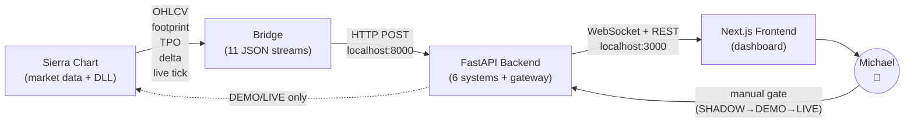
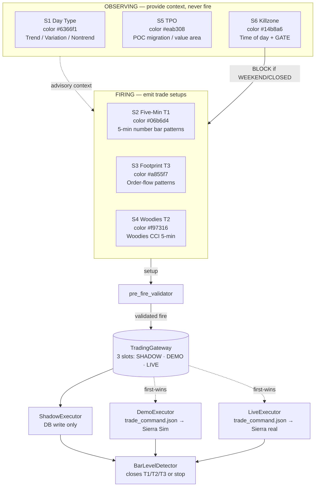
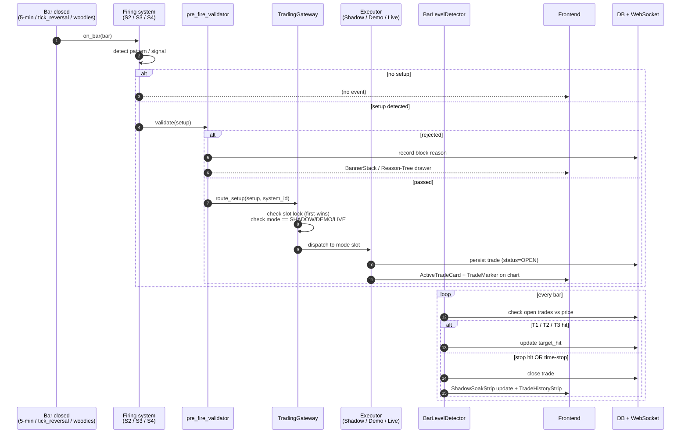
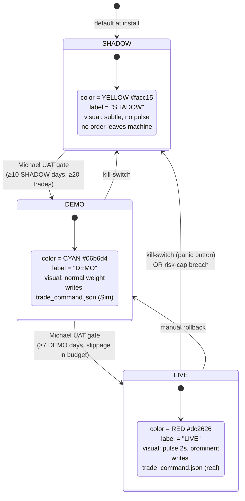
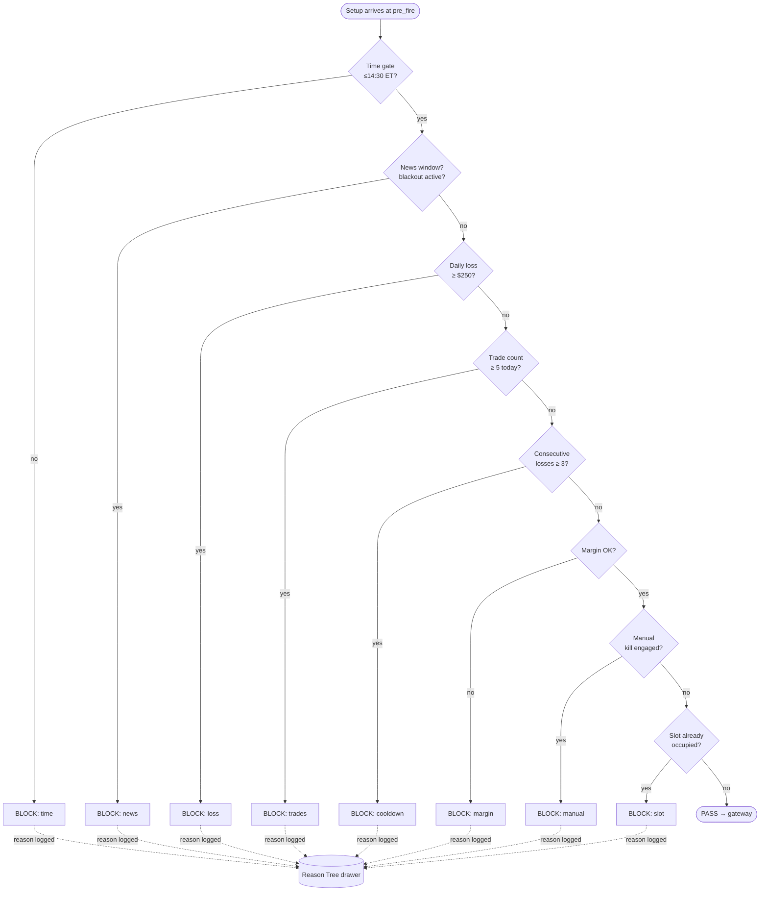
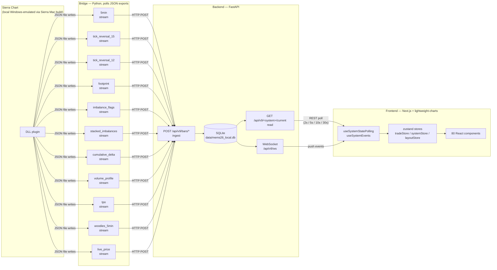
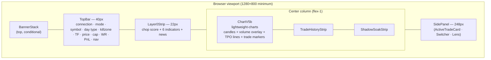

# 01 — System Architecture

**Status:** living document
**Last updated:** 2026-05-16
**Read after:** [`00_README.md`](./00_README.md)
**Read before:** [`02_SYSTEMS_SPEC.md`](./02_SYSTEMS_SPEC.md)

This document gives the designer a map of MEMS26 so every screen they design can be traced back to the data it represents and the constraints that data lives under.

---

## 1. The 30-second elevator pitch

**Designer's slice = everything between `Frontend` and `User`.** The backend, bridge, and Sierra are off-limits visually except for compact health indicators.

---

## 2. The 6 systems at a glance

**S2 / S3 / S4** are "firing" — they propose trades. **S1 / S5 / S6** are "observing" — they shape the decision but never propose. **S6 additionally acts as a hard gate**: WEEKEND or CLOSED instantly blocks all firing.

| # | System | Role | Color (canonical) | UI emphasis |
|---|---|---|---|---|
| S1 | Day Type | OBSERVING | `#6366f1` indigo | Compact label (`TRD 73%`); always present in TopBar |
| S2 | Five-Min T1 | FIRING | `#06b6d4` cyan | Active when 5-min bar closes; chart annotation when pattern building |
| S3 | Footprint T3 | FIRING | `#a855f7` purple | Active on tick-reversal close; absorption / sweep / imbalance / exhaustion |
| S4 | Woodies T2 | FIRING | `#f97316` orange | Active on each new 5-min Woodies bar; A1–A7 decision tree |
| S5 | TPO | OBSERVING | `#eab308` yellow | Profile silhouette + POC/VAH/VAL on right axis |
| S6 | Killzone | OBSERVING + GATE | `#14b8a6` teal | Zone name + edge quality; LARGE warning if gate is blocking |

(Full per-system spec in [`02_SYSTEMS_SPEC.md`](./02_SYSTEMS_SPEC.md).)

---

## 3. Decision flow — what happens when a setup fires

**Designer implications**:
- Every state in this diagram needs a visual: setup-detected (transient), pre-fire-rejected (banner + drawer), routed (chart marker), open (ActiveTradeCard), partial-close (T1/T2 hit), closed (history).
- The Reason Tree is auditable per-fire — there must be a way to drill into "why didn't this fire?" or "why did this fire?".

---

## 4. The three modes (state diagram)

**Visual implication**: the whole UI shifts identity between modes. Top-bar badge color, pulsing effect on LIVE, possibly chart border or accent color, and definitely kill-switch prominence are all affected.

**Constraint**: Only one mode can fire a specific setup at a time (first-wins). SHADOW always runs in parallel as the "what-if" oracle even when DEMO or LIVE is active.

---

## 5. Risk gates (ordering matters)

When a setup arrives at `pre_fire_validator`, gates run in this strict order (`REQ-S-063`). The first gate that rejects wins; the setup is BLOCKED with that single reason recorded in the Reason Tree.

**Visual implications**:
- Each gate needs a visual representation (chip, dot, percentage bar) — the user must be able to glance at the screen and see which gate is closest to tripping.
- The Reason Tree drawer needs to show the **exact gate** that blocked, with a timestamp and the gate's threshold vs the actual value.
- The Cap indicator already exists in TopBar (line 174 of `TopBar.tsx`); other gates need equivalent visibility.

---

## 6. The data layer — what powers each pixel

**Two refresh modes**:
- **REST polling** for slow-changing state (`Day Type` every 10 s, `Killzone` every 5 s, `gateway/status` every 5 s, `shadow/today_wr` every 30 s).
- **WebSocket push** for fast-changing state (new bar close, new trade open/close, banner conditions).

The frontend must remain responsive even when one polling channel stalls — degrade gracefully (last-known value with a `stale` indicator), never freeze.

---

## 7. Frontend layout today (high-level)

This is the layout that exists in `frontend/v9/src/v9/components/layout/V9Dashboard.tsx`. The previous-session hardening (2026-05-16) removed `SystemPanelsBar` (bottom S1–S6 strip) and `VolumePanel` (separate pane) — see [`../../reports/handoff/SESSION_LOG_2026-05-16.md`](../../reports/handoff/SESSION_LOG_2026-05-16.md). Whether they come back, in what form, is **the designer's call** ([`04_DESIGN_BRIEF.md`](./04_DESIGN_BRIEF.md) §3).

---

## 8. What the designer does NOT need to design

| Layer | Why off-limits |
|---|---|
| Bridge JSON shapes | Wire-format, dev-only |
| FastAPI endpoint paths | Already named; designer references them, doesn't rename |
| SQLite schema | Internal; no UI mirror |
| `screen` session management | CLI-level, no UI |
| Sierra Chart's own window | Runs in parallel; we never style Sierra |
| Backend admin (`REQ-ADMIN-001..005`) | Dev console, not user-facing |

---

## 9. What the designer absolutely DOES design

| Surface | Document section |
|---|---|
| SHADOW dashboard primary screen | [`04_DESIGN_BRIEF.md`](./04_DESIGN_BRIEF.md) §2.1 |
| DEMO + LIVE visual modes (color/state shifts) | [`04_DESIGN_BRIEF.md`](./04_DESIGN_BRIEF.md) §2.2–2.3 |
| Trades view (full history + per-trade detail) | [`04_DESIGN_BRIEF.md`](./04_DESIGN_BRIEF.md) §2.4 |
| Settings drawer | [`04_DESIGN_BRIEF.md`](./04_DESIGN_BRIEF.md) §2.5 |
| Reason-Tree drawer (per-fire audit) | [`04_DESIGN_BRIEF.md`](./04_DESIGN_BRIEF.md) §2.6 |
| Blocked-Setup drawer (pre_fire rejects) | [`04_DESIGN_BRIEF.md`](./04_DESIGN_BRIEF.md) §2.7 |
| Kill-Switch UI state | [`04_DESIGN_BRIEF.md`](./04_DESIGN_BRIEF.md) §2.8 |
| Stream Health panel | [`04_DESIGN_BRIEF.md`](./04_DESIGN_BRIEF.md) §2.9 |
| Replay timeline (optional, deferred) | [`04_DESIGN_BRIEF.md`](./04_DESIGN_BRIEF.md) §2.10 |

---

*Next: [`02_SYSTEMS_SPEC.md`](./02_SYSTEMS_SPEC.md) — the per-system deep dive.*
