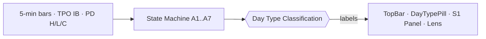
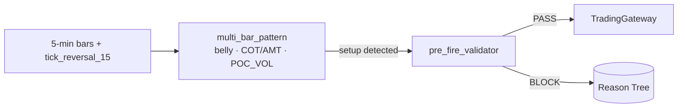
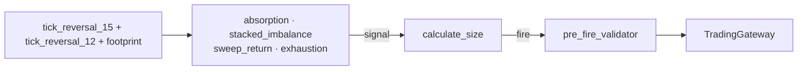
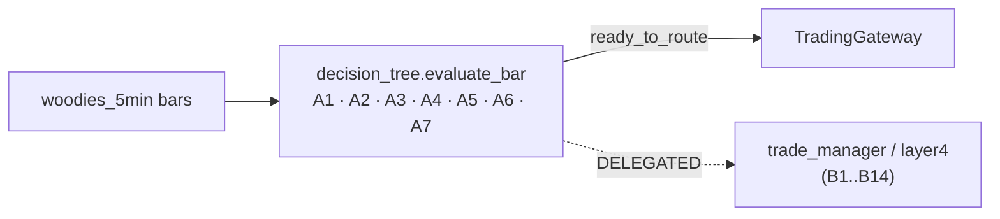
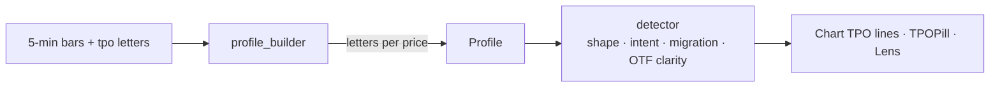
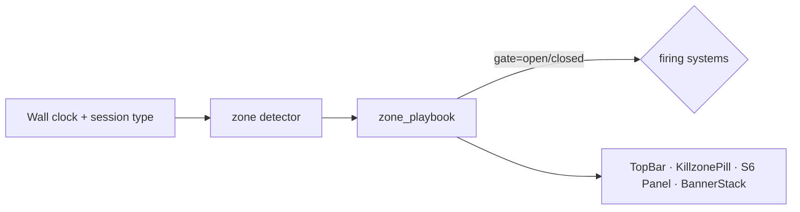

# 02 — Systems Specification (S1–S6)

**Status:** living document
**Last updated:** 2026-05-16
**Read after:** [`01_ARCHITECTURE.md`](./01_ARCHITECTURE.md)
**Read before:** [`03_FRONTEND_AND_TOKENS.md`](./03_FRONTEND_AND_TOKENS.md)

For each of the 6 systems this document gives the designer:
1. **Role** — what the system does for the decision
2. **Inputs / Outputs** — which streams it consumes and what it produces
3. **State machine** — the possible internal states (when relevant)
4. **API endpoint(s)** — the URL the frontend reads from, with a real-shape JSON example
5. **Current UI components** — what's already in the codebase
6. **Visual gaps** — what's missing or unclear

Constants used throughout:

| | |
|---|---|
| Backend host | `http://127.0.0.1:8000` (local) |
| All routes | versioned under `/api/v9/` |
| Symbol | `MES` (Micro E-mini S&P 500) |

---

## S1 — Day Type (OBSERVING)



### 1. Role
S1 classifies "what kind of day is this so far" — Trend / Variation / Nontrend / Normal / Neutral — so firing systems can adjust quality thresholds (e.g., S2 widens its tolerance on a Trend day). **It never fires a trade.**

### 2. Inputs / outputs

| In | Out |
|---|---|
| 5-min bars (via BarRouter) | `day_type` label (`Trend_Normal`, `Trend_DD`, `Variation`, `Neutral`, `Normal`, `Nontrend`, `UNKNOWN`) |
| TPO Initial Balance width (from S5) | `probability` 0..1 |
| Previous Day H / L / C (`pd_high/pd_low/pd_close`) | `directional_certainty` `BULL`/`BEAR`/`NEUTRAL` |
| | `lock_state` `PENDING`/`LOCKED`/`DEGRADED` |
| | `opening_type` `OPEN_DRIVE`/`OPEN_AUCTION`/`OPEN_REJECT`/etc. |
| | `ib_width_class` `S`/`M`/`W`/`EW` |
| | `behavior` `DEVELOPING`/`CONFIRMED`/`UNCONFIRMED` |

### 3. State machine

Stages **A1 → A7** (gated by RTH minutes since open):

| Stage | When | What it does |
|---|---|---|
| A1 | Pre-open | Loads `pd_close` from `v9_bars_5min`, prepares IB target |
| A2 | 09:30–09:45 | Watches opening type (drive / auction / reject) |
| A3 | 09:45–10:30 | IB forming; cannot classify yet — `PENDING` |
| A4 | 10:30+ | IB locked; first classification attempt |
| A5 | Confirmation window | Looks for behavior confirmation |
| A6 | Post-confirmation | Day type LOCKED |
| A7 | EOD | Day type archived to `v9_day_type_history` |

If PD H/L/C inputs are missing, state goes to `DEGRADED/PENDING` with explicit reason — UI must **never** show a confident-looking classification when source is degraded.

### 4. API
`GET /api/v9/day_type/v9/current` (canonical, V9; preferred)
`GET /api/v9/day_type/current` (V1 fallback, demoted)

**Sample response (V9 canonical):**

```json
{
  "data": {
    "day_type": "Trend_Normal",
    "probability": 0.73,
    "directional_certainty": "BULL",
    "lock_state": "LOCKED",
    "opening_type": "OPEN_DRIVE",
    "ib_width_class": "M",
    "behavior": "CONFIRMED",
    "stage": "A6",
    "confidence": 0.73,
    "source": "v9"
  },
  "ts": "2026-05-16T13:42:11Z"
}
```

Backend file: `backend/v9/systems/day_type/api.py` (line 1). Source-of-truth file: `backend/v9/systems/day_type/state_machine.py`.

### 5. Current UI components

| Component | File | Role |
|---|---|---|
| `DayTypePill` | `frontend/v9/src/v9/components/systems/DayTypePill.tsx` | Small chip in the Switcher row |
| `DayTypeLensContent` | `frontend/v9/src/v9/components/systems/DayTypeLensContent.tsx` | Side panel content when S1 is selected |
| `DayTypePlan` | `frontend/v9/src/v9/components/sidepanel/lens/plan/DayTypePlan.tsx` | Card showing today's expected behavior |
| `System1Panel` | `frontend/v9/src/v9/components/panels/System1Panel.tsx` | Bottom strip cell (currently removed from layout) |
| Top-bar label | `TopBar.tsx` lines 41–65 | `DT_LABELS` mapping: `Trend_Normal → TRD`, `Trend_DD → TDD`, `Variation → VAR`, `Neutral → NEU`, `Normal → NOR`, `Nontrend → NTR` |

### 6. Visual gaps for the designer

- The 3-letter abbreviation (`TRD`, `VAR`, `NOR`...) is hard to interpret at a glance for new viewers. Designer to evaluate iconography vs full label vs progressive disclosure on hover.
- `lock_state=DEGRADED` must be visually unmistakable (current: text only, no warning treatment).
- `directional_certainty` is currently shown as a single letter (`B`/`N`/—); designer to evaluate.
- Day Type stage `A1..A7` is shown nowhere on the UI; consider a small progress ring.

---

## S2 — Five-Min T1 (FIRING)



### 1. Role
S2 looks at the last few 5-minute bars and asks: is there a Reactive or Initiative pattern that justifies entering a trade at T1 (the first profit target)? This is the most frequent firing system on a normal RTH day.

### 2. Inputs / outputs

| In | Out (on fire) |
|---|---|
| 5-min OHLCV bars | `pattern` (Reactive / Initiative / COT / AMT / POC_VOL) |
| 15-tick reversal bars (confluence) | `direction` `LONG`/`SHORT` |
| Day Type quality tier from S1 | `confluence` score 0..1 |
| Killzone gate state from S6 | `mode` (SHADOW/DEMO/LIVE) |
| TPO quality tier from S5 | `reasoning_notes` (free text array) |
| | `entry` / `stop` / `t1` / `t2` / `t3` price levels |

### 3. State machine

Lightweight — buffer of last N bars per pattern, evaluated each bar close. No long-lived stages.

### 4. API
`GET /api/v9/chart_5min/state` — last engine state snapshot (auth-protected: requires `BRIDGE_TOKEN`)
`GET /api/v9/chart_5min/signals?limit=N&direction=LONG&classification=...` — recent S2 signals

**Sample response (`/signals`):**

```json
{
  "signals": [
    {
      "id": 1247,
      "ts": "2026-05-16T13:35:00Z",
      "system_id": 2,
      "classification": "Reactive_Long",
      "direction": "LONG",
      "confidence": 0.68,
      "payload": {
        "pattern": "inside_bar_reversal",
        "entry": 7462.5,
        "stop": 7458.0,
        "t1": 7466.5,
        "t2": 7471.0,
        "t3": 7476.0,
        "reasoning_notes": [
          "Inside-bar reversal at VAL",
          "COT bullish divergence",
          "Killzone NY_AM (edge=A)"
        ]
      }
    }
  ]
}
```

> **Designer note:** S2 does **not** have a dedicated `/current` endpoint like S5/S6 do. The "live" state is derived by the frontend from the latest entry in `/signals` plus polling for new bars. If a `/current` endpoint is needed for the new design (recommended for a glanceable pill), the dev team can add one — flag it in your designer notes.

Backend files: `backend/v9/systems/five_min/five_min_system.py` (574 lines), `setup_emitter.py` (92 lines), API in `backend/v9/systems/chart_5min/api.py`.

### 5. Current UI components

| Component | File |
|---|---|
| `FiveMinPill` | `components/systems/FiveMinPill.tsx` |
| `FiveMinLensContent` | `components/systems/FiveMinLensContent.tsx` |
| `FiveMinPlan` | `components/sidepanel/lens/plan/FiveMinPlan.tsx` |
| `System2Panel` | `components/panels/System2Panel.tsx` |

### 6. Visual gaps for the designer

- When a pattern is **building** (e.g., 2 of 3 conditions met), where does the user see it? Current code has `REQ-UI-004` "Active pattern overlay — visual region for building patterns" specified but not implemented. Designer to propose.
- On the chart, what does an Inside-Bar look like vs an Initiative bar? Designer to spec annotation glyphs.
- `confluence` score — bar, ring, gauge, or just a number? Today: number.

---

## S3 — Footprint / Tick Reversal T3 (FIRING)



### 1. Role
S3 reads **order-flow** — who is hitting the bid, who is lifting the offer, where stops were swept, where absorption stopped a move. It fires when one of 4 detectors confirms with sufficient delta + dominance.

### 2. Inputs / outputs

| In | Out |
|---|---|
| 15-tick reversal bars + footprint | One of `ABSORPTION`/`STACKED_IMBALANCE`/`SWEEP_RETURN`/`EXHAUSTION` |
| 12-tick reversal bars (confluence) | `direction`, `strength` 0..1 |
| Cumulative delta | `evidence` (per-detector breakdown) |
| | `size_contracts` (from `calculate_size`) |

### 3. Detectors

| Detector | What it looks for | Lines (file) |
|---|---|---|
| `absorption.py` | Large delta arriving at a level without price moving — institutional absorption | 97 lines |
| `stacked_imbalance.py` | ≥3 consecutive ask-side or bid-side imbalances stacked | 121 lines |
| `sweep_return.py` | A spike that prints above/below a level then returns — stop-run pattern | 91 lines |
| `exhaustion.py` | Climactic volume + delta extreme + reversal candle | 105 lines |

### 4. API
`GET /api/v9/reversal/current` — last reversal-bar enrichment (cluster + empty zone)
`GET /api/v9/reversal/history?limit=N` — recent reversal enrichment records
`GET /v9/tick_reversal/signals?limit=N&classification=...` — recent S3 firing signals (auth-protected; note prefix is `/v9/...` not `/api/v9/...`)

**Sample response (`/reversal/current`):**

```json
{
  "running": true,
  "bars_processed_today": 167,
  "last_bar_ts": "2026-05-16T13:42:00Z",
  "cluster": {
    "active": true,
    "type": "ABSORPTION_LONG",
    "size_ticks": 4
  },
  "empty_zone": {
    "detected": false
  }
}
```

**Sample response (`/v9/tick_reversal/signals`):**

```json
{
  "signals": [
    {
      "id": 2031,
      "ts": "2026-05-16T13:42:30Z",
      "system_id": 3,
      "classification": "ABSORPTION",
      "direction": "LONG",
      "confidence": 0.81,
      "confluence_total": 0.73,
      "pattern": "near_VAL",
      "payload": {
        "evidence": {
          "bid_volume": 1240,
          "price_movement": -0.25,
          "delta": -890,
          "location": "near_VAL"
        },
        "size_contracts": 1
      }
    }
  ]
}
```

Backend file: `backend/v9/systems/footprint/footprint_system.py` (419 lines). APIs in `backend/v9/api/v9/reversal_routes.py` and `backend/v9/systems/tick_reversal/api.py`.

### 5. Current UI components

| Component | File |
|---|---|
| `FootprintPill` | `components/systems/FootprintPill.tsx` |
| `FootprintLensContent` | `components/systems/FootprintLensContent.tsx` |
| `FootprintPlan` | `components/sidepanel/lens/plan/FootprintPlan.tsx` |
| `System3Panel` | `components/panels/System3Panel.tsx` |

### 6. Visual gaps for the designer

- Footprint visualization on the chart itself (per-bar bid/ask volume column) is the most-requested data view in the project but currently absent. Designer to evaluate: render inside `ChartV5b`, separate hover panel, or both.
- Each of the 4 detectors has its own glyph language — designer to propose unified iconography.
- `evidence` is currently raw numbers; designer to spec how to surface the "story" (e.g., "absorption at VAL: 1240 contracts bid into, price unmoved").

---

## S4 — Woodies T2 (FIRING)



### 1. Role
S4 implements the **Woodies CCI** decision tree on 5-minute bars (post D-074 migration; the 30-min path is legacy). A1–A7 is live runtime; B1–B14 is delegated to downstream services. It fires when 9 specific patterns are detected and the decision tree reaches `ready_to_route=true`.

### 2. Inputs / outputs

| In | Out |
|---|---|
| `woodies_5min` bars (OHLCV + CCI_14 + CCI_6_tcci + LSMA + SWI + CZI + EMA_34 + trend_state + predictor_next_cci + ZLR) | `classification` (one of 9 patterns: ZLR / TPL / TCB / TLB / DLZ / etc.) |
| Day Type from S1 | `direction`, `entry`, `stop`, `t1`, `t2`, `t3` |
| TPO from S5 | `decision_tree_stages` (A1..A7 results) |
| Killzone gate from S6 | `ready_to_route` boolean |

### 3. Decision tree

| Stage | What it checks |
|---|---|
| A1 | Pattern existence (one of 9) |
| A2 | Trend state alignment |
| A3 | CCI extremes |
| A4 | **Touch-points**: queries day_type, tpo, veto, killzone, layer0 (HTTP gates) |
| A5 | LSMA agreement |
| A6 | Risk-reward floor |
| A7 | Final composite go/no-go |
| B1–B14 | Delegated to `trade_manager`, `layer4`, `gateway` |

### 4. API
`GET /api/v9/woodies/state` — current studies + active patterns
`GET /api/v9/woodies/signals?limit=20` — recent fires
`GET /api/v9/woodies/patterns` — pattern detection on current bar history

**Sample response (`/state`):**

```json
{
  "trend_state": "GREEN",
  "cci_14": 142.3,
  "cci_6_tcci": 89.5,
  "lsma_value": 7458.6,
  "swi_value": 0.62,
  "czi_value": 1.8,
  "ema_34": 7449.2,
  "predictor_next_cci": 138.1,
  "zlr_detected": true,
  "zlr_direction": "LONG",
  "classification": "ZLR_LONG",
  "direction": "LONG",
  "active_patterns": ["ZLR", "TCB"]
}
```

Backend files: `backend/v9/systems/woodies/woodies_system.py` (427 lines), `decision_tree.py` (379 lines), `pattern_engine.py` (59 lines), `patterns/*.py` (9 detectors).

### 5. Current UI components

| Component | File |
|---|---|
| `WoodiesPill` | `components/systems/WoodiesPill.tsx` |
| `WoodiesLensContent` | `components/systems/WoodiesLensContent.tsx` |
| `WoodiesPlan` | `components/sidepanel/lens/plan/WoodiesPlan.tsx` |
| `System4Panel` | `components/panels/System4Panel.tsx` |

### 6. Visual gaps for the designer

- The decision tree A1..A7 is the most logically complex of the 6 systems. Today the user sees only "fired" / "not fired" — no insight into **which** stage rejected. Designer to propose a stage-by-stage visualization (e.g., 7 mini-dots in WoodiesPill, each green/red).
- 9 patterns × 2 directions = 18 distinct visual states for `classification`. Designer to evaluate iconography or naming convention that fits in a small pill.
- CCI / LSMA / SWI / CZI / EMA_34 are 5 indicators that could be plotted; designer to decide: chart overlay, side panel sparkline, or hidden until S4 selected?

---

## S5 — TPO (OBSERVING)



### 1. Role
S5 builds a live **TPO Market Profile** for the trading day: where time was spent, where value is, where POC has migrated to. It is observing — it gives firing systems context (e.g., S2 weights setups near VAL/VAH higher).

### 2. Inputs / outputs

| In | Out |
|---|---|
| 5-min bars (volume per price) | `poc`, `vah`, `val` |
| TPO letter assignments per period | `profile_shape` (D / P / b / etc.) |
| | `poc_migration` (`STUCK` / `MIGRATING_UP` / `MIGRATING_DOWN`) |
| | `hvn_zones[]`, `lvn_zones[]` |
| | `ib_high`, `ib_low`, `ib_class`, `ib_locked` |
| | `bars_processed_today` (currently broken — see [`../../reports/handoff/MEGA_PROMPT_P27_5A.md`](../../reports/handoff/MEGA_PROMPT_P27_5A.md) and P27.5c) |

### 3. API
`GET /api/v9/tpo/current` — current profile + live stats
`GET /api/v9/tpo/profile?limit=500` — full profile builder output
`GET /api/v9/tpo/levels` — POC/VAH/VAL only (lightweight)

**Sample response (`/current`):**

```json
{
  "running": true,
  "hydrated": true,
  "session_type": "RTH",
  "poc": 7475.75,
  "vah": 7480.25,
  "val": 7473.50,
  "profile_shape": "D",
  "opening_type": "OPEN_DRIVE",
  "ib_high": 7476.5,
  "ib_low": 7458.0,
  "ib_locked": true,
  "ib_width": 18.5,
  "ib_class": "M",
  "ib_locked_ts": "2026-05-16T14:30:00Z",
  "poc_migration": "MIGRATING_UP",
  "hvn_zones": [{ "high": 7475, "low": 7470, "volume": 12400 }],
  "lvn_zones": [{ "high": 7468, "low": 7462, "volume": 200 }],
  "volume_cluster": "balanced",
  "letter_count": 17,
  "buffer_size": 0,
  "bars_processed_today": 0
}
```

Backend file: `backend/v9/systems/tpo/tpo_system.py` (554 lines).

### 5. Current UI components

| Component | File |
|---|---|
| `TPOPill` | `components/systems/TPOPill.tsx` |
| `TPOLensContent` | `components/systems/TPOLensContent.tsx` |
| `TpoPlan` | `components/sidepanel/lens/plan/TpoPlan.tsx` |
| `TPOLines` (chart overlay) | `components/chart/TPOLines.tsx` |
| `RightSideLabels` (POC/VAH/VAL badges) | `components/chart/RightSideLabels.tsx` |
| `System5Panel` | `components/panels/System5Panel.tsx` |

### 6. Visual gaps for the designer

- The **profile silhouette itself** (the lateral histogram of letters per price) is the iconic TPO visual and is the most-asked-for graphic from this system. Today the chart shows POC/VAH/VAL as horizontal lines + right-side badges, but not the profile silhouette. Designer to evaluate left- or right-side anchored silhouette, transparency over candles, etc.
- `poc_migration` is currently a text label; designer to evaluate animated arrow indicator.
- HVN/LVN zones are currently invisible on the chart; designer to propose zone-rectangle treatment.

---

## S6 — Killzone (OBSERVING + GATE)



### 1. Role
S6 is time-of-day-aware: it knows which "killzone" we're in (NY_AM, NY_PM, LUNCH, LONDON, WEEKEND, etc.) and assigns a quality tier per zone. It also **acts as a hard gate** — if the zone is WEEKEND or CLOSED, no firing system can fire.

### 2. Inputs / outputs

| In | Out |
|---|---|
| Wall clock (ET timezone) | `zone` (`NY_AM`/`NY_PM`/`LUNCH`/`LONDON_OPEN`/`LONDON_CLOSE`/`OVERNIGHT`/`WEEKEND`/`CLOSED`) |
| Session type flags (holiday half-day, trade-in-lunch, block-first-15min) | `edge_class` (`A`/`B`/`C`/`D`) |
| | `quality_modifier` (multiplier) |
| | `gate_open` boolean |
| | `remaining` (minutes until zone ends) |
| | `next` (next zone label) |

### 3. Zones

11 zones defined in `backend/v9/systems/killzone/definitions.py`. The full list is exposed via `GET /v9/killzone/zones`. Examples:

| Zone | Time (ET) | Quality | Notes |
|---|---|---|---|
| `LONDON_OPEN` | 03:00–05:00 | A | High vol, often clean trend |
| `NY_AM` | 09:30–11:00 | A | Best edge, most firing |
| `LUNCH` | 12:00–13:00 | D (blocked default) | Low vol, chop risk |
| `NY_PM` | 13:00–14:30 | B | Decent edge, watch news |
| `LONDON_CLOSE` | 11:00–12:00 | B | Volatility tail from LDN |
| `WEEKEND` | Sat/Sun all day | N/A — GATE BLOCKED | Hard block |

### 4. API
`GET /api/v9/killzone/current` — current zone + edge + remaining + next (the canonical endpoint used by frontend)
`GET /v9/killzone/active` — lower-level same data with query overrides
`GET /v9/killzone/zones` — full zone catalog

**Sample response (`/current`):**

```json
{
  "zone": "NY_AM",
  "edge_class": "A",
  "quality_modifier": 1.15,
  "gate_open": true,
  "session_phase": "RTH",
  "remaining_minutes": 47,
  "next_zone": "LUNCH",
  "ts": "2026-05-16T13:43:00Z"
}
```

Backend files: `backend/v9/systems/killzone/killzone_system.py` (88 lines), `definitions.py` (99 lines), `zone_playbook.py` (140 lines), `api.py` (52 lines).

### 5. Current UI components

| Component | File |
|---|---|
| `KillzonePill` | `components/systems/KillzonePill.tsx` |
| `KillzoneLensContent` | `components/systems/KillzoneLensContent.tsx` |
| `KillzonePlan` | `components/sidepanel/lens/plan/KillzonePlan.tsx` |
| `System6Panel` | `components/panels/System6Panel.tsx` |
| TopBar zone label | `TopBar.tsx` lines 76–82, 131–133 |

### 6. Visual gaps for the designer

- **When the gate BLOCKS, the user must know instantly.** Today the killzone shows a small label color (green=OPEN / red=CLOSED) but does not visually dominate. Designer to propose a more prominent treatment when blocked.
- A **time-strip / Gantt-style band** showing today's killzones across the bottom (or above the chart) would help the user anticipate "when does the next edge window open?" — not currently designed.
- `quality_modifier` and `edge_class` are two ways of expressing the same idea; designer to consolidate or differentiate.
- Holiday half-day / news blackout signaling is implemented in the backend but has no UI surface.

---

## Cross-cutting: gateway + executor visibility

These are not "systems" in the S1–S6 sense, but the UI must surface them clearly.

### TradingGateway

`GET /api/v9/gateway/status` returns:

```json
{
  "running": true,
  "mode": "shadow",
  "shadow_slot": { "active_trade_id": null, "active_count_today": 0 },
  "demo_slot":   { "active_trade_id": null, "active_count_today": 0 },
  "live_slot":   { "active_trade_id": null, "active_count_today": 0 },
  "daily_pnl_usd": 0.0,
  "trade_count_today": 0,
  "consecutive_losses": 0
}
```

`GET /api/v9/gateway/risk` returns:

```json
{
  "cooldown":      { "active": false, "remaining_seconds": 0 },
  "cluster_guard": { "active": false, "active_count": 0 },
  "ssv":           { "active": false, "reason": null },
  "chop_state":    "BALANCED"
}
```

**Designer needs**: a small, persistent gateway-status widget (probably TopBar right-cluster) and a more detailed risk-state surface (probably a drawer or a Sidebar tab).

### pre_fire_validator

`POST /api/v9/pre_fire/validate` (not normally polled by UI; results surface inside fires and inside the Reason Tree drawer).

### Executors

The three executors (`ShadowExecutor`, `DemoExecutor`, `LiveExecutor`) do not have their own GET endpoint — their activity is observed via `gateway/status.shadow_slot/demo_slot/live_slot` and via the trades collection (`GET /api/v9/trades`).

---

## Quick-reference: all per-system endpoints

> **Note:** every endpoint with `BRIDGE_TOKEN` auth requires the `Authorization: Bearer <token>` header; the frontend stores this token in `NEXT_PUBLIC_BRIDGE_TOKEN`. Two systems (S2 chart_5min and S3 tick_reversal) do not have a dedicated `/current` endpoint today — the recommendation is to add one as part of the redesign.

| System | Endpoint(s) | Auth | Cadence today |
|---|---|---|---|
| S1 Day Type | `/api/v9/day_type/v9/current` (canonical), `/api/v9/day_type/current` (V1 fallback), `/api/v9/day_type/v9/history?days=N`, `/api/v9/day_type/state` | none | 10 s |
| S2 Five-Min | `/api/v9/chart_5min/state`, `/api/v9/chart_5min/signals?limit=N` | BRIDGE_TOKEN | 5 s (signals) |
| S3 Footprint/T3 | `/api/v9/reversal/current`, `/api/v9/reversal/history?limit=N`, `/v9/tick_reversal/signals?limit=N` | reversal: none; tick_reversal: BRIDGE_TOKEN | 5 s |
| S4 Woodies | `/api/v9/woodies/state`, `/api/v9/woodies/signals?limit=N`, `/api/v9/woodies/patterns` | none | 5 s |
| S5 TPO | `/api/v9/tpo/current`, `/api/v9/tpo/profile?limit=N`, `/api/v9/tpo/levels` | none | 5 s |
| S6 Killzone | `/api/v9/killzone/current` (canonical), `/v9/killzone/active`, `/v9/killzone/zones` | none | 5 s |
| Gateway | `/api/v9/gateway/status`, `/api/v9/gateway/risk`, `POST /api/v9/gateway/route_setup` (dev/test only) | none | 5 s |
| Status (composite) | `/api/v9/status` | none | 5 s |
| WebSocket | `/api/v9/ws` (push for new bars + trades) | bearer in subprotocol | continuous |

---

*Next: [`03_FRONTEND_AND_TOKENS.md`](./03_FRONTEND_AND_TOKENS.md) — current frontend inventory and design tokens.*
