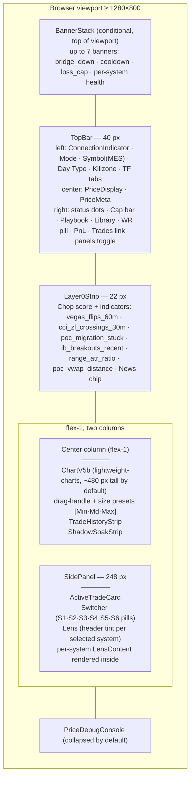
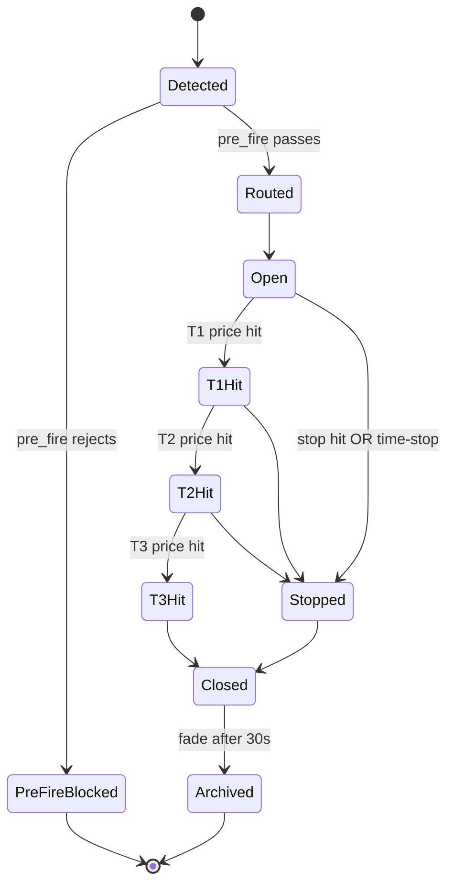

# 03 — Frontend & Design Tokens

**Status:** living document
**Last updated:** 2026-05-16
**Read after:** [`02_SYSTEMS_SPEC.md`](./02_SYSTEMS_SPEC.md)
**Read before:** [`04_DESIGN_BRIEF.md`](./04_DESIGN_BRIEF.md)

This document gives the designer a complete picture of **what already exists in the frontend** so they can refer to specific components by name when proposing changes, and so they don't accidentally design something that already exists under a different name.

---

## 1. Tech stack

| Layer | Choice | Why |
|---|---|---|
| Framework | **Next.js 16 (App Router)** — `frontend/v9/` | Existing project; see `frontend/v9/AGENTS.md` for version-specific notes |
| Language | TypeScript (strict) | Project convention |
| Styling | **Tailwind CSS 4** + inline `style={}` for chart-adjacent dynamic colors | Tailwind for layout; inline for token-driven values |
| State | **Zustand** — `tradeStore`, `systemStore`, `layoutStore` | Lightweight, no Redux |
| Chart | **`lightweight-charts`** (TradingView Inc., Apache 2.0) | Open-source, local-only |
| Realtime | WebSocket (`/api/v9/ws`) + REST polling (2s/5s/10s/30s) | Best-of-both |
| Tokens | `frontend/v9/src/v9/design/tokens.ts` + `system_colors.ts` + `globals.css` CSS vars | Mixed; consolidate as part of the redesign |
| Dev port | `127.0.0.1:3000` | Local-only |

---

## 2. Current dashboard layout (as of 2026-05-16)



**Source file**: `frontend/v9/src/v9/components/layout/V9Dashboard.tsx`.

**Removed in 2026-05-16** (and currently absent):
- `VolumePanel` — was a second `lightweight-charts` instance below the main one. **Do not bring it back as a separate component**; if volume needs to render, it must be an overlay inside `ChartV5b` (see `03_FRONTEND_AND_TOKENS.md` §6 and [`04_DESIGN_BRIEF.md`](./04_DESIGN_BRIEF.md) §3.2).
- `SystemPanelsBar` — was a bottom 6-cell strip with one cell per system (`System1Panel..System6Panel`). All 6 panel components **still exist** in `frontend/v9/src/v9/components/panels/`; only their container was removed. Whether they return, in what form, and where they live is a designer decision ([`04_DESIGN_BRIEF.md`](./04_DESIGN_BRIEF.md) §3.1).

---

## 3. Component inventory (80 components, grouped by layer)

The frontend lives under `frontend/v9/src/v9/components/`. All paths below are relative to that directory.

### 3.1 Layout (6 components)

| Component | Path | Purpose |
|---|---|---|
| `V9Dashboard` | `layout/V9Dashboard.tsx` | Top-level dashboard composition |
| `TopBar` | `layout/TopBar.tsx` | 40 px top strip (mode, symbol, day type, killzone, TF, price, PnL, nav) |
| `Layer0Strip` | `layout/Layer0Strip.tsx` | 22 px chop-score + indicators row |
| `SidePanel` | `layout/SidePanel.tsx` | Right-side 248 px panel (Active trade + Switcher + Lens) |
| `Switcher` | `layout/Switcher.tsx` | 6 system pills in side panel header |
| `DashboardLayout` | `layout/DashboardLayout.tsx` | **Legacy** — do not re-wire (kept for reference only) |

### 3.2 Chart (12 components)

| Component | Path | Purpose |
|---|---|---|
| `ChartV5b` | `chart/v5b/ChartV5b.tsx` | **Canonical** chart (lightweight-charts, candles + volume overlay) |
| `ChartV5a` | `chart/ChartV5a.tsx` | **Legacy** — do not re-wire |
| `ChartArea` | `chart/ChartArea.tsx` | Chart container (legacy wrapper) |
| `TimeframeSelector` | `chart/TimeframeSelector.tsx` | TF buttons (3m/5m/15m/30m/1h) |
| `RightSideLabels` | `chart/RightSideLabels.tsx` | POC/VAH/VAL/PDH/PDL/ONH/ONL/OPEN badges on right axis (`REQ-UI-011`) |
| `StaticLevels` | `chart/StaticLevels.tsx` | Horizontal lines for PD/ON/IB levels |
| `TradeMarkerOverlay` | `chart/TradeMarkerOverlay.tsx` | Per-trade markers on candles (`REQ-UI-003`) |
| `TPOLines` | `chart/TPOLines.tsx` | POC/VAH/VAL horizontal lines from S5 |
| `VegasEMAs` | `chart/VegasEMAs.tsx` | EMA overlay (used by S4 context) |
| `PriceDebugConsole` | `PriceDebugConsole.tsx` | Dev-only price debug (collapsible) |
| `VolumeDragHandle` | `volume/VolumeDragHandle.tsx` | Drag handle (legacy from VolumePanel split; vestigial) |
| `VolumePanel` | `volume/VolumePanel.tsx` | **Removed from layout** — do not re-import |

### 3.3 Top-bar children (3 components)

| Component | Path | Purpose |
|---|---|---|
| `ConnectionIndicator` | `topbar/ConnectionIndicator.tsx` | Green/red bridge+backend dots |
| `PriceDisplay` | `topbar/PriceDisplay.tsx` | Big live MES price in center of TopBar |
| `PriceMeta` | `topbar/PriceMeta.tsx` | Bid/ask, change, change% next to PriceDisplay |

### 3.4 Strips (2 components)

| Component | Path | Purpose |
|---|---|---|
| `TradeHistoryStrip` | `strips/TradeHistoryStrip.tsx` | Recent trades horizontal scroll below chart |
| `ShadowSoakStrip` | `strips/ShadowSoakStrip.tsx` | SHADOW soak progress + cumulative WR |

### 3.5 Per-system Pills (6 components)

Each system has a Pill (compact selector chip used in the Switcher row).

| File | System |
|---|---|
| `systems/DayTypePill.tsx` | S1 |
| `systems/FiveMinPill.tsx` | S2 |
| `systems/FootprintPill.tsx` | S3 |
| `systems/WoodiesPill.tsx` | S4 |
| `systems/TPOPill.tsx` | S5 |
| `systems/KillzonePill.tsx` | S6 |

### 3.6 Per-system LensContents (6 components)

When a system pill is selected in the SidePanel Switcher, its LensContent renders inside the Lens container.

| File | System |
|---|---|
| `systems/DayTypeLensContent.tsx` | S1 |
| `systems/FiveMinLensContent.tsx` | S2 |
| `systems/FootprintLensContent.tsx` | S3 |
| `systems/WoodiesLensContent.tsx` | S4 |
| `systems/TPOLensContent.tsx` | S5 |
| `systems/KillzoneLensContent.tsx` | S6 |

### 3.7 Per-system Plans (6 components)

Plan cards live inside LensContent — they describe "what this system would do right now if a trade entered".

| File | System |
|---|---|
| `sidepanel/lens/plan/DayTypePlan.tsx` | S1 |
| `sidepanel/lens/plan/FiveMinPlan.tsx` | S2 |
| `sidepanel/lens/plan/FootprintPlan.tsx` | S3 |
| `sidepanel/lens/plan/WoodiesPlan.tsx` | S4 |
| `sidepanel/lens/plan/TpoPlan.tsx` | S5 |
| `sidepanel/lens/plan/KillzonePlan.tsx` | S6 |

### 3.8 Per-system Panels (6 components)

Bottom-strip cells from the removed `SystemPanelsBar`. **Still exist** in code; not currently rendered.

| File | System |
|---|---|
| `panels/System1Panel.tsx` | S1 |
| `panels/System2Panel.tsx` | S2 |
| `panels/System3Panel.tsx` | S3 |
| `panels/System4Panel.tsx` | S4 |
| `panels/System5Panel.tsx` | S5 |
| `panels/System6Panel.tsx` | S6 |
| `panels/SystemPanelWrapper.tsx` | Shared wrapper |
| `panels/SystemPanelsBar.tsx` | Container — currently unused |

### 3.9 Sidebar tabs (15 components, full-page Trades view)

`sidebar/LeftTabs.tsx` is the 9-tab Hebrew-labeled nav (`REQ-UI-001`). 15 tab components exist (more than the 9 active tabs — some are alternatives or future).

| File | Purpose |
|---|---|
| `sidebar/LeftTabs.tsx` | Hebrew-labeled tab nav container |
| `sidebar/tabs/PerformanceTab.tsx` | Daily/weekly PnL aggregate |
| `sidebar/tabs/DecisionsTab.tsx` | Per-trade decision audit |
| `sidebar/tabs/SystemsTab.tsx` | 6-system at-a-glance |
| `sidebar/tabs/MarketTab.tsx` | Symbol + levels |
| `sidebar/tabs/TraderTab.tsx` | Trader-level stats |
| `sidebar/tabs/PredictionsTab.tsx` | Predictions log |
| `sidebar/tabs/PredActualTab.tsx` | Predicted vs Actual (`REQ-UI-005`) |
| `sidebar/tabs/StatsTab.tsx` | Stats aggregates |
| `sidebar/tabs/DayTab.tsx` | Today's session |
| `sidebar/tabs/OrdersTab.tsx` | Order history |
| `sidebar/tabs/DataTab.tsx` | Raw data inspection |
| `sidebar/tabs/PatternsTab.tsx` | Pattern library |
| `sidebar/tabs/SetupsTab.tsx` | Setups catalog |
| `sidebar/tabs/SignalTab.tsx` | Signal log |
| `sidebar/tabs/TradeTab.tsx` | Per-system PnL tracker (`REQ-UI-006`) |

### 3.10 Banners (2 components)

| File | Purpose |
|---|---|
| `banners/BannerStack.tsx` | Conditional top-of-viewport banners (bridge_down, cooldown, loss_cap, per-system health) |
| `banners/LibraryModal.tsx` | Modal for Playbook / Journal / Spec / Settings |

### 3.11 Atoms / Molecules (5 components)

| File | Purpose |
|---|---|
| `atoms/Pill.tsx` | Generic pill chip primitive |
| `atoms/StatusDot.tsx` | Generic colored-dot primitive |
| `atoms/EmptyState.tsx` | "Nothing to show yet" placeholder |
| `molecules/Lens.tsx` | Side-panel content container with header tint |
| `molecules/SwitcherSlot.tsx` | Single cell of the Switcher row |

### 3.12 SidePanel cards (1 component besides the 6 Plans)

| File | Purpose |
|---|---|
| `sidepanel/ActiveTradeCard.tsx` | Live in-trade card: entry, current PnL, targets hit, time-in-trade, mode |

### 3.13 Trades (5 components)

| File | Purpose |
|---|---|
| `trades/TradesView.tsx` | Full-page Trades view (`/trades`) |
| `trades/TradesTable.tsx` | Sortable trades table |
| `trades/TradeFilters.tsx` | Filters: mode, system, date, outcome |
| `trades/TradeDetailsModal.tsx` | Per-trade drill-down modal (Reason Tree origin) |
| `chart/TradeMarkerOverlay.tsx` | Chart trade markers (listed under chart too) |

### 3.14 Misc

| File | Purpose |
|---|---|
| `health/StreamHealthPanel.tsx` | 11-stream health table (pushes/sec, last-push age, errors) |
| `settings/SettingsDrawer.tsx` | Settings UI (slide-out drawer) |
| `sounds/SoundProvider.tsx` | Audio cue dispatcher (trade fire / close / banner) |

### 3.15 Hooks (not in `components/`, listed for completeness)

| Hook | Purpose |
|---|---|
| `useSystemStatePolling(intervalMs)` | Polls all 6 `/current` endpoints + gateway/status |
| `useSystemEvents` | Subscribes to `/api/v9/ws` for live events |

---

## 4. Design tokens (current, extracted from source)

### 4.1 From `frontend/v9/src/v9/design/tokens.ts` (canonical)

**Backgrounds (dark, very near-black):**

| Token | Value | Use |
|---|---|---|
| `bgBase` | `#0a0a0a` | App background |
| `bgSurface1` | `#0d0d0d` | First-elevation surface (SidePanel, drawers) |
| `bgSurface2` | `#0f0f0f` | Second-elevation (cards) |
| `bgSurface3` | `#101010` | Third-elevation |
| `bgSurface4` | `#141414` | Fourth-elevation (selected state) |
| `bgSurface5` | `#1a1a1a` | Fifth-elevation |
| `bgSurface6` | `#1f1f1f` | Sixth-elevation (modal) |

**Borders:**

| Token | Value | Use |
|---|---|---|
| `borderFaint` | `#1a1a1a` | Hairlines |
| `borderTertiary` | `#262626` | Card edges |
| `borderSecondary` | `#333333` | Section dividers |
| `borderPrimary` | `#404040` | Strong dividers |
| `borderStrong` | `#525252` | Focus / active |

**Text:**

| Token | Value | Use |
|---|---|---|
| `textPrimary` | `#e5e5e5` | Body text |
| `textSecondary` | `#a3a3a3` | Secondary labels |
| `textTertiary` | `#737373` | Tertiary |
| `textDisabled` | `#525252` | Disabled |
| `textDim` | `#404040` | Decorative dim |

**Semantic colors:**

| Token | Value | Use |
|---|---|---|
| `bull` | `#16a34a` | Green / up / win |
| `bullLight` | `#86efac` | Bull tint |
| `bullFill` | `#dcfce7` | Bull background fill |
| `bear` | `#dc2626` | Red / down / loss |
| `bearLight` | `#fca5a5` | Bear tint |
| `warning` | `#f59e0b` | Warning amber |
| `caution` | `#facc15` | Caution yellow (also SHADOW mode) |

**Mode colors:**

| Token | Value | Use |
|---|---|---|
| `modeShadow` | `#facc15` | SHADOW mode (yellow) |
| `modeDemo` | `#06b6d4` | DEMO mode (cyan) |
| `modeLive` | `#dc2626` | LIVE mode (red) |

**Chart-specific:**

| Token | Value | Use |
|---|---|---|
| `tpoPoc` | `#ec4899` | POC line (TPO) |
| `ibLine` | `#4ade80` | Initial Balance line |
| `currentPriceLine` | `#facc15` | Live price marker on chart |

### 4.2 From `frontend/v9/src/v9/design/system_colors.ts`

Per `Constitution V3 D-049`:

| System | ID | Color | Type |
|---|---|---|---|
| Day Type | 1 | `#6366f1` indigo | OBSERVING |
| Five-Min | 2 | `#06b6d4` cyan | FIRING |
| Footprint | 3 | `#a855f7` purple | FIRING |
| Woodies | 4 | `#f97316` orange | FIRING |
| TPO | 5 | `#eab308` yellow | OBSERVING |
| Killzone | 6 | `#14b8a6` teal | OBSERVING |

⚠️ **Conflict to flag**: The system colors here do **not** match the colors in `globals.css` (`--sys1: #58a6ff`, `--sys2: #56d364`, `--sys3: #d2a8ff`, `--sys4: #fb950b`, `--sys5: #79c0ff`, `--sys6: #8b949e`). This is a real inconsistency the designer must resolve. Choose **one** palette and propagate; `system_colors.ts` is more recent and aligns to Constitution V3 D-049 so it is the recommended canonical source.

### 4.3 From `frontend/v9/src/app/globals.css` (CSS vars — older, partial overlap)

```css
--bg-primary: #0d1117;       /* slightly bluer than tokens.ts bgBase */
--bg-secondary: #161b22;
--bg-tertiary: #21262d;
--border: #30363d;
--text-primary: #e6edf3;
--text-secondary: #8b949e;
--text-muted: #484f58;
--sys1..--sys6: (see conflict above)
--green: #56d364;
--red: #f85149;
```

⚠️ **Second conflict**: `--bg-*` here is GitHub-dark-mode palette, while `tokens.ts` `bg*` is true-black. The designer must consolidate. The codebase uses both interchangeably today.

### 4.4 Typography

| Token | Value |
|---|---|
| `fontSans` | `system-ui, -apple-system, sans-serif` |
| `fontMono` | `ui-monospace, monospace` (used for prices and metrics) |
| `textXs` | `8px` (status dot labels) |
| `textSm` | `10px` (chip text) |
| `textMd` | `11px` (small body) |
| `textLg` | `13px` (base body — matches `globals.css` `font-size: 13px`) |
| `textXl` | `14px` (headings inside cards) |
| `weightRegular` | 400 |
| `weightMedium` | 500 |
| `weightSemibold` | 600 |
| `weightBold` | 700 |
| `letterSpacingLabel` | `0.5px` |

### 4.5 Sizing

| Token | Value | Use |
|---|---|---|
| `topBarHeight` | 36 px | TopBar (note: actual `TopBar.tsx` uses 40 px — inconsistency) |
| `layer0Height` | 22 px | Layer0Strip |
| `chartToolbarHeight` | 28 px | Chart-internal toolbar |
| `volumeStripHeight` | 28 px | Volume strip (legacy) |
| `sidePanelWidth` | 248 px | SidePanel right column |
| `pillFiring.{w,h}` | 36 × 32 px | Firing system pills (S2/S3/S4) |
| `pillObserving.{w,h}` | 36 × 28 px | Observing system pills (S1/S5/S6) |
| `pillBorderRadius` | 5 px | Pill corner |
| `pillBorderSelected` | 1.5 px | Selected pill border weight |
| `lensCardRadius` | 6 px | Lens card corner |
| `lensCardBorder` | 0.5 px | Lens card border weight |
| `lensPadding` | 8 px | Lens internal padding |
| `lensTabBorderActive` | 1.5 px | Lens active tab border |

⚠️ **Third conflict**: `topBarHeight: 36` in tokens but `TopBar.tsx` line 102 uses `h-[40px]`. Designer to lock one.

### 4.6 Animations

| Token | Spec | Use |
|---|---|---|
| `pulseFire` | 1.6 s `ease-in-out`, opacity `1 → 0.72 → 1` | Active firing pill |
| `stateTransition` | `200 ms` | Generic state change |
| `tradeEntryFlash` | `800 ms` | New trade entry flash on chart |
| `tradeTintExpand` | `400 ms` | Tint expanding when trade opens |
| `justClosedFade` | `30 s` | Fade-out of just-closed trade markers |
| `pulse` (CSS, TopBar) | `2 s infinite` | LIVE mode badge |
| `pulsePill` (CSS, globals) | `600 ms ease-out` | Pill pulse on select |

---

## 5. API endpoint inventory (25 routes)

All under `http://127.0.0.1:8000/api/v9/`. The designer references these by path when proposing widgets; the dev team owns the shape.

### 5.1 Per-system

Routes marked `🔒` require `BRIDGE_TOKEN` (`Authorization: Bearer <token>`). All routes are under `http://127.0.0.1:8000` and most are prefixed `/api/v9/` — note that two killzone and one tick_reversal route use a bare `/v9/` prefix (historical).

| Endpoint | Method | Auth | Used by |
|---|---|---|---|
| `/api/v9/day_type/v9/current` | GET | open | TopBar, DayTypeLensContent, S1Panel |
| `/api/v9/day_type/current` (V1 fallback) | GET | open | TopBar (fallback) |
| `/api/v9/day_type/state` | GET | open | DayTypeLensContent (full state) |
| `/api/v9/day_type/v9/history?days=N` | GET | open | DecisionsTab (audit) |
| `/api/v9/chart_5min/state` | GET | 🔒 | FiveMinLensContent, S2Panel |
| `/api/v9/chart_5min/signals?limit=N` | GET | 🔒 | DecisionsTab, S2Panel |
| `/api/v9/reversal/current` | GET | open | FootprintPill, FootprintLensContent, S3Panel |
| `/api/v9/reversal/history?limit=N` | GET | open | DecisionsTab |
| `/v9/tick_reversal/signals?limit=N` | GET | 🔒 | S3 signal log (note: `/v9/...` prefix, not `/api/v9/`) |
| `/api/v9/woodies/state` | GET | open | WoodiesPill, WoodiesLensContent, S4Panel |
| `/api/v9/woodies/signals?limit=N` | GET | open | DecisionsTab |
| `/api/v9/woodies/patterns` | GET | open | PatternsTab |
| `/api/v9/tpo/current` | GET | open | TopBar, TPOLensContent, S5Panel, RightSideLabels |
| `/api/v9/tpo/profile?limit=N` | GET | open | (S5 detailed profile builder) |
| `/api/v9/tpo/levels` | GET | open | RightSideLabels (lightweight) |
| `/api/v9/killzone/current` | GET | open | TopBar, KillzonePill, S6Panel, BannerStack |
| `/v9/killzone/active?...` | GET | open | (lower-level same data; note `/v9/...` prefix) |
| `/v9/killzone/zones` | GET | open | KillzoneLensContent (full catalog) |

### 5.2 Chart data

| Endpoint | Method | Used by |
|---|---|---|
| `/api/v9/chart/bars5min?limit=N&before=ts` | GET | ChartV5b (primary candles) |
| `/api/v9/chart/bars1m` / `bars3m` / `bars15m` / `bars30m` / `bars1h` | GET | ChartV5b (TF switcher) |
| `/api/v9/live_price` | GET | TopBar PriceDisplay, ChartV5b live marker |

### 5.3 Gateway + trades

| Endpoint | Method | Used by |
|---|---|---|
| `/api/v9/gateway/status` | GET | TopBar (mode + slot states), BannerStack |
| `/api/v9/gateway/risk` | GET | (drawer) |
| `/api/v9/gateway/route_setup` | POST | Dev/test only |
| `/api/v9/trades?limit=N&mode=...&system=...` | GET | TradesView, TradeHistoryStrip |
| `/api/v9/trades/{id}` | GET | TradeDetailsModal |
| `/api/v9/trades/active` | GET | ActiveTradeCard |
| `/api/v9/shadow/today_wr` | GET | TopBar (WR pill), ShadowSoakStrip |
| `/api/v9/shadow/soak/progress` | GET | ShadowSoakStrip |
| `/api/v9/trade_commands` | GET | OrdersTab |

### 5.4 Risk + alerts

| Endpoint | Method | Used by |
|---|---|---|
| `/api/v9/pre_fire/validate` | POST | (consumed internally; not polled by UI) |
| `/api/v9/markers` | GET | TradeMarkerOverlay (chart trade markers) |
| `/api/v9/signals?limit=N` | GET | SignalTab |
| `/api/v9/clock/state` | GET | DayTab (live clock + replay mode) |
| `/api/v9/audit` | GET | DecisionsTab |

### 5.5 Infrastructure

| Endpoint | Method | Used by |
|---|---|---|
| `/status` | GET | TopBar (composite status: bridge, backend, subscribers, mode) |
| `/health_streams` | GET | StreamHealthPanel |
| `/chop_score/current` | GET | Layer0Strip |
| `/layer0/state` | GET | Layer0Strip |
| `/open_type` (current open classification) | GET | DayTypeLensContent |
| `/spec_compliance` | GET | (dev-only, not user-facing) |
| `/configs` | GET / PUT | SettingsDrawer |
| `/ws` | WebSocket | useSystemEvents (push) |

---

## 6. Special integration constraints

### 6.1 `lightweight-charts` constraints

- **Only one chart instance** on screen (multiple instances produce duplicate "TradingView" watermarks; the previous-session hardening added `attributionLogo: false` and removed the second chart).
- Volume **must overlay** inside the candle chart (histogram series on its own pane via `lightweight-charts` built-in), never as a separate chart component.
- TPO lines, trade markers, EMAs, and static levels (`PD H/L`, `ONH/ONL`, `OPEN`) are added as series or priceLine on the same chart.
- The chart already has client-side bad-bar filtering (`looksOk` heuristic) which will become defense-in-depth after P27.5a; the designer should treat the chart as always returning clean data.

### 6.2 Polling cadence cap

Polls are aggressive (2–10 s). The UI **must** degrade gracefully if a poll fails — show last-known value + a small staleness indicator (clock icon + age). Don't blank the data.

### 6.3 Trade lifecycle visual states

A single trade transitions through:



The designer must propose visual treatment for each transition (chart marker, side-panel card state, sound cue, banner notification).

### 6.4 Realtime channels

| Channel | Pushes | Used by |
|---|---|---|
| `CHANNEL_BARS_5MIN` | New 5-min bar close | ChartV5b |
| `CHANNEL_BARS_TICK_REVERSAL` | New tick-reversal bar | (S3 internal) |
| `CHANNEL_BARS_WOODIES` | New Woodies bar | (S4 internal) |
| `CHANNEL_LEVELS` | POC/VAH/VAL update | RightSideLabels, TPOLines |
| Trade events | Trade opened/closed | ActiveTradeCard, TradeHistoryStrip, SoundProvider |

---

## 7. Inconsistencies the designer should resolve

A redesign opportunity to consolidate these:

1. **Two color systems** for systems (`tokens.ts/system_colors.ts` vs `globals.css/--sys1..6`). Pick one.
2. **Two background palettes** (`tokens.ts` true-black vs `globals.css` GitHub-dark). Pick one.
3. **TopBar height** is 36 px in tokens but 40 px in actual component. Lock one.
4. **Vestigial drag-handle** in `V9Dashboard.tsx` controls a chart height that no longer affects layout (no second pane to push). Either re-purpose or remove.
5. **15 tab files** for what was probably meant to be 9 (`REQ-UI-001` says "9 tabs"). Designer + dev should reconcile which 9 are canonical.
6. **System Panels currently absent** from the layout but `panels/System1..6Panel.tsx` files still exist. Decide: re-introduce in new form, repurpose components, or delete.
7. **Two icon callouts in TopBar both open `LibraryModal`** (line 187 Playbook + line 192 Library) — likely a copy-paste leftover; designer to consolidate.
8. **No clear visual difference today between DEMO and SHADOW modes** beyond the badge color. Designer to amplify (chart border? accent color shift? prominent slot indicator?).

---

*Next: [`04_DESIGN_BRIEF.md`](./04_DESIGN_BRIEF.md) — the actual ask.*
