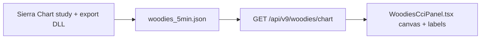

# P30 Woodies CCI Panel — Agent Handoff (2026-05-19)

## Purpose
Sierra-faithful **Woodies CCI Trend** floating panel on Cockpit 5m chart.  
**Source of truth:** `docs/design/WOODY_PANEL_DESIGNER_SPEC_v1.md` (copy of Michael's v1.0).

**Woody system architecture (FIRE pipeline, export, gates — not a manual Fire button on the panel):**  
[`docs/architecture/Woody_CCI_System_Architecture.docx`](../architecture/Woody_CCI_System_Architecture.docx) · index [`docs/architecture/README.md`](../architecture/README.md)

**Designer brief (field semantics + chart links + time rules):**

| Doc | Language |
|-----|----------|
| `P30_WOODIES_DESIGNER_BRIEF_HE.md` | Hebrew (authoritative, Michael 2026-05-19) |
| `P30_WOODIES_DESIGNER_BRIEF_EN.md` | English (for designer handoff) |
| `WOODY_CCI_PANEL_HANDOFF_DOCX.md` | Michael’s **docx** ingested + **3 reference PNGs** in `assets/woodies/` |
| Source docx | `/Users/michael/Downloads/Woody_CCI_Panel_Handoff.docx` |

---

## Big picture — do we understand it?

**Yes.** This is not a generic chart widget. It is a **pixel-faithful clone** of Sierra Chart's "Woodies CCI Trend" study, embedded in MEMS26 Cockpit as **S4**, so Michael can read the same signals (trend color bars, CCI-14, TCCI, ZLR, projections, data column) while trading on the 5m chart.



| Layer | Role |
|-------|------|
| **Sierra** | Computes CCI studies, trend state, OHLC, predictor, ZLR; writes JSON every few seconds |
| **Backend** | Normalizes bars, `stale` if export >30s, enriches ProjHi/Lo + ccidiff + angle when missing |
| **Frontend** | 480×360 layout, interactions, draws histogram/lines/markers, 10 data rows + axis |
| **Cockpit** | Panel floats bottom-left on **5m only**; future: WOODY tab toggles visibility (§1) |

**Non-negotiable (spec §1):** colors, fonts, layout zones, data placements match Sierra. Only background `#2D5555` may be tweaked slightly for dashboard cohesion.

**Local-only:** bridge/API must stay `http://localhost:8000` — never cloud push for this stack.

---

## Layout (480×360 content) — current implementation

```
┌──────────────────────────────────────────────────────────────────────────┐
│ TITLE (22px) — drag = move window; CCI + TrendDown/Neutral/Up            │
├────────────────────────────────────┬──────────┬──┬───────────────────────┤
│ Chart x=22–338                     │ Data     │││ Axis (right of frame) │
│ Histogram + CCI black + TCCI yellow│ 340–446  │││ cciMax drag, ticks    │
│ 5 dotted lines → stop before data  │ 10 rows  │││ default ±240          │
│ Last bar + white X at x≈338        │          │││                       │
├────────────────────────────────────┴──────────┴──┴───────────────────────┤
│ TIME (y=340–360) — bar-aligned labels; drag/wheel = **bar zoom**         │
│ dbl-click = NOW + reset bar count                                        │
│                                    │ 9 L E badge (x≈455)                 │
├──────────────────────────────────────────────────────────────────────────┤
│ TOOLBAR — ◀▶ history, −/+ bars, bars N, Y±cciMax                        │
└──────────────────────────────────────────────────────────────────────────┘
```

| Zone | Spec (§2, §4) | Implemented | Gap |
|------|---------------|-------------|-----|
| Chart | 22–295, pan + wheel zoom | 22–338, pan=scroll history, wheel=bar zoom on chart zone | Coords wider; spec pan-any-dir vs our scroll-window |
| Data | right-align x=447, 10 rows | left-align 340–446, 10 rows | Alignment + Last Price font/color (spec: **22px black**) |
| Frame | x=450 | x=448 | ~2px — OK |
| Axis | x=455–498, 13 ticks | right of frame, rescale with cciMax | OK at default; verify 4 above / 5 below **zero** visually |
| Time | scroll history | **zoom bar count** on strip; labels on bar centers | **Intentional deviation** per Michael — expand/contract, not fake future times |
| Title chrome | minimize / max / close | partial | Maximize 600×500, minimize collapse §6.9 |
| WOODY tab | §1 left edge toggle | **Not built** | Blocks “closed by default” UX |

### Five dotted reference lines (§5.3)
| CCI | Y @ default zoom | Color |
|-----|------------------|-------|
| +200 | 69 | `#DC2020` |
| +100 | 130 | `#22BBBB` |
| 0 | 192 | `#22CC22` |
| -100 | 254 | `#22BBBB` |
| -200 | 315 | `#DC2020` |

Lines: `x=22` → stop at **data column edge** (not through text). Stroke `3.5`, dash `0.5 7`.

---

## Data column — what the 10 rows mean (§5.12)

**Full semantics:** `P30_WOODIES_DESIGNER_BRIEF_HE.md` / `_EN.md` (Michael, authoritative).

Summary: HUD updates every tick; rows tie to **black CCI-14 vs yellow TCCI**, **two-bar OHLC highs/lows**, **DLL projections**, **next-bar CCI predictor**, **low-line angle**.

| # | Row | Meaning (Sierra) | Live? |
|---|-----|------------------|-------|
| 1–3 | CCIDiff H / mid / L | CCI-14 − TCCI at bar **High**, **current**, **Low** | tick |
| 4 | High Prev/Cur | **High** of bar N−1 and N | tick |
| 5 | Last Price | Traded price (22px black) | tick |
| 6 | Low Prev/Cur | **Low** of bar N−1 and N | tick |
| 7–8 | ProjHigh / ProjLow | Session projection from **DLL** | ~5m |
| 9 | CCI Pred. H/L | Next-bar CCI-14 high/low forecast | tick |
| 10 | Angle | Geometric slope of lows (2 bars) | tick |

**Display rules:** right @ x=447, **transparent** background (no dark box), semantic colors per brief.

**Code gaps (`buildDataTexts` today):** wrong CCIDiff (uses `cci_14_prev`), wrong prev prices, fake Proj, wrong angle domain, dark `rgba` behind column, left-align not 447.

**Historical scroll (§6.8):** chart frozen; **Last Price still live**; white X hidden until NOW.

**Not in data column:** TCCI/ZLR drawing, full title study strings `(6, 5, 14, 100, HLC Avg)…`, axis, toolbar.

---

## Spec worklist — what still needs doing

### P0 — Data fidelity (designer brief Part A)
- [x] **CCIDiff H/mid/L:** from export `ccidiff_h` / `cci_14−cci_6_tcci` / `ccidiff_l`
- [x] **High/Low Prev/Cur:** `prev_ohlc` + window fallback
- [~] **ProjHigh/Low:** API enrich `max(high)+2` until DLL subgraphs export `proj_hi`/`proj_lo` on `current_bar`
- [x] **CCI Pred. H/L:** `predictor_cci_high` / `predictor_cci_low`
- [x] **Angle:** prefers export `low_prev_angle` (Sierra dx=2); geometric fallback if missing
- [x] **Sierra export / `_normalize_bar`:** HUD fields wired (May 2026 DLL)

### P1 — Layout / visual fidelity (§2, §5, brief Part E)
- [ ] Last Price: **22px bold `#000000`** at spec Y (§5.12 y=200), centered on green zero line
- [ ] Data text: **right-align @ x=447**, **transparent** — remove dark column overlay
- [x] Title bar: study caption `(6, 5, 14, 100, HLC Avg) · 5m` from API `study_caption` (restart backend after route change)
- [ ] Dead space: last bar at `CHART_R=338`, frame 448 — verify after refresh
- [ ] Axis: **4 tick labels above 0, 5 below** at default `cciMax=240` (not scaled 309… from bad localStorage)
- [ ] Dotted lines reach chart/data boundary per reference mockup

### P2 — Interactions (§4) — partial
- [x] Title move, chart history scroll, time strip bar zoom, Y cciMax, toolbar, dbl-click NOW
- [ ] Time strip **scroll** with 1:1 bar/time lockstep (brief Part C); reconcile any bar-count zoom as separate control
- [x] Historical mode: frozen chart + **live HUD (all rows)** + “back to NOW” (§6.8)
- [x] Chart **double-click reset** zoom + scroll (§4 ZONE 3)
- [x] Y-axis **double-click reset** ±240 (§4 ZONE 4)
- [ ] Shift+drag box zoom (§4) — optional / TBD
- [ ] Frame double-click hide data column — implemented; document in spec addendum

### P3 — Chrome & product (§1, §5.15, §6)
- [x] **S4 WOODY toggle tab** on chart left edge (§1)
- [x] Title: minimize / maximize **600×500** / close (§4 ZONE 1)
- [x] Resize handles + orange hover `#fb950b` (§5, §7)
- [~] States §6.1–6.9: stale/disconnected/historical/ZLR border — loading skeleton deferred
- [ ] Toolbar: timeframe pills, last-update `2s` (§5.15)

### P4 — Verification & docs
- [x] UAT **four axes** — `test_four_uat_axes_on_parsed_export` + live curl after backend restart
- [x] Regression tests for `buildDataTexts` + DLL full HUD + frozen chart window
- [ ] Report `docs/reports/PROMPT30_*.md` (delegate draft to Claude Code after UAT)
- [ ] Pixel diff vs `v14_data_right_aligned.html` when mockup available
- [ ] Map Sierra study settings screenshot when Michael provides

---

## Code map

| File | Role |
|------|------|
| `frontend/v9/src/v9/components/chart/woodies/WoodiesCciPanel.tsx` | Panel UI, canvas, interactions |
| `frontend/v9/src/v9/components/chart/woodies/woodiesDesignerSpec.ts` | Coordinates, `buildDataTexts`, layout math |
| `backend/v9/api/v9/woodies_chart_routes.py` | Chart API + `_enrich_bar_projections` |
| `frontend/v9/src/v9/components/chart/v5b/ChartV5b.tsx` | `<WoodiesCciPanel visible={activeTf === '5m'} />` |

## Known fixes (2026-05-19)
- **Invisible data labels:** interaction layer covered labels → `zIndex` 10+ on label layer
- **Dead teal gap:** `CHART_R=338`, data 340–446, bars span full chart width
- **Stale API:** still returns bars with `stale:true` for layout preview
- **Time labels:** aligned to bar centers, deduped; strip zooms bar count

## Interactions (implemented)

| Zone | Action |
|------|--------|
| Title | Move panel |
| Chart drag | Scroll bar window (`scrollEnd`) |
| Time strip drag/wheel | Change `barCount` (zoom) |
| Chart wheel | `barCount` zoom |
| Y-axis strip drag | `cciMax` |
| Toolbar ◀▶ | scroll history |
| Double-click time | jump NOW + reset bars |
| Frame dbl-click | toggle `showDataColumn` |

## Export fields matrix (P30.10 — Agent 2, 2026-05-19)

Sierra `woodies_5min.json` → `GET /api/v9/woodies/chart` normalized bar keys.

| HUD row | API key(s) | Sierra export (`v9_woodies_export.h`) | Status |
|---------|------------|----------------------------------------|--------|
| CCIDiff H | `ccidiff_h` | `ccidiff_h` (CCI-14 − TCCI at bar High anchor) | **Exported** v9.3.1-p30.10 |
| CCIDiff | `ccidiff` | `ccidiff` (+ API fallback `cci_14 − cci_6_tcci`) | **Exported** |
| CCIDiff L | `ccidiff_l` | `ccidiff_l` | **Exported** |
| High Prev/Cur | `prev_high`, `high` | `prev_ohlc.h` on bar when `bi>0`; API also fills from prior bar in `history` | **Exported** |
| Last Price | (live tick / `close`) | `ohlc.c` on `current_bar` | **Partial** — tick feed not in JSON |
| Low Prev/Cur | `prev_low`, `low` | `prev_ohlc.l` + `ohlc.l` | **Exported** |
| ProjHigh | `proj_hi` | *Not in ACSIL header yet* | **MISSING** — wire from Sierra study |
| ProjLow | `proj_lo` | *Not in ACSIL header yet* | **MISSING** — API fallback `max(high)+2` / `min(low)−2` until export |
| CCI Pred. H/L | `predictor_cci_high`, `predictor_cci_low` | `predictor_cci_high`, `predictor_cci_low` | **Exported** (linear extrap at H/L anchors) |
| Low angle | `low_prev_angle` | `low_prev_angle` (`atan2(Δlow, 2)` degrees) | **Exported** (+ API fallback from price lows) |

**Michael — Sierra subgraph names needed for ProjHigh / ProjLow (session DLL):**

Wire study outputs into `v9_woodies_5min_to_json` as `proj_hi` / `proj_lo` (price levels, not CCI). Typical Woodies CCI Trend study labels to confirm on your chart:

- `Proj High` / `Projected High` / session projection high subgraph
- `Proj Low` / `Projected Low` / session projection low subgraph

Until those are mapped in `MES_AI_DataExport.cpp` (read `sc.GetStudyArrayFromChartUsingID` or subgraph index from your study instance), the backend keeps the gated `max(high)+2` fallback only when `proj_hi` is absent.

**Rebuild:** recompile Sierra study after `v9_woodies_export.h` change; restart backend after `woodies_chart_routes.py` change.

**תפעול DLL מלא (מיקום, שמירה, הגדרות Input, באגים):** [`docs/runbooks/SIERRA_DLL_OPS.md`](../runbooks/SIERRA_DLL_OPS.md) — CC מעדכן אחרי בדיקה מול לוגים אחרים.

### איך הקוד מגיע לסיירה (חובה — לא מספיק לערוך רק את ה-.h)

סיירה **לא** קומפלת `v9_woodies_export.h` ישירות. השרשרת:

| שלב | קובץ | פעולה |
|-----|------|--------|
| 1 | `sc_study/v9_woodies_export.h` | מקור האמת לשדות HUD |
| 2 | `./scripts/build_monolithic_cpp.sh --deploy` | מייצר `MES_AI_DataExport_merged.cpp` ומעתיק ל-`~/SierraChart/ACS_Source/MES_AI_DataExport.cpp` |
| 3 | Sierra Chart | **Remote Build** על הסטאדי → DLL חדש |
| 4 | `~/SierraChart_Data/v9_export/woodies_5min.json` | אחרי קומפילציה: `current_bar` חייב לכלול `ccidiff`, `ccidiff_h`, `prev_ohlc`, … ו-`version` = `v9.4.0-p30.10` |
| 5 | Backend | הפעלה מחדש אחרי שינוי `woodies_chart_routes.py` — בלי זה `/api/v9/woodies/chart` לא מחזיר את המפתחות החדשים |

```bash
cd /Users/michael/Downloads/mems26_web_git
./scripts/build_monolithic_cpp.sh --deploy
# אחר כך בסיירה: Analysis → Build Custom Studies DLL
python3 -c "import json; cb=json.load(open('/Users/michael/SierraChart_Data/v9_export/woodies_5min.json'))['current_bar']; print(cb.get('version'), 'ccidiff' in cb)"
curl -s 'http://127.0.0.1:8000/api/v9/woodies/chart?limit=1' | python3 -c "import sys,json; print(json.load(sys.stdin).get('current_bar',{}).get('ccidiff'))"
```

אם `ccidiff` חסר ב-JSON → DLL לא עודכן. אם חסר ב-curl אבל קיים ב-JSON → backend לא הופעל מחדש.

**2026-05-19 fix:** `MES_AI_DataExport.cpp` חסר `v9_write_json(..., "woodies_5min.json")` — נוסף Export 8b. עד Remote Build מוצלח: `python3 scripts/patch_woodies_5min_hud.py` מעדכן את הקובץ עם שדות HUD.

---

## Data prerequisites
- Bridge/backend on `localhost:8000` (**restart backend** after route changes)
- Sierra writes `~/SierraChart_Data/v9_export/woodies_5min.json` every few seconds
- **Stale (>30s):** API returns last bars + `stale:true` + banner; LIVE needs fresh export
- Panel only on **5m** timeframe
- Reset bad Y zoom: `localStorage.removeItem('mems26-woodies-panel-cci-max')`

## For a new agent
1. Read designer spec §1–2, §4–5, §6.
2. Read **Big picture** and **P0 data fidelity** above before UI polish.
3. Never put axis numbers left of `FRAME_X`.
4. Never let interaction layers cover label layer (`z-index ≥ 10`).
5. `curl localhost:8000/api/v9/woodies/chart?limit=5` before blaming UI.

## Michael can parallelize
Other agents: bridge stability, unrelated P-IDs — avoid Woodies refactors during Sierra-fidelity pass unless coordinated.
