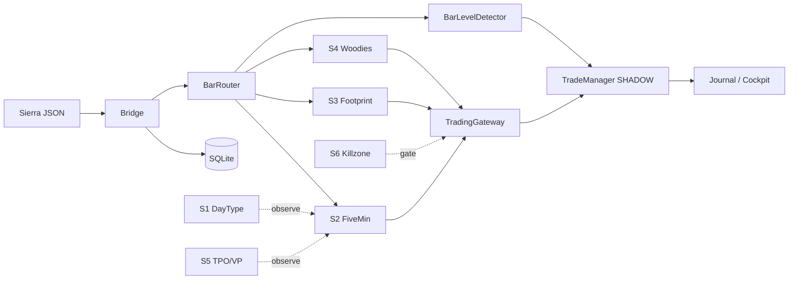

# P31 — מטריצת תבניות, כניסה אוטונומית וסטופים

**מטרה:** לוודא שהמערכת **מבינה** כל תבנית, **מזהה** אותה, **נכנסת** לבד (Gateway → SHADOW), **יוצאת** לבד (BarLevelDetector + TradeManager).

**מקורות קוד:** `pattern_engine.py` · `chart_5min/patterns/` · `woodies/decision_tree.py` · `five_min_system.py` · `footprint_system.py` · `trading_gateway.py` · `bar_level_detector.py`

---

## 0. זרימה אוטונומית (שישה חלקים)



| שלב | מי | אוטונומי? | מה קורה |
|-----|-----|-----------|---------|
| 1 | Sierra DLL | — | כותב OHLC, CCI, footprint… |
| 2 | Bridge | ✅ | POST ל-`/api/v9/bars/*` |
| 3 | מערכת יורה (S2/S3/S4) | ✅ אם ברים מגיעים | בונה `setup` + `pattern_id` |
| 4 | Gateway | ✅ | `route_setup` → SHADOW (כמעט תמיד) |
| 5 | TradeManager | ✅ | `accept_setup` + `on_fill` |
| 6 | BarLevelDetector | ✅ **רק אם** BarRouter מקבל **עדכוני** 5min | T1/T2/T3 + stop + time-stop |

**חוסם ידוע היום:** `bars.py` — BarRouter רק על **INSERT** → S2/BLD לא רואים בר חי → יציאות אוטומטיות עלולות לא לרוץ גם אם נכנסת ידנית.

---

## 1. מערכות ש**יורות** (FIRE) — תבניות לזיהוי

### S4 — Woodies CCI (`woodies_system.py` + `pattern_engine.py`)

| pattern_id | קבוצה | כיוון | מינימום ברים | סטופ (בדיטקטור) | T1/T2/T3 | קובץ |
|------------|--------|--------|--------------|-----------------|----------|------|
| ZLR | CONTINUATION | LONG/SHORT | ≥3 | per pattern | targets[] | `patterns/zlr.py` |
| TLB | CONTINUATION | LONG/SHORT | ≥3 | per pattern | targets[] | `patterns/tlb.py` |
| TT | CONTINUATION | LONG/SHORT | ≥3 | per pattern | targets[] | `patterns/tt.py` |
| GB100 | CONTINUATION | LONG/SHORT | ≥3 | per pattern | targets[] | `patterns/gb100.py` |
| **VEGAS** | REVERSAL | LONG/SHORT | **≥20** | 12 ticks (3 נקודות MES) | 16 / 32 ticks | `patterns/vegas.py` |
| GHOST | REVERSAL | LONG/SHORT | ≥3 | per pattern | targets[] | `patterns/ghost.py` |
| FAMIR | REVERSAL | LONG/SHORT | ≥3 | per pattern | targets[] | `patterns/famir.py` |
| HTLB | REVERSAL | LONG/SHORT | ≥3 | per pattern | targets[] | `patterns/htlb.py` |
| HFE | REVERSAL | LONG/SHORT | ≥3 | per pattern | targets[] | `patterns/hfe.py` |

**שערי כניסה אוטונומית (לפני Gateway):** עץ החלטות 21 שלבים — `ready_to_route=true` רק אם:

- `patterns` לא ריק (A3)
- `sizing != "reject"`
- אין `failed_stages` (A1 trend, A2 studies, A5 aux, A6 entry class, A7 pre_fire…)
- A4 touchpoints — לעיתים **PENDING** (לא חוסם לבד)

**בדיקה:** `GET /api/v9/woodies/current` → `active_patterns`, `failed_stages`, `ready_to_route`, `last_route`.

---

### S2 — Five Min (`chart_5min` + `five_min_system.py`)

| pattern (classification) | סוג | כיוון | תלות |
|--------------------------|-----|--------|------|
| reactive_buyer / reactive_seller | micro | LONG/SHORT | ברים 5min + detector |
| initiative_buyer / initiative_seller | micro | LONG/SHORT | idem |
| bull_flag, bear_flag, bull_pennant, bear_pennant | chart | LONG/SHORT | ≥N ברים ב-buffer |
| double_top, double_bottom | chart | SHORT/LONG | idem |
| ascending/descending_triangle, H&S, wedges, cup_handle… | chart | per detector | `chart_5min/patterns/*.py` |

**כניסה:** `_try_fire` → `emit_t1_setup` → `pre_fire_validator` → `gateway.route_setup` (system_id=2).

**תלות חיצונית:** COT/AMT מ-**Footprint** (S3), Day Type (S1), **BarRouter `"5min"`** חי.

**בדיקה:** `GET /api/v9/five_min/current` → `last_pattern`, `mode`, `buffer_size`.

---

### S3 — Footprint (`footprint_system.py`)

| סיווג | תפקיד | כניסה |
|--------|--------|--------|
| cluster / empty / OTF / confluence | זיהוי הקשר | `process_bar` → classification |
| T3 fire (כשמוגדר) | FIRE | `route_setup` system_id=3 |

**בדיקה:** `GET /api/v9/footprint/current` → `last_pattern`, `last_classification`.

---

## 2. מערכות **צופות** (לא יורות) — הקשר לכניסה

| מערכת | מה מספק לזיהוי | API |
|--------|----------------|-----|
| **S1** Day Type | time-stop, chop, opening | `/api/v9/day_type/current` |
| **S5** TPO/VP | POC, VA, location | `/api/v9/tpo/current` |
| **S6** Killzone | GATE — חוסם Gateway | `/api/v9/killzone/current` |

---

## 3. טבלת סטופים ויציאות (אוטונומי)

### 3.1 סטופ ראשוני (בכניסה)

| מקור | איך נקבע `stop` | שדות ב-setup |
|------|------------------|--------------|
| Woodies pattern | `PatternResult.stop` (למשל VEGAS: entry ± 12 ticks) | `stop`, `t1`,`t2`,`t3` מ-targets |
| Five Min | `stop_price` מ-detector + emitter | `stop`, `t1`, `t2` (t3=0 נפוץ) |
| Footprint | payload ל-Gateway | לפי מימוש ב-S3 |

### 3.2 יציאות אוטומטיות על כל עסקה פתוחה (`BarLevelDetector`)

| סוג יציאה | סדר | תנאי | מי מפעיל |
|-----------|-----|------|---------|
| **STOP** | 1 (קודם) | LONG: `bar.low <= stop` · SHORT: `bar.high >= stop` | `on_stop_hit` |
| **T1** | 2 | מחיר מגיע ל-`t1` | `on_target_hit(1)` |
| **T2** | 3 | אחרי T1, מחיר ל-`t2` | `on_target_hit(2)` |
| **T3** | 4 | אחרי T2, מחיר ל-`t3` | `on_target_hit(3)` |
| **Time stop** | 5 | לפי Day Type (דקות) | `close_trade` |
| **EOD** | 6 | Gateway EOD | `gateway.eod` |

**Time-stop לפי Day Type (דקות):**

| Day Type | דקות |
|----------|------|
| TREND_NORMAL | אין |
| VARIATION | 60 |
| NORMAL | 30 |
| TREND_DD | 90 |
| NEUTRAL | 45 |
| NONTREND | 20 |

### 3.3 אחרי T1 (TradeManager — B2 Smart-BE)

| מצב | התנהגות |
|-----|----------|
| T1 הותקף | סטופ לרווח מינימלי / break-even (לפי מימוש TM) |
| STOP אחרי T1/T2 | P&L לפי C1/C2 נשאר + יתרה לסטופ (**P31-01**) |

---

## 4. Gateway — למה "לא זיהתה תבנית" ב-UI?

ה-UI **לא מזהה** — הוא **מציג** מה שנשמר ב-`v9_trades` + `trade_context`:

| תסמין ב-UI | סיבה אפשרית | איפה לבדוק |
|------------|-------------|------------|
| `pattern` / `trigger` ריק | לא היה `classification` ב-setup או לא נשמר ב-quality | `trade_context.py` |
| אין עסקה בכלל | `ready_to_route=false` או `blocked_by` | `woodies/current` → `last_route`, `failed_stages` |
| עסקה בלי VEGAS | דיטקטור לא מצא divergence (צריך ≥20 ברים Woodies) | `active_patterns` ריק |
| S2 לא ירה | BarRouter / footprint / buffer | P31-02 |
| נכנס אבל לא יוצא | BarLevelDetector לא מקבל 5min updates | P31-02 INSERT-only |

---

## 5. מה עושים עכשיו — סדר עבודה (P31)

| סימון | משימה | מטרה |
|--------|--------|------|
| `[ ]` | **P31-PAT-1** אימות "המערכת מבינה" | CC: dump `woodies/current` + `five_min/current` בזמן תבנית ב-Sierra |
| `[ ]` | **P31-PAT-2** השוואת VEGAS | על גרף: האם `active_patterns` מכיל VEGAS? אם לא — למה (failed_stages / buffer) |
| `[ ]` | **P31-02** BarRouter UPDATE | בלעדי זה אין יציאה אוטונומית אמינה |
| `[~]` | **P31-01** P&L אחרי יציאה | אחרי שיש סגירה אוטומטית |

### CC — P31-PAT-1 (הדבק)

```text
בזמן ש-Michael רואה תבנית ב-Sierra (למשל VEGAS):

curl -s http://127.0.0.1:8000/api/v9/woodies/current | python3 -m json.tool | head -80
# חפש: active_patterns, ready_to_route, failed_stages, last_route, decision_tree

curl -s http://127.0.0.1:8000/api/v9/five_min/current | python3 -m json.tool
curl -s http://127.0.0.1:8000/api/v9/footprint/current | python3 -m json.tool | head -40
curl -s http://127.0.0.1:8000/api/v9/cockpit/systems-snapshot | python3 -m json.tool

החזר טבלה: מערכת | pattern ב-API | ready_to_route | blocked_by | המלצה
```

---

## 6. קישורים

- [`P31_TASK_BOARD.md`](./P31_TASK_BOARD.md) — גאנט + סימונים `[ ]/[~]/[x]`
- [`P30_ROAD_START_TO_LIVE.md`](../reports/P30_ROAD_START_TO_LIVE.md)
- [`docs/architecture/for_designer/00_README.md`](../architecture/for_designer/00_README.md) — מילון מונחים
