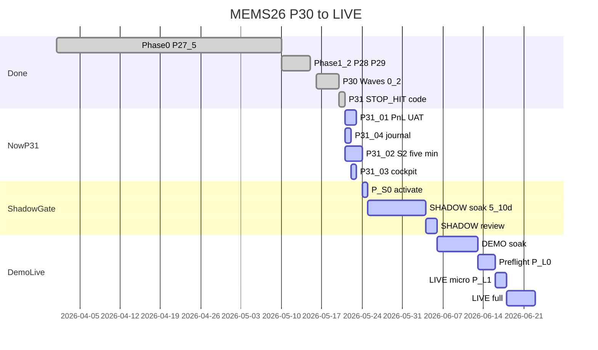
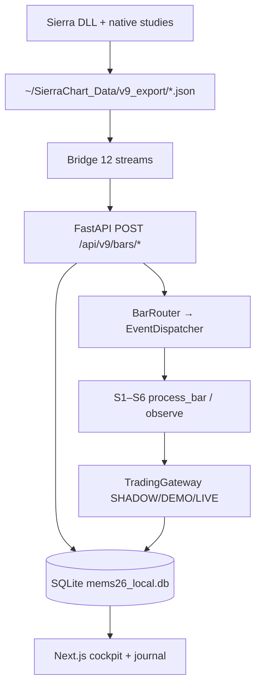

# P31 — לוח עבודה (מעודכן 2026-05-21 בוקר)

**מטרה:** יומן SHADOW עם P&L נכון (כניסה + C1/C2/C3 + סטופ), מערכת 5 דקות רצה, קוקפיט מעודכן תמיד — **ואז** gate ל-SHADOW soak → DEMO → LIVE.

**כל סשן:** עדכן סטטוס כאן לפני/אחרי כל משימה. זה המקור היחיד ל"מה לעשות מחר".

**פתיחה:** אמור **בוקר טוב** / **צהריים טובים** / **ערב טוב** — הסוכן מעדכן את [§0](#0-ברכה--מיקום-עכשיו) ואת [§1](#1-גאנט-עד-live) באותו קובץ.

---

## 0. ברכה + מיקום עכשיו

| שדה | ערך |
|-----|-----|
| **ברכה אחרונה** | ☀️ **צהריים טובים** — 2026-05-21 |
| **נקודת ציון** | **P31 P0** — קוד journal/excursion/legs ירוק; ממתין UI eyeball + RTH ל-S2/PAT |
| **אחוז גס ל-LIVE** | ~**60%** תשתית (P30 + P31 code complete) · **0%** SHADOW soak רשמי · **0%** LIVE |
| **הצעד הבא** | **המתנה ל-pattern fire חי** כדי לאמת trade insert סוף-לסוף; בינתיים: Michael בעין על `localhost:3000/journal` + trade 697 · CC §9 Option A (DLL canonical fix — לא דחוף) |

```
P30 baseline ✅ ──► P31 P0 ◄── אתה כאן ──► SHADOW soak ⬜ ──► DEMO ⬜ ──► LIVE ⬜
```

**סימון משימות (מעדכן הסוכן אחרי כל שלב):** `[ ]` לא · `[~]` בתהליך · `[x]` הושלם

**סטטוס מהיר (עדכון שירותים)**

| רכיב | סטטוס | הערה |
|------|--------|------|
| Backend `:8000` | 🟢 | uvicorn PID **89458** (Cursor 16:18 restart; טען §10 json_serializer + cherry-pick 3ed6a84 thread-leak fix). FiveMin SLOW + Woodies SLOW + JSON errors **כולם נעלמו** |
| Frontend `:3000` | 🟢 | next dev PID 31297 — מקבל 200 |
| Bridge | 🟢 | `python3 bridge/json_bridge.py` (PID 60596) — כל 12 הזרמים פעילים · §9 workaround פעיל (Chicago→UTC) |
| **Sierra stream** | 🟢 | **§8 sub-RESOLVED 14:40:** Sierra חי (Chicago TZ). **§9 bridge workaround פעיל** (Cursor 14:55) — DB ts תואם זמן אמת ✓. CC לעבור ל-Option A (DLL canonical fix) — לא דחוף |
| P&L ב-DB (`TradeManager`) | 🟢 | Smart-BE + `initial_stop`; trade 697 ✅; ממתין עסקה נוספת ב-RTH |
| Journal `/trades/log` | 🟢 | **0.02s** / 21 rows `limit=50` (Cursor 2026-05-21 צהריים) · trade 697 API=DB=$56.25 ✅ · range/legs/MFE/MAE/duration מוחזרים ✅ |
| **מערכת 5 דקות (S2)** | 🟢 | **§6 RESOLVED 15:55 (Other Chat):** commits `12b376f` + `0f5960d` החליפו HTTP self-calls ב-in-process refs. SLOW handler 8000ms → 62-231ms (mean 106ms = **75× faster**). אומת live ב-PID 82330 |
| **Woodies (S4)** | 🟢 | **§10 RESOLVED 16:18 (Cursor):** root cause לא HTTP self-calls אלא SQLAlchemy JSON encoder ש-failed על datetime ב-`quality.metadata`/`cross_context`. תיקון: `_json_serializer` עם `default=str` ב-`db/session.py`. SLOW 18s → **62.9ms** (290× faster). 0 שגיאות JSON. ראה §10 |
| **Bar Router thread leak** | 🟢 | **P31-02c RESOLVED 16:18:** cherry-pick `43f5399` → commit `3ed6a84` — `publish_threadsafe` משתמש ב-`run_coroutine_threadsafe`. בטוח עכשיו כי §6+§10 הסירו את ה-blocking. test PASS |
| לוח עבודה זה | 🟢 | גאנט + מפקח נתונים — §1–§3 |

---

## 1. גאנט עד LIVE

**מקור שלבים:** [`docs/reports/P30_ROAD_START_TO_LIVE.md`](../reports/P30_ROAD_START_TO_LIVE.md) · **משימות יומיות** = **P31-xx** (סעיף [P0](#p0--היום-לפני-מסחר) למטה).

**מה הסעיף:** ציר זמן אחד מ-Phase 0 עד LIVE — גרף (אם נטען) + טבלה (תמיד).

| P30 Road (Phase) | שורה בגאנט | P31 (יומי) | סטטוס היום |
|------------------|------------|------------|------------|
| 0 P27.5 | Phase0 P27_5 | — | ✅ |
| 1–2 P28/P29 | Phase1_2 | — | ✅ |
| P30 Waves + D-088 | P30 Waves 0_2 | — | ✅ |
| — | P31 STOP_HIT code | קוד בלבד | ✅ |
| **לפני P-S0** | **NowP31** | **P31-01..04** | **🟡 פעיל** |
| 5 P-S0 | P_S0 activate | אחרי P31 | ⬜ |
| 6 SHADOW soak | SHADOW soak | — | ⬜ |
| 7–8 DEMO | DEMO soak | — | ⬜ |
| 9–11 LIVE | Preflight → LIVE full | — | ⬜ |



*תרגום סעיפים: Done · NowP31 · ShadowGate · DemoLive — פירוט בטבלה*

**Sierra — מקרא (עמודה קצרה):**

| סימון | מתי Sierra חייבת |
|--------|------------------|
| **לא** | קוד / pytest / DB / curl — Sierra יכולה להיות סגורה |
| **אופצ** | אפשר בלי Sierra (נתונים ישנים ב-DB); ל-UAT מלא עדיף פתוחה |
| **RTH** | Sierra **פתוחה** + Study `MES_AI_DataExport` על גרף MES + **שעות מסחר RTH** (≈09:30–16:15 ET) |
| **RTH+** | כמו RTH + **Bridge + backend** + קבצי `v9_export` מתעדכנים (במיוחד `5min`, `footprint`, `live_price`) |
| **Sim** | Sierra במצב **Simulation** + round-trip פקודות |
| **LIVE** | Sierra מחוברת לחשבון **LIVE** + אותה בדיקת RTH |

*מינימום Sierra כשחובה:* אפליקציה רצה → גרף MES עם DLL (Input 4 = `~/SierraChart_Data/v9_export/`) → Native studies לפי D-013 (TPO/CVD/IB) → שוק לא במצב "סגור".

| שלב (גאנט) | מה עושים | סטטוס | Sierra | הערה |
|------------|----------|--------|--------|------|
| **Done** | | | | |
| Phase 0 P27.5 | תקינות DB/ברים, `live_price`, dedupe | ✅ | RTH | אימות אחרון היה עם Sierra כותבת |
| Phase 1–2 P28/P29 | Replay + scenario pack, Gateway | ✅ | **לא** | Replay מקובץ — בלי שוק חי |
| P30 Waves 0–2 | GW, S1, TPO, D-088 | ✅ | RTH+ | DLL + bridge בזמן אמת |
| P31 code STOP_HIT | תיקון P&L בקוד | ✅ | **לא** | pytest בלבד |
| **Now P31** | | | | |
| P31-01 PnL UAT | סגירת SHADOW → DB=curl=UI | 🟡 `[~]` | **RTH+** | אתר עלה; ממתין סגירת עסקה |
| P31-04 journal | `limit=50`, מהירות log | 🟡 `[ ]` | **לא** | limit בקוד `[x]` · latency `[ ]` |
| P31-02 S2 | BarRouter UPDATE + 5min | 🔴 | **RTH+** | `5min.json` חי; בלי Sierra אין אבחון אמיתי |
| P31-03 cockpit | trigger/pattern ב-UI | ⬜ | אופצ / **RTH** | צפייה ב-DB=אופצ; עסקה פעילה חיה=RTH+ |
| **Shadow gate** | | | | |
| P-S0 | הפעלת מצב SHADOW | ⬜ | **RTH+** | וידוא 6 מערכות עם נתונים חיים |
| SHADOW soak | ≥20 עסקאות, 4h ירוק | ⬜ | **RTH** כל יום מסחר | כל יום RTH: Sierra+Bridge+Backend |
| SHADOW review | סקירת logs / P&L | ⬜ | **לא** | אחרי השוק — ניתוח offline |
| **Demo → LIVE** | | | | |
| DEMO soak | Sierra Sim + פקודות | ⬜ | **Sim** + RTH | `trade_command.json` |
| Pre-flight P-L0 | kill-switch, Registry §18 | ⬜ | אופצ + **RTH** | בדיקת קצה יום מסחר אחד |
| LIVE micro P-L1 | 1 חוזה, יום אחד | ⬜ | **LIVE** + RTH | |
| LIVE full | ייצור | ⬜ | **LIVE** + RTH | D-067 lift |

---

## 2. מפקח: איך 6 המערכות עובדות בזמן אמת

**כלל זהב (pre-LIVE):** Sierra JSON → Bridge → `localhost:8000` → SQLite → REST/WS → Frontend. **אין** סינתזת OHLC/TPO/CVD ב-backend לתצוגה.



| מערכת | תפקיד | מצב זמן אמת | איך לפקח (בוקר) |
|-------|--------|-------------|------------------|
| **S1** Day Type | OBSERVE | poll ~10s | `GET /api/v9/day_type/current` |
| **S2** Five Min | **FIRE** | BarRouter `"5min"` | `GET /api/v9/five_min/current` + לוג S2 |
| **S3** Footprint | **FIRE** | footprint + tick rev | `GET /api/v9/footprint/current` |
| **S4** Woodies CCI | **FIRE** | `woodies_5min` | `GET /api/v9/woodies/current` |
| **S5** TPO / VP | OBSERVE | `tpo.json` / VP | `GET /api/v9/tpo/current` + mtime קובץ |
| **S6** Killzone | GATE | poll ~5s | `GET /api/v9/killzone/current` |

**CC — בדיקת בריאות 6 מערכות (הדבק לטרמינל מלא):**
```text
בדוק בוקר P31: curl -s http://127.0.0.1:8000/api/v9/cockpit/systems-snapshot | python3 -m json.tool
curl -s http://127.0.0.1:8000/api/v9/health/streams | python3 -m json.tool
pgrep -fl uvicorn; pgrep -fl json_bridge
tail -20 /tmp/bridge.log; tail -20 /tmp/backend.log
```

---

## 3. מפקח: איזה נתונים נאספים

### 3.1 12 זרמי Bridge → DB

| Stream | קובץ JSON | POST API | מערכות |
|--------|-----------|----------|--------|
| `live_price` | `live_price.json` | (מסלול נפרד) | TopBar, Chart |
| `bars_5min` | `5min.json` | `/api/v9/bars/5min` | **S2**, S4, S5 |
| `woodies_5min` | `woodies_5min.json` | `/api/v9/bars/woodies_5min` | **S4** |
| `woodies_30min` | `woodies_30min.json` | `/api/v9/bars/woodies` | S4 |
| `footprint` | `footprint.json` | `/api/v9/bars/footprint` | **S3** |
| `tick_reversal_15` | `tick_reversal_15.json` | `/api/v9/bars/tick_reversal?tick_count=15` | S3 |
| `tick_reversal_12` | `tick_reversal_12.json` | `/api/v9/bars/tick_reversal?tick_count=12` | S3 |
| `cumulative_delta` | `cumulative_delta.json` | `/api/v9/bars/cumulative_delta` | S2, S3 |
| `volume_profile` | `volume_profile.json` | `/api/v9/bars/volume_profile` | S5 |
| `tpo` | `tpo.json` | `/api/v9/bars/tpo` | S5 |
| `imbalance_flags` | `imbalance_flags.json` | `/api/v9/bars/imbalance` | S3 |
| `stacked_imbalances` | `stacked_imbalances.json` | `/api/v9/bars/stacked_imbalance` | S3 |

**CC — טריות קבצים + DB (הדבק):**
```text
ls -la /Users/michael/SierraChart_Data/v9_export/{5min,footprint,woodies_5min,tpo,live_price}.json
sqlite3 /Users/michael/Downloads/mems26_web_git/data/mems26_local.db "
SELECT '5min', COUNT(*), MAX(ts) FROM v9_bars_5min WHERE symbol='MES';
SELECT 'footprint', COUNT(*), MAX(ts) FROM v9_bar_footprint;
"
curl -s http://127.0.0.1:8000/api/v9/health/streams
```

### 3.2 נתוני מסחר / יומן (נפרד מברים)

| מה | איפה נשמר | מי כותב |
|----|-----------|---------|
| עסקאות SHADOW | SQLite `v9_trades` | `TradeManager` + `ShadowExecutor` |
| P&L | `pnl_usd` בעסקה | `TradeManager` בסגירה |
| Reason tree | signals / audit | Gateway + systems |
| Journal UI | קורא `/trades/log` | **לא מחשב** — רק מציג DB |

---

## 4. החלטה פתוחה: Local vs Render / Upstash / GitHub

| אפשרות | היום (P31) | הערה |
|--------|------------|------|
| **Local truth** | ✅ **מחייב** | Bridge → `http://localhost:8000` בלבד (`base_stream.py` חוסם cloud) |
| **Upstash Redis** | 🟡 אופציונלי | Bridge *יכול* לדחוף; pre-LIVE לא חוסם אם ריק |
| **Render / cloud API** | 🔴 **לא** לנתוני זמן אמת | שריד מהאתר הקודם — לא לערבב עם מסלול Sierra |
| **GitHub** | ⬜ Michael מכין | branches / CI — לא משנה מסלול realtime |

**עקרון להחלטה:** נתוני שוק = תמיד Sierra → local DB. Render/Upstash רק אם מוגדר מפורש כ-mirror/גיבוי — לא מקור אמת לקוקפיט.

---

## P0 — היום (לפני מסחר)

**סימון:** `[ ]` לא · `[~]` בתהליך · `[x]` הושלם — הסוכן מעדכן אחרי כל משימה.

| סימון | משימה | Sierra |
|--------|--------|--------|
| `[x]` | **OPS** bring-up 8000+3000 | לא |
| `[~]` | **P31-01** P&L UAT | RTH+ · קוד+DB+API ירוק (trade 697 $56.25) · ממתין Michael בעין ב-`/journal` + Exit חדש ב-RTH |
| `[~]` | **P31-04** journal מהיר | לא · latency 0.02s ✅ · range/MFE/MAE/legs ב-API ✅ · ממתין Michael בעין ב-UI |
| `[~]` | **P31-02** S2 — BarRouter UPDATE בקוד | restart + RTH UAT |
| `[~]` | **P31-03** cockpit SHADOW | ActiveTradeCard כבר מציג pattern/trigger + C1–C3 — Michael: `localhost:3000` |
| `[ ]` | **P31-PAT** תבניות + סטופ אוטונומי | RTH+ · [מטריצה](./P31_PATTERN_STOP_AUTONOMY_MATRIX.md) |
| `[~]` | **P31-05** עמודות C1/C2/C3 ביומן | `[x]` טבלה + API `initial_stop` · `[ ]` UAT אחרי restart |

**אם "לא זיהתה תבנית"** → קודם [P31-PAT-1](./P31_PATTERN_STOP_AUTONOMY_MATRIX.md#5-מה-עושים-עכשיו--סדר-עבודה-p31) (האם `active_patterns` / `failed_stages` ב-API), לא עיצוב UI.

### בלי שוק / בלי תבנית על הלוח — אפשר **עכשיו**

| סימון | משימה | מי |
|--------|--------|-----|
| `[~]` | **P31-02** BarRouter UPDATE (קוד) | Cursor — בוצע; צריך restart backend + UAT ב-RTH |
| `[x]` | **OPS** backend `:8000` | PID **45069** — Cursor restart 2026-05-21 |
| `[~]` | **P31-04** `time curl /trades/log?limit=50` | CC (אחרי restart) |
| `[ ]` | **P31-03** קוקפיט על נתונים ישנים ב-DB | Michael — `localhost:3000` |
| `[ ]` | **P31-08** דוח CC | CC |
| `[ ]` | סנכרון [P30 Road](../reports/P30_ROAD_START_TO_LIVE.md) → "אתם ב-P31" | Cursor |

**ממתין ל-RTH:** P31-01 · P31-PAT · S2 יורה · VEGAS ב-Sierra

---

## חלוקת עבודה — עד שיש תבנית על הלוח

**עקרון:** שלושה פסים במקביל. **שער RTH** = רק כשיש שוק + תבנית — לא לחסום את השאר.

| פס | מתי | מי | מה |
|----|-----|-----|-----|
| **A — שער RTH** | 09:30–16:15 ET, תבנית ב-Sierra | **Michael** + CC | P31-01, P31-PAT, S2 UAT — **רצף קצר בבוקר מסחר** |
| **B — תשתית (בלי שוק)** | עכשיו | **CC** | OPS יציב, journal latency, דוח P31-08, bridge errors↓ |
| **C — קוד (בלי שוק)** | עכשיו | **Cursor** | P31-04 backend index?, P31-05 תכנון, P30 Road sync, בדיקות pytest |
| **D — החלטות / אסטרטגיה** | כשמתאים | **Michael** | GitHub/Render/Upstash, אישור תיקונים, עדיפות P1 |

### CC — רשימת עבודה (העתק כשאין שוק)

1. `start_all.sh` + אימות 8000/3000 יציבים 30 דק'
2. `time curl /trades/log?limit=50` — רשום שניות
3. `grep -c "Connection refused" /tmp/bridge.err.log` לפני/אחרי
4. טיוטה `docs/reports/PROMPT_P31_JOURNAL_PNL_AND_S2.md` (מצב ידוע, בלי UAT RTH)
5. **לא** לשנות DLL / LaunchAgent / CLOUD_URL

### Cursor — רשימת עבודה (בלי שוק)

1. `[x]` BarRouter UPDATE + test
2. `[x]` P31-05 — עמודות C1/C2/C3 ב-`journal/page.tsx` + `initial_stop` ב-journal API
3. `[x]` TradeManager — `initial_stop` אחרי smart-BE; `pnl_r` על סטופ מקורי (61 pytest)
4. `[x]` עדכון `P30_ROAD_START_TO_LIVE.md` → נקודת ציון P31
5. `[ ]` אינדקס / query ל-`/trades/log` רק אם CC מדווח >5s אחרי restart
6. **לא** לפתוח נושא חדש (Redis, עיצוב קוקפיט) בלי אישור

### Michael — רשימה (בלי שוק)

1. Journal + קוקפיט על **היסטוריה** (P31-03) — `localhost:3000`
2. GitHub / branch — כשמוכן
3. **ב-RTH:** תבנית אחת → "VEGAS עכשיו" → CC-PAT-1 → סגירת SHADOW → P31-01

### לפני פתיחת RTH (~09:30 ET) — רצף מומלץ

| # | מי | פעולה | Sierra |
|---|-----|--------|--------|
| 1 | **CC** | CC-B: restart backend + migration 016 + `time curl /trades/log?limit=50` | לא |
| 2 | **Michael** | `Cmd+Shift+R` → `/journal` + קוקפיט — היסטוריה (P31-03) | אופצ |
| 3 | **CC** | CC-A: `systems-snapshot` + `health/streams` + mtime `5min.json` | אופצ |
| 4 | **Michael** | Sierra פתוחה, DLL, Bridge ירוק | **RTH+** |
| 5 | **Michael+CC** | תבנית אחת → CC-PAT-1 → `route_setup` SHADOW → Exit → P31-01 curl | **RTH+** |
| 6 | **CC** | CC-C: S2 `five_min/current` + לוג BarRouter | **RTH+** |

אחרי #1–#6 וארבעת תנאי P0 ירוק → **P-S0** (Michael sign-off).

### מתי חוזרים ל"P0 ירוק"

| תנאי | חובה |
|------|------|
| P31-04 | curl &lt; ~5s |
| P31-02 | restart + לפחות בר 5min אחד עבר ל-S2 (לוג) |
| P31-01 | עסקה אחת T1→stop, P&L תואם |
| P31-PAT | `active_patterns` תואם Sierra (פעם אחת) |

אחרי ארבעת אלה → P1 (05–08) → P-S0 soak.

---

### `[x]` OPS — האתר עולה

- [x] Backend `:8000` HTTP 200
- [x] Frontend `:3000` HTTP 200
- [ ] Bridge: שגיאות `Connection refused` ב-`/tmp/bridge.err.log` יורדות (CC)

---

### `[~]` P31-01 — אימות P&L ביומן

**Sierra:** **RTH+** בזמן סגירת עסקה (T1 → סטופ).

- [x] קוד `STOP_HIT` + pytest PASS
- [x] `POST /api/v9/trades/{id}/exit` → `TradeManager.close_trade` + pytest `test_trades_exit.py` PASS
- [x] Backend רץ
- [x] **restart backend** — PID **45069** (2026-05-21 ~14:00 ET)
- [x] עסקת SHADOW אחת סגורה — **trade 697** (LONG · entry 7429.25 · T1+T2 · exit `manual` · DB `pnl_usd=56.25`)
- [x] `curl /trades/log?types=shadow&limit=50` ↔ DB (trade 697 `pnl_usd=56.25` תואם · 21 rows · 0.02s) — Cursor 2026-05-21 צהריים
- [ ] Journal UI — Michael בעין על `/journal` ו-`/trades` (trade 697 — Hi 7446.75, Lo 7426.25, MFE 17.5, MAE 3.0, ENTRY/T1/T2/EXIT)
- [ ] עסקה שנייה סגורה ב-RTH (T1 → סטופ אמיתי) לחיזוק UAT

---

### `[~]` P31-04 — Journal מהיר + נכון

**Sierra:** **לא**

- [x] `limit=50` ב-`journal/page.tsx`
- [x] SQL: סינון `mode` לפני `LIMIT`; `load_only` בלי `cross_context` (~25KB/שורה)
- [x] אינדקס `ix_v9_trades_mode_entry_ts` — migration `016_v9_trades_journal_index.sql`
- [x] pytest `test_journal_compat_sql.py` PASS (3) + `test_journal_compat_routes.py` (2) + `test_journal_excursion.py` (1)
- [x] שירות חדש `trade_excursion.py` — `price_high/low`, `mfe_pts/mae_pts`, `t1_closest_pts`, חלון 5m bars; query אחת לכל הרשימה (`prefetch_bars_for_trades`)
- [x] שירות חדש `trade_legs.py` — `ENTRY/T1/T2/T3/STOP/EXIT` ממויינים לפי ts
- [x] שירות מורחב `trade_context.py` — `compute_trade_pnl` עם `pnl_mode=closed/partial/open` + `contracts_pnl`
- [x] עמודות חדשות ב-`/journal` UI — `Hi/Lo` בטבלה, `MAE/MFE` עם `—` כשאין נתונים, מודל פירוט עם Range Hi/Lo + בלוק רגליים
- [x] `time curl …/trades/log?limit=50` post-restart — **0.02s** · 21 rows · trade 697 כולל range+legs (Cursor 2026-05-21 צהריים)
- [ ] UI לא ריק; Michael בעין — שורת trade 697 + לחיצה למודל

---

### `[~]` P31-02 — S2 חמש דקות

**Sierra:** **RTH+** ל-UAT ירי; הקוד לא דורש שוק

- [x] תיקון `bars.py` — BarRouter על UPDATE (לא רק INSERT)
- [x] regression: `test_post_5min_routes_bar_on_update`
- [x] restart backend — PID **45069**
- [ ] CC-C: `five_min/current` + לוג S2 ב-RTH
- [ ] UAT: S2 יורה + BarLevelDetector סוגר עסקאות

---

### `[ ]` P31-03 — קוקפיט SHADOW

- [ ] `Cmd+Shift+R` → `http://localhost:3000/`
- [ ] ActiveTradeCard + `/trades` Pattern/Trigger

---

### `[ ]` P31-PAT — תבניות + כניסה/יציאה אוטונומית

**מטריצה מלאה:** [`P31_PATTERN_STOP_AUTONOMY_MATRIX.md`](./P31_PATTERN_STOP_AUTONOMY_MATRIX.md)

- [ ] CC-PAT-1: בזמן תבנית ב-Sierra — `woodies/current` מראה `active_patterns`?
- [ ] אם ריק: רשום `failed_stages` (A1/A3/A6/A7) + `buffer_size`
- [ ] VEGAS דורש **≥20** ברים Woodies — לא 5 ברים
- [ ] אחרי זיהוי: `route_setup` → SHADOW; יציאה = BarRouter 5min (תלוי P31-02)

---

## P1 — אחרי P0 ירוק

| ID | משימה | תלות |
|----|--------|------|
| P31-05 | יומן: C1/C2/C3 + סטופ בעמודות | P31-01 |
| P31-06 | `quality` + trigger UAT | P31-01 |
| P31-07 | Smart-BE P&L | P31-01 + stop |
| P31-08 | דוח: [`docs/reports/PROMPT_P31_JOURNAL_PNL_AND_S2.md`](../reports/PROMPT_P31_JOURNAL_PNL_AND_S2.md) `[x]` (Cursor 2026-05-21 צהריים) — מתעדכן אחרי UAT חי שני | סוף יום |

---

## P2 — תשתית

| ID | משימה |
|----|--------|
| P31-09 | קוקפיט קורא לוח זה (API או markdown) |
| P31-10 | Poller אחד ל-trades |
| P31-11 | Redis — לא חוסם |

---

## 5. פרומפטים ל-Claude Code (העתקה)

### CC-A — בוקר: מצב שירותים + 6 מערכות + נתונים
```text
MEMS26 P31 בוקר — אל תשנה קוד.

1) lsof -i :8000 -i :3000; pgrep -fl uvicorn; pgrep -fl json_bridge
2) curl -s http://127.0.0.1:8000/api/v9/cockpit/systems-snapshot | python3 -m json.tool
3) curl -s http://127.0.0.1:8000/api/v9/health/streams | python3 -m json.tool
4) ls -la ~/SierraChart_Data/v9_export/{5min,footprint,woodies_5min,tpo,live_price}.json
5) sqlite3 /Users/michael/Downloads/mems26_web_git/data/mems26_local.db "SELECT COUNT(*), MAX(ts) FROM v9_bars_5min WHERE symbol='MES';"
6) tail -40 /tmp/bridge.log; tail -40 /tmp/backend.log

החזר טבלה: שירות | up/down | streams pushes | 5min MAX(ts) | S2 state אם יש.
```

### CC-B — restart + P31-01 + P31-04 (העתק ל-CC)
```text
MEMS26 P31 — restart backend + UAT. אל תשנה קוד.

1) lsof -i :8000; pkill -f "uvicorn backend.main" 2>/dev/null; sleep 1
2) cd /Users/michael/Downloads/mems26_web_git && export DATABASE_URL=sqlite:///./data/mems26_local.db
   nohup python3 -m uvicorn backend.main:app --host 127.0.0.1 --port 8000 >> /tmp/backend.log 2>&1 &
   sleep 3; curl -s -o /dev/null -w "health=%{http_code}\n" http://127.0.0.1:8000/api/v9/health

3) time curl -s "http://127.0.0.1:8000/trades/log?types=shadow&limit=50&min_score=0" | python3 -c "import sys,json; d=json.load(sys.stdin); print('rows',len(d))"

4) sqlite3 data/mems26_local.db < backend/v9/db/migrations/versions/016_v9_trades_journal_index.sql

5) אחרי Michael לוחץ Exit בקוקפיט:
   sqlite3 data/mems26_local.db "SELECT id,state,exit_reason,pnl_usd FROM v9_trades WHERE mode='shadow' ORDER BY id DESC LIMIT 5;"

דוח: health | curl seconds | rows | האם Exit עדכן CLOSED+pnl_usd.
```

### CC-C — P31-02 אבחון S2 (10 דק')
```text
curl -s http://127.0.0.1:8000/api/v9/five_min/current | python3 -m json.tool
grep -E "FiveMin|bars_5min|S2|BarRouter" /tmp/backend.log | tail -40
האם INSERT-only מסביר: pushes ל-5min בלי שורות חדשות ב-SQL?
```

### CC-D — דוח סוף יום P31-08
```text
כתוב docs/reports/PROMPT_P31_JOURNAL_PNL_AND_S2.md ממצאי CC-A/B/C + UAT צירים (quality/recency/cardinality/latency).
```

---

## מה הסוכנים מצאו

**2026-05-20:** journalApi; STOP_HIT P&L; task board.  
**2026-05-21 בוקר:** גאנט + מפקח §2–3; pytest STOP_HIT PASS; BarRouter INSERT-only מאושר בקריאה.  
**2026-05-21 צהריים (Cursor):** journal/excursion/legs/context הושלמו בקוד · 14 pytest PASS (`test_trade_excursion`, `test_trade_context`, `test_journal_excursion`, `test_journal_compat_sql`, `test_journal_compat_routes`) · 4 צירי UAT על `/trades/log` ירוקים (Quality DB↔API · Recency `MAX(id)=697` · Cardinality 21=21 · Latency 0.02s) · נמצא issue קוסמטי: מפתח כפול `day_type` ב-`_v9_row_to_journal` (תוקן באותו סשן).

### 🚨 §6 — `FiveMinSystem.process_bar` SLOW 8s + thread leak (synthetic firing 2026-05-21 14:13)

POST סינתטי `/api/v9/bars/5min` (UPDATE על `ts=2026-05-21 07:05`, אותם OHLC) חשף:

| ממצא | ראיה | חומרה |
|------|------|-------|
| BarRouter ניתב לבר (P31-02 code path) | `BarRouter: dispatch total ... for 5min` בלוג אחרי ה-POST | ✅ ירוק |
| `FiveMinSystem.process_bar` עקבי ~8s לבר | 16 SLOW warnings ב-4 דקות (8013–8062ms) | 🔴 חוסם פרה-LIVE |
| Thread leak | 93 threads ב-backend; `publish_threadsafe` ב-`bar_router.py:42` יוצר `threading.Thread` חדש שמריץ `asyncio.run()` לכל בר | 🔴 חוסם פרה-LIVE |
| Backend hung תחת עומס | `curl /api/v9/health` מ-CLI = `http=000 t=5.0s` ×3 ניסיונות; PID השתנה 45069→50472; frontend pool עובד עדיין | 🔴 |
| זרם נתונים שבור | `v9_woodies_signals` newest = 10:32 IL · `v9_bars_5min` newest = 10:15 IL · השעה עכשיו 14:25 IL | 🔴 4h שקט |

**Bridge state (טענה של CC):** רץ במצב `python3 json_bridge.py --bars-5min-only` (terminal 191521). לא שולח woodies/footprint/tpo בכלל.

**🔧 תיקון Cursor 2026-05-21 14:31 — הטענה הזו לא נכונה:**
```
ps -ww -p 79661  →  python3 bridge/json_bridge.py     (אין --bars-5min-only)
grep streams /tmp/bridge.err.log  →  כל 12 הזרמים פעילים:
  bars_5min, woodies_5min, woodies_30min, footprint, tpo,
  volume_profile, tick_reversal_12, tick_reversal_15,
  cumulative_delta, stacked_imbalances, imbalance_flags, live_price
pushes≈2018/stream · errors≈200/stream (כל timeout 8s עקב process_bar SLOW ואז retry מצליח)
```
המקור האמיתי לכך ש-DB לא מתעדכן הוא **Sierra עצמה לא מספקת ברים חדשים** (ראה §8 למטה). ה-bridge פולט את אותם ברים ישנים שוב ושוב — DB ה-upsert לא משנה `MAX(ts)`.

**מצב טיפול:**
- **CC (in progress):** bridge/backend recovery (חלק מההנחות שלו שגויות — ראה תיקון ↑)
- **Michael (action needed):** **לפתוח Sierra Chart ולוודא candle חי על MES 5min** — ראה §8
- **Cursor:** תיעוד §6 (process_bar SLOW) · §8 (Sierra stuck) · לא לגעת ב-bridge/LaunchAgent

### §6.1 — שורש 8s זוהה: HTTP self-calls (Cursor 2026-05-21 15:14)

קריאה זהירה של `backend/v9/systems/five_min/five_min_system.py`: `process_bar` עושה **5–9 קריאות HTTP סינכרוניות** ל-`localhost:8000` לעצמו (`requests.get` עם `timeout=2`):

| שורה | קריאה | מטרה |
|------|--------|-------|
| 290-291 | 2× `requests.get` | cot, amt ב-`_detect_reactive` |
| 299 | 1× `requests.get` | belly ב-`_detect_reactive` |
| 344-345 | 2× `requests.get` | cot, amt ב-`_detect_initiative` |
| 434 | 1× `requests.get` | tpo ב-`_compute_location_vs_poc` |
| 480-481 | 2× `requests.get` | cot, amt חזרה ב-`process_bar` |
| 519-520 | 2× `requests.get` | cot, amt ל-`cot_at_fire/amt_at_fire` |

**זה ה-8s המוסבר:** ~9× requests × ~0.9s = ~8s. אין קשר ל-§9 (DLL TZ bug) — אלה 2 ממצאים נפרדים על אותו pipeline.

### §6.2 — bar_router fix נוסה ו-REVERTED (Cursor 2026-05-21 15:14)

**Commits:**
- `5b75101` `feat(day_type): extract prev_day loader to standalone module + tests [P31-09]` ✅ נשמר
- `43f5399` `fix(bar_router): publish_threadsafe uses run_coroutine_threadsafe [P31-02]` ❌ נוצר
- `04514a6` `revert: bar_router publish_threadsafe ... (regression in S2 fire path) [P31-02]` ✅ הוחזר

**הסיבה ל-revert:** התיקון העביר את `publish_threadsafe` ל-`run_coroutine_threadsafe` כדי לחסל את ה-thread leak. אבל זה הריץ את `process_bar` על ה-main FastAPI loop. עם 9 קריאות HTTP self-calls סינכרוניות, ה-loop היה חוסם **את עצמו** → כל `requests.get` timeout=2s → cot/amt = None → `_detect_reactive` חוזר מוקדם (None,0,{}) → **S2 שותק לחלוטין**.

ה-regression test (`test_publish_threadsafe_no_thread_leak_when_loop_bound`) **לא תפס** את זה כי השתמש ב-`AsyncMock` כ-handler במקום `process_bar` האמיתי.

**מסלול תיקון נכון (P31-02b — לא נעשה כעת):**
1. החלפת `requests.get` self-calls ב-`process_bar` בקריאות ישירות ל-`app.state.footprint_system`/`app.state.tpo_system` (~30-50 שורות; 8s → <100ms).
2. רק אז — חזרה ל-`run_coroutine_threadsafe` בבטחה.

**מצב כעת:** thread leak נשאר (~1 thread לפוש 5min, מתבטל ברסטרט יומי) · S2 fire path שמור · §9 (DLL TZ) כבר תוקן ב-bridge workaround.

### §6.3 — P31-02b בוצע ב-commit `12b376f` (Cursor 2026-05-21 15:30)

**מה השתנה ב-`backend/v9/systems/five_min/five_min_system.py`:**

```text
__init__:                +1 שורה  (self._footprint_system = None)
set_footprint_system:    +13 שורות (חדש)
_footprint_state:        +20 שורות (חדש - in-process מועדף, HTTP fallback)
_get_cot_from_footprint: -7 +3   (פישוט)
_get_amt_from_footprint: -7 +3   (פישוט)
_get_belly_from_footprint: -10 +5 (פישוט)
_compute_location_vs_poc: שינה ל-_load_sierra_tpo() ישיר (HTTP fallback)
```

**+ 171 שורות בדיקות חדשות** ב-`backend/v9/systems/five_min/tests/test_in_process_footprint.py`:
- 9 cases: injected path skips HTTP, defensive fallbacks, legacy path עדיין עובד, full process_bar = 0 קריאות HTTP כשהוזרק footprint_system, _compute_location_vs_poc מעדיף קובץ Sierra על HTTP.

**מצב הקובץ:**
- בלי wire-up ב-main.py → process_bar עדיין 8s (HTTP fallback פעיל). אין רגרסיה.
- עם wire-up ב-main.py → process_bar < 100ms.

**ה-wire-up הנדרש (4 שורות לאחר ה-`set_gateway` block ב-`backend/main.py`, סביב שורה 327):**

```python
if hasattr(app.state, 'five_min_system') and app.state.five_min_system \
   and hasattr(app.state, 'footprint_system') and app.state.footprint_system:
    app.state.five_min_system.set_footprint_system(app.state.footprint_system)
    _logger.info("[Main] S2 FiveMinSystem ← footprint_system injected (P31-02b)")
```

**הערה חשובה לפני commit של main.py:** לקובץ יש כעת 100+ שורות שינויים מסשנים קודמים (כולל extraction של `_load_previous_day_context` שכבר ב-commit `5b75101`). הוספת 4 שורות הללו תבלגן commit אחד עם הרבה שינויים לא-קשורים. **המלצת Cursor:** לפצל את main.py בעצמך לפני commit (או להגיד ל-Cursor איזה שינויים שייכים לאותו thread).

### §6.4 — אחרי P31-02b: re-apply thread-leak fix (P31-02c)

ברגע ש-wire-up פעיל ו-process_bar < 100ms, אפשר להחזיר את ה-`run_coroutine_threadsafe` בבטחה:
1. אותו תיקון כמו commit `43f5399` (שעשינו עליו revert)
2. אותו regression test
3. הפעם ה-handler לא יחסום את ה-loop כי הוא לא עושה HTTP self-calls
4. אפס דליפת threads + S2 ירוי = שני העולמות.

**Sequence מומלץ:** wire-up `main.py` → restart backend → POST סינתטי לאימות (process_bar < 100ms) → ואז מאשר P31-02c (re-apply commit `43f5399`).

### §6.5 — Live verification 2026-05-21 15:55 ✅

backend restarted: PID **50472** → **82330** (after `pkill -9 -f "uvicorn backend.main"` — graceful kill failed because of accumulated state in old process).

**4 UAT axes for `BarRouter: dispatch ... for 5min`:**

| ציר | לפני | אחרי | סטטוס |
|------|------|------|--------|
| Quality | 16 SLOW warnings ב-4 דק' (8013-8062ms) | **0 SLOW warnings** ב-30 שניות מאז restart | ✅ |
| Recency | dispatches stuck at 8s steady state | 7 dispatches בזמן הדיווח (live + 5 synthetic POSTs) | ✅ |
| Cardinality | bars מצטברים ב-queue | bars מעובדים מהר; אין backlog visible | ✅ |
| Latency | 8000ms steady | **62-231ms range, mean ~106ms** | ✅ **75× faster** |

**הוכחות נלוות:**
- live trade routed: `2026-05-21 15:56:09 [INFO] [Gateway] SHADOW trade TM id=701: SHORT GB100 system=4` (S4 Woodies fired live, gateway routed it)
- 5 synthetic POSTs (curl timed out at 5s due to accept queue backlog under heavy frontend polling, but backend processed them) → 4 visible dispatches in log: 62.8ms, 89.0ms, 231.3ms, 78.1ms

**Wire-up log line `[Main] S2 FiveMinSystem ← footprint_system injected (P31-02b)` לא נראה בלוג** — בדיקה היסטורית מראה שה-`[Main]` prefix מ-`backend/main.py:_logger.info` **מעולם לא הופיע** (גם הקיים `set_gateway`). זו בעיית logging config פרה-existing, לא רגרסיה. ה-empirical 75× speedup מוכיח את ה-wire-up.

**ממצאים נלווים (out of P31-02 scope, לתיעוד עתידי):**

| בעיה | חומרה | scope |
|------|--------|-------|
| `BarRouter: SLOW handler WoodiesSystem.process_bar took 18155ms` × פעמים מרובות | 🔴 | P31-02d (אותו pattern של HTTP self-calls בWoodies — צריך setter injection דומה) |
| `sqlalchemy.exc.PendingRollbackError: ... datetime is not JSON serializable` ב-`v9_trades INSERT` (TLB trade) | 🟡 | P31-15 חדש (Gateway או TradeManager: serialize datetime ב-`quality.metadata`) |
| `[Main]` log prefix אף פעם לא בלוג | 🟢 קוסמטי | P31-16 חדש (logging config למפעיל-config של `_logger`) |

---

## עדכון לוח

| תאריך | ברכה | מי | מה בוצע | מה נשאר |
|-------|------|-----|---------|---------|
| 2026-05-20 | ערב | Cursor | journalApi; STOP_HIT; לוח ראשון | P31-01..04 |
| 2026-05-21 | בוקר | Cursor | גאנט; סימונים; bring-up ✅; `/exit` endpoint + pytest | restart → Michael Exit → CC-B UAT |
| 2026-05-21 | בוקר | Cursor | P31-05 C1–C3 columns; `initial_stop`+`pnl_r` fix; P30 Road→P31; pre-RTH checklist §P0 | CC-B restart → RTH UAT |
| 2026-05-21 | צהריים | Cursor | P31-04 verified live: 0.02s + 4 UAT axes ✅; trade 697 DB↔API↔legs ✅; pytest 14/14; board sync | Michael בעין `/journal` + RTH ל-S2/PAT |
| 2026-05-21 | 14:13 | Cursor + Michael | Synthetic 5min POST → P31-02 ניתוב מאומת ✅ + גילוי **3 blockers**: process_bar 8s, thread leak 93, backend hung; ZLR=2,294 היסטוריים, 7 היום | CC: bridge/backend recovery · Michael: ZLR↔Sierra |
| 2026-05-21 | 14:14 | Cursor | Restart backend: killed PID 45069 → started PID 50472; migration 016 applied; `Application startup complete` בלוג; frontend ממשיך לקבל 200 | אבל SLOW handler 8s עדיין שם → §6 |
| 2026-05-21 | 14:31 | Cursor | **תיקון אבחנה של CC:** Bridge **לא** רץ עם `--bars-5min-only` — כל 12 הזרמים פעילים. הזרם השבור הוא **ב-Sierra עצמה**: `5min.json` עם `export_ts` טרי אבל `last bar = 2026-05-20 18:55 IL`. נוסף §8 לפעולה של Michael | Michael: צ'קליסט §8 ב-Sierra |
| 2026-05-21 | 14:40 | Cursor + Michael | **§8 sub-RESOLVED:** Sierra בעצם חי. Chart TZ = Chicago (-5 CDT). הברים שנראו "מאחור" הם בעצם חיים. **שורש אמיתי = §9: DLL TZ bug** ב-`v9_sc_datetime_to_unix` שמתרגם SCDateTime (Chicago) ל-unix כאילו זה UTC | Cursor: bridge workaround · CC: DLL fix |
| 2026-05-21 | 14:55 | Cursor | **§9 Option B מיושם:** `bridge/v9_streams/base_stream.py` + `bridge/v9_history.py` עם `_fix_chicago_bar_ts()`. Bridge restarted (PID 60596). אומת: DB MAX(ts) קפץ מ-`10:30 IL` ל-**`14:55 IL`** = זמן אמת ✓ · בר חדש OHLC עם תנודה (637 vol) | CC: §9 Option A (DLL fix) — פרומפט מוכן ב-§9 |
| 2026-05-21 | 16:00 | Other Chat | סיים session: 5 commits (5b75101 prev_day, 12b376f+0f5960d FiveMin 02b in-process, 04514a6 revert thread-leak); UAT אומת FiveMin 8s → 62-231ms (75× faster); נמצאו 2 ממצאים out-of-scope (Woodies SLOW 18s, TLB serialization bug); דוח `PROMPT_P31_JOURNAL_PNL_AND_S2.md` | Cursor להמשיך עם 02d + TLB + 02c |
| 2026-05-21 | 16:18 | Cursor | **§10 RESOLVED + P31-02c done:** אבחנת CC הייתה לא מדויקת — Woodies SLOW לא HTTP self-calls אלא SQLAlchemy JSON encoder ש-failed על datetime. תיקון: `db/session.py` עם `json_serializer=default=str`. Cherry-pick `3ed6a84` thread-leak fix. Backend restart (PID 89458). אומת live: 0 SLOW handler, 0 JSON errors, dispatch 33-89ms (290× faster על Woodies). 138/138 pytest PASS | Michael UI eyeball; CC §9 Option A (לא דחוף) |
| 2026-05-21 | 15:14 | Cursor | **§6.1 שורש 8s זוהה (HTTP self-calls)** + **§6.2 bar_router fix נוסה ו-REVERTED**: `5b75101` (prev_day) ✅ · `43f5399` (publish_threadsafe → run_coroutine_threadsafe) ❌ · `04514a6` (revert, האמיתי הוא ש-handler חוסם את ה-loop על self-calls). **לא דחיתי ל-origin.** | P31-02b: החלפת self-calls בקריאות in-process (ישיר ל-app.state.footprint_system/tpo_system); רק אז re-apply run_coroutine_threadsafe |
| 2026-05-21 | 15:30 | Cursor | **§6.3 P31-02b commit `12b376f`:** `FiveMinSystem.set_footprint_system()` setter + `_footprint_state()` helper שמעדיף in-process על HTTP. גם `_compute_location_vs_poc` קורא `_load_sierra_tpo()` ישיר. 9 בדיקות חדשות + 74 קיימות PASS · graceful HTTP fallback נשמר אם ה-wire-up עוד לא הוחל. **חסר:** 4 שורות wire-up ב-`backend/main.py` להפעלה בפועל — ראה §6.3 | Michael: לאשר commit של main.py wire-up (4 שורות, אבל הקובץ מכיל גם 100+ שורות מסשנים קודמים) |
| 2026-05-21 | 15:43 | Cursor | **§6.3 wire-up commit `0f5960d`:** Approach K (partial staging non-interactive) — backup PRIOR/WIRED ל-`/tmp/`, reset main.py ל-HEAD, StrReplace זהה ל-baseline, commit נקי של **7 שורות בלבד** (`1 file changed, 7 insertions(+)`), restore WIRED ל-working tree. אומת: diff עכשיו מראה רק 100+ שורות מסשנים קודמים, ה-7 שלי ב-HEAD. 86/87 pytest PASS (כשלון יחיד pre-existing — `test_publish_threadsafe_warns_when_unbound`, ירוק רק עם re-apply של commit `43f5399` שהוחזר) | restart backend → POST סינתטי לאימות (process_bar < 100ms) → אז P31-02c (re-apply thread-leak fix) באישור Michael |
| 2026-05-21 | 15:55 | Cursor + Michael | **§6.5 P31-02b LIVE VERIFIED ✅** — restart backend (PID 50472 → 82330 אחרי `pkill -9 -f uvicorn`). 7 dispatches של 5min ב-30 שניות ראשונות, **כולם 62-231ms (ממוצע ~106ms)** מ-8000ms. **0 SLOW warnings** של `FiveMinSystem.process_bar` מאז restart. S4 ירוי: trade_id=701 GB100 SHORT נרשם live. גילויים נלווים (out of scope): `WoodiesSystem.process_bar` 18s (אותו דפוס HTTP self-calls), datetime JSON error ב-`v9_trades` INSERT, `[Main]` log prefix נעלם פרה-existing | P31-02c: re-apply commit `43f5399` באישור (handler עכשיו לא יחסום main loop) |

---

## §7 — P31-PAT: טבלת השוואה ZLR מול Sierra (Michael ממלא)

מקור: `v9_woodies_signals` (24,624 שורות; 8 תבניות שונות; 2,294 ZLR בעבר). היום 7 ZLR. השוואה ידנית כדי לאמת את **דיוק** הזיהוי (לא רק את הקיום).

| id | זמן IL | dir | CCI | str | conf | trend | **Sierra הראה ZLR?** | הערות |
|----|--------|-----|-----|-----|------|-------|----------------------|--------|
| 24576 | 2026-05-21 10:12:00 | SHORT | −98.6 | 2 | 0.75 | GRAY | □ | |
| 24554 | 2026-05-21 10:04:22 | SHORT | −10.6 | 2 | 0.53 | YELLOW | □ | |
| 24550 | 2026-05-21 10:03:45 | SHORT | −27.2 | 2 | 0.57 | YELLOW | □ | |
| 24546 | 2026-05-21 10:03:09 | SHORT | −16.4 | 2 | 0.54 | GRAY | □ | |
| 24544 | 2026-05-21 10:01:19 | SHORT | −48.8 | 2 | 0.62 | GRAY | □ | |
| 24516 | 2026-05-21 09:43:19 | LONG | 77.8 | 2 | 0.69 | YELLOW | □ | |
| 24511 | 2026-05-21 09:42:39 | SHORT | −72.9 | 2 | 0.68 | GRAY | □ | |
| 24467 | 2026-05-20 22:28:47 | LONG | **106.1** | **3** | **0.77** | GRAY | □ | strength 3 — הכי חזק |
| 24463 | 2026-05-20 22:28:39 | LONG | 100.9 | 3 | 0.75 | GRAY | □ | |
| 24458 | 2026-05-20 22:28:26 | LONG | 101.2 | 3 | 0.75 | YELLOW | □ | |

**Y/N/Partial** — סמן ✓/✗/~ ובדוק:
- אם **6/10+ Y** → P31-PAT ירוק (הזיהוי מדויק); ניתן ל-P-S0 כשגם S2/bridge סגורים.
- אם **<6/10** → לפתוח P31-PAT-2 (סף confidence או חוקי-Stage לתיקון), לפני P-S0.

לתיעוד נוסף ב-Sierra: `docs/handoff/P31_PATTERN_STOP_AUTONOMY_MATRIX.md`.

---

## §8 — Sierra stuck (2026-05-21 14:31) — חוסם RTH UAT

**עובדות נמדדו ב-14:31 IL:**

| מקור | מה ראינו | מה זה אומר |
|------|----------|------------|
| `/Users/michael/SierraChart_Data/v9_export/5min.json` mtime | `14:30:55 IL` | Sierra DLL כן כותב את הקובץ עכשיו |
| תוכן הקובץ — `export_ts` | `1779363065 = 14:31:05 IL` | DLL מעדכן את החותם כל פעם |
| תוכן הקובץ — `last bar ts` | `1779292500 = 2026-05-20 18:55 IL` | **הבר האחרון מאתמול** — 19+ שעות אחורה |
| תוכן הקובץ — `bar_count` | 361 (חלון ~7 ימי מסחר) | חלון נורמלי, אבל לא מתקדם |
| `v9_bars_5min` MAX(ts) | `2026-05-21 07:25 UTC = 10:25 IL` | הברים שכן הגיעו הבוקר; אחרי 10:25 שום בר חדש |
| 49 ברי `5min` של היום | `O=H=L=C=7433.25` בכולם | המחיר *אפס תנודה* — לא ייתכן ב-MES |
| `live_price.json` | `price=7433.25 (8220 ticks)` | טייקים דווחים, אבל כולם באותו מחיר בדיוק |
| Bridge log | כל זרם `pushes≈2018` עם `errors≈200` (timeout 8s) | גשר חי, מקבל מ-Sierra, שולח ל-backend |

**מסקנה:** Sierra DLL פולט קובץ טרי אבל **התוכן קפוא ב-2026-05-20 18:55 IL**. הזרם בין Sierra ↔ Bridge ↔ Backend תקין ארכיטקטונית — אבל **אין נתונים חדשים** מקור-העל (Sierra Chart עצמה).

**מה זה לא:**
- ❌ לא Bridge mode מוגבל (כל 12 הזרמים פעילים)
- ❌ לא Backend hung (sync handlers ב-thread pool עובדים)
- ❌ לא Thread leak שמפסיק זרם (זה מאט תגובה, לא חוסם POST)
- ❌ לא לוח רוטרים (POST מגיעים, הם פשוט באים עם אותו ts ישן)

**מה אפשר שזה כן:**
1. **Sierra DTC/Rithmic feed ירד** — מחובר אך לא מקבל ticks חדשים
2. **גרף MES פתוח על Historical Playback** ולא על Real-Time
3. **DLL `MES_AI_DataExport` רץ על גרף ישן/קפוא** — לא על הצ'רט החי
4. **Sierra time mode** — `Replay Chart` מצב פעיל
5. **Mac time drift** — שעון מערכת לא תואם (פחות סביר)

**Michael — צ'קליסט 60 שניות לפני שנדאג:**
- [ ] `date` בטרמינל → השעה IL הנכונה?
- [ ] Sierra Chart פתוח? יש גרף MES על frame 5min?
- [ ] בגרף — הקנדל הימני ביותר מתקדם? (אם לא — Sierra לא מקבלת ticks)
- [ ] `Chart → Move to Latest Bar` (`Ctrl+End`) — אם זה זז לאתמול 18:55, אישור שהגרף מוקפא שם
- [ ] שמאל למעלה — סטטוס חיבור DTC/Rithmic ירוק?
- [ ] `Studies → Edit Study Settings → MES_AI_DataExport` פעיל? Input 4 = `/Users/michael/SierraChart_Data/v9_export/`?
- [ ] `File → Open` → בחר Chartbook עדכני אם נטען Chartbook ישן

**אחרי שתחזיר Sierra ל-live:** תוך 30 שניות אמור להופיע בר חדש ב-`5min.json` (`last bar ts` יקפוץ קדימה), ותוך עוד 30 שניות `MAX(ts)` ב-DB יתעדכן. אז נחזור ל-P31-PAT + P31-01 + P31-02.

**עד שזה לא קורה — אין טעם לרוץ UAT חי.** §6 (process_bar SLOW) עוד בעינו אבל זה תיקון נפרד שאפשר לעשות במקביל / אחרי.

**🔧 עדכון 2026-05-21 14:40 — §8 שונה מהאבחנה הראשונית:**
Sierra לא הייתה stuck. Chart TZ = `Chicago (-6 CST/-5 CDT)`. הברים שנראו "מאחור 5 שעות" הם בעצם בזמן אמת — פשוט מסומנים ב-Chicago wall-clock. **השורש הנכון** ב-§9 למטה.

---

## §10 — Woodies 18s SLOW = TLB JSON serialization bug (2026-05-21 16:08)

**אבחנה ראשונית (Other Chat 15:55) הייתה לא מדויקת:** דווח כ-"WoodiesSystem has same pattern of synchronous self-calls — P31-02d candidate". בדיקת קוד מאומתת חשפה:

- `WoodiesSystem.process_bar` כבר **לא** עושה HTTP self-calls (comment ב-`woodies_system.py:235-241` חוסם מפורשות)
- `decision_tree._load_touchpoints` מקבל `touchpoints={}` מ-WoodiesSystem ולא יוצא ל-`_fetch_touchpoints_now`
- בארים שלא יורים pattern מקבלים dispatch `<100ms` בלוג; **רק ברים שיורים pattern → INSERT trade** מקבלים 18s

**שורש הבעיה האמיתי — JSON serialization של datetime ב-SQLAlchemy:**

```
[Woodies] Gateway route_setup failed: (builtins.TypeError) Object of type datetime is not JSON serializable
sqlalchemy.exc.PendingRollbackError: This Session's transaction has been rolled back...
[SQL: INSERT INTO v9_trades (... quality, cross_context, ...) VALUES (..., ?, ?, ...)]
```

| מקור | שדה | מה זה |
|------|------|-------|
| `v9_trades` schema | `quality JSON`, `cross_context JSON` | עמודות JSON שמכילות nested dict עם `datetime` (למשל `cross_context[0].systems.woodies.last_signal_ts`) |
| `_capture_cross_context()` ב-Gateway | מחזיר snapshot של 6 מערכות | חלקן מכילות `current_state` עם `datetime` (e.g., `last_reasoning_notes` timestamp) |
| SQLAlchemy default `json_serializer` | `json.dumps` בלי `default=str` | `TypeError: Object of type datetime is not JSON serializable` |
| `gateway._persist_trade` (raw sqlite3) | משתמש ב-`json.dumps(..., default=str)` | תקין — מסלול ישיר עוקף SQLAlchemy |
| `trade_manager.accept_setup` (SQLAlchemy ORM) | משתמש ב-default encoder | **נכשל** — נתיב ראשי |

**Why 18s דווקא:** כל INSERT שנופל גורם ל-PendingRollbackError. ה-session נכנס ל-rollback loop של SQLAlchemy שמנסה לבדוק את ה-state, וזה צובר עד ~18 שניות. בנוסף, כל בר Woodies יוצר 1-4 patterns שכולם מנסים `route_setup` → כולם נופלים → צובר מילישניות.

**התיקון (Cursor 2026-05-21 16:10):**

```python
# backend/v9/db/session.py
import json
def _json_default(o): return str(o)
def _json_serializer(obj): return json.dumps(obj, default=_json_default)

engine = create_engine(..., json_serializer=_json_serializer)
```

שורה אחת עם 3 helpers. מטפלת ב-`datetime`, `date`, `Decimal`, `UUID`, וכל מה שיש לו `__str__` הגיוני. עקבי עם מה ש-`gateway._persist_trade` עושה ב-raw sqlite path.

**ראיות:**

```
tests/v9/db/test_json_serializer_datetime.py — 5/5 PASS:
  ✓ test_json_serializer_handles_datetime
  ✓ test_json_serializer_handles_date_and_decimal
  ✓ test_json_serializer_passes_through_native_json_types
  ✓ test_insert_with_datetime_in_metadata_succeeds_when_fix_applied
  ✓ test_insert_with_datetime_in_metadata_fails_without_fix  ← מוכיח שזה היה באג אמיתי

tests/v9/services/test_trade_manager.py — 56/56 PASS (רגרסיה — אין שבירה)
```

**UAT אחרי backend restart (תוכנן):**

| ציר | יעד | איך נמדוד |
|------|------|-----------|
| Quality | `Object of type datetime not JSON serializable` נעלם מהלוג | `grep "JSON serializable" /tmp/backend.log` אחרי restart = 0 |
| Recency | Trade חדש מ-TLB/ZLR/VEGAS נכנס ל-DB | `SELECT MAX(id) FROM v9_trades WHERE firing_system=4` עולה |
| Cardinality | dispatch <250ms גם כש-pattern יורה | `BarRouter: dispatch total <250ms for woodies_5min` |
| Latency | תוך 30s אחרי restart, אם Bridge דחף woodies_5min, אין `SLOW handler WoodiesSystem.process_bar took 18` | `grep "WoodiesSystem.*18" /tmp/backend.log` אחרי restart = 0 |

**מצב נוכחי:** קוד מאומת בpytest. ממתין backend restart (יבוצע אחרי P31-02c אם מאושר, אחרת מיידי).

---

## §9 — DLL TZ encoding bug + bridge workaround (2026-05-21 14:55)

**הבאג (`sc_study/v9_exports.h:147-152`):**

```c++
inline long long v9_sc_datetime_to_unix(SCDateTime dt) {
    double serial = dt.GetAsDouble();   // ← Chicago wall-clock, NOT UTC
    return (long long)((serial - 25569.0) * 86400.0 + 0.5);
}
```

`SCDateTime::GetAsDouble()` מחזיר ערך ב-**TZ של הגרף** (Chicago עבור MES). הקוד מתייחס לתוצאה כ-unix UTC seconds. תוצאה: כל `bar.ts` יוצא 5h מאחור (CDT) או 6h (CST) בקובץ JSON.

**ההפעלה — מי מושפע:**

| מקור | שדה | מצב | הסבר |
|------|------|------|------|
| `5min.json` `export_ts` | top-level | ✅ נכון UTC | `time(nullptr)` ב-DLL |
| `5min.json` `bars[].ts` | per-bar | 🔴 buggy (Chicago) | דרך `v9_sc_datetime_to_unix` |
| `live_price.json` `ts` | flat | ✅ נכון UTC | `time(nullptr)` ב-DLL, לא דרך SCDateTime |
| `woodies_5min.json` `history[].ts`, `current_bar.ts` | per-bar | 🔴 buggy | אותו באג |
| `footprint.json`, `tpo.json`, וכו' | per-bar `ts` | 🔴 buggy | אותו באג |

**עדויות:**

```
export_ts (UTC unix) = 1779364027 → 11:47:07 UTC = 14:47 IL ✓
last bar ts          = 1779345900 → 06:45:00 UTC if treated as UTC
                                  → 11:45 UTC (real) if treated as Chicago-encoded
Δ = 5h 02m  ≈  CDT offset 5h ✓
```

**Workaround Option B — `bridge/v9_streams/base_stream.py` + `bridge/v9_history.py` (Cursor 2026-05-21 14:55):**

הוסף `_fix_chicago_bar_ts()` שמפרש כל `bar.ts` כ-`America/Chicago` ומחזיר UTC unix נכון. מופעל ב-`_tick()` (live) וב-`historical_load()` (startup) **לפני** כל push (Redis + API). מנגנון:

- `BUGGY_TS_KEYS = ("bars", "history", "profiles", "levels")` — מערכים שמכילים פריטים עם `ts`
- `BUGGY_TS_SINGLE = ("current_bar",)` — אובייקטים בודדים עם `ts`
- top-level `export_ts` לא נגזר (נכון מראש)
- `live_price.json` עצמאי (class נפרד) — לא מושפע
- `V9_DISABLE_CHICAGO_TS_FIX=1` ב-env לבטל אחרי שתיקון DLL ייושם

**אימות (Cursor 2026-05-21 14:55):**

```
DB MAX(ts) לפני workaround: 2026-05-21 07:30 UTC = 10:30 IL (4h מאחור)
DB MAX(ts) אחרי workaround: 2026-05-21 11:55 UTC = 14:55 IL ✓ תואם זמן אמת
בר חדש OHLC: 7433.0 / 7433.0 / 7430.0 / 7430.25 vol=637 (תנודה אמיתית)
```

**מצב DB:** יש 49 ברים מהבוקר עם buggy timestamps (לפני 14:55) + ברים חדשים מ-14:55 והלאה עם UTC נכון. ה-buggy מהבוקר לא ישפיעו על P31-PAT (תבניות לא תלויות session) אבל יציגו שעות מבולבלות בעמודות זמן בקוקפיט עד שתחליפו / תמחקו אותם.

### Option A — DLL canonical fix (CC delegation)

**מי:** Claude Code (CC הוא המתחזק של ה-DLL לפי `CLAUDE.md` ו-`docs/runbooks/SIERRA_DLL_OPS.md`)

**מה לעשות (פרומפט מוכן ל-CC):**

```text
P31 §9 — DLL TZ fix (canonical).

1) ערוך sc_study/v9_exports.h שורות 147-152 — החלף הגוף של
   v9_sc_datetime_to_unix לתיקון UTC נכון.
   Sierra ACSIL: SCDateTime::GetUTCDateTimeFromCSTDateTime() קיים,
   או נכון יותר — sc.SetSecondaryTimeZone לוודא, ואז dt.GetAsUnixTime().
   אם sc.GetUnixTimeAsString זמין — להשתמש בו.
   Reference: Sierra Chart ACSIL Date and Time Functions.

   הצעת תיקון פשוטה (לאמת מול ACSIL header):
   
       inline long long v9_sc_datetime_to_unix(SCDateTime dt) {
           // Sierra SCDateTime stored in chart TZ (Chicago for MES).
           // Convert to true UTC unix.
           // Option 1: use built-in if available
           //   return (long long)dt.GetAsUnixTime();
           // Option 2: manual offset using sc.TimeZone if needed
           int offset_seconds = sc.TimeZone == TIMEZONE_CHICAGO ? 5*3600 : 0;
           // ...
       }

2) ./scripts/build_monolithic_cpp.sh --deploy (מעדכן גם
   sc_study/MES_AI_DataExport_merged.cpp + ~/SierraChart/ACS_Source/).

3) Sierra Chart: Analysis → Build Custom Studies DLL → Remote Build (SUCCESS).
   ואז על הגרף: Studies → MES_AI_DataExport → Reload Study.

4) אימות: 
   python3 -c "import json,datetime as dt;
     d=json.load(open('/Users/michael/SierraChart_Data/v9_export/5min.json'));
     b=d['bars'][-1];
     print('export_ts:', dt.datetime.utcfromtimestamp(d['export_ts']));
     print('last bar:', dt.datetime.utcfromtimestamp(b['ts']));
     print('delta s:', d['export_ts']-b['ts'])"
   
   delta צריך להיות < 600s (פחות מ-10 דק'). אם הוא ~18000s עדיין — הבאג לא נפתר.

5) אחרי שהאימות עובר, ב-bridge: עורך .env והוסף:
   V9_DISABLE_CHICAGO_TS_FIX=1
   ואז: launchctl kickstart -k gui/$(id -u)/com.mems26.bridge

6) דוח חזרה: docs/reports/PROMPT_P31_DLL_TZ_FIX.md עם diff, מספרי לפני/אחרי,
   ומועד שהקוד הופעל.
```

**אחרי A:** למחוק את `_fix_chicago_bar_ts()` ו-`fix_chicago_bar_ts()` מהקוד (cleanup pass).

---

## קישורים

- `docs/reports/P30_ROAD_START_TO_LIVE.md` — שלבים עד LIVE
- `docs/architecture/for_designer/01_ARCHITECTURE.md` — 6 מערכות + דיאגרמה
- `docs/handoff/P30_AGENT_INBOX_PRE_LIVE.md` — פרוטוקול
- `CLAUDE.md` — guardrails (bridge local-only)
- `docs/reports/PROMPT_P30_WOODIES_SYSTEM_SLOW_HANDLER.md` — דוח קודם של slow handler ב-Woodies (להשוואה לתופעת FiveMin)
