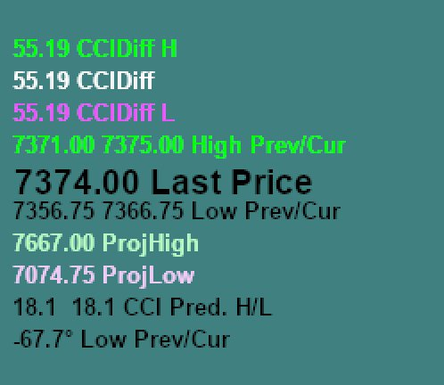
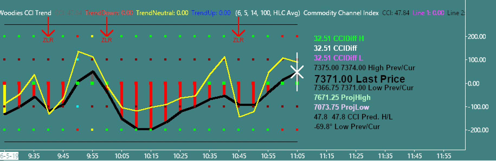
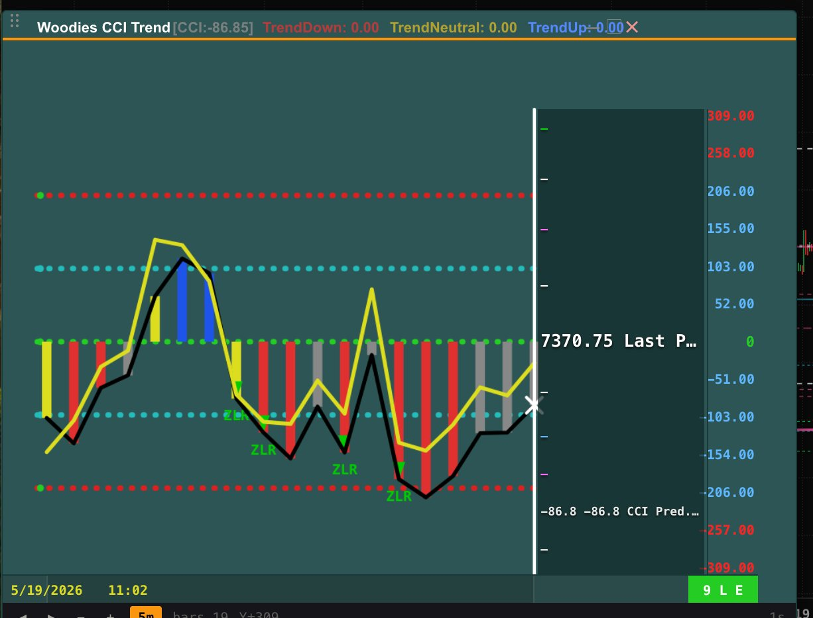

# Woody CCI Panel — Design Handoff (from Michael’s docx)

**Source file:** `/Users/michael/Downloads/Woody_CCI_Panel_Handoff.docx` (ingested 2026-05-19)  
**Version:** v1.0 Handoff  
**Component:** S4 Woody CCI Panel  
**Spec:** `docs/design/WOODY_PANEL_DESIGNER_SPEC_v1.md`  
**Baseline:** `v14_data_right_aligned.html` (when available)  
**Companion semantics:** `P30_WOODIES_DESIGNER_BRIEF_HE.md` / `P30_WOODIES_DESIGNER_BRIEF_EN.md`

---

## Authority (when in doubt)

1. **Sierra full view** (image below) — supreme reference  
2. **Designer spec v1.0** — technical coordinates  
3. **`v14_data_right_aligned.html`** — approved HTML baseline  

Any deviation → another review cycle until all three align.

---

## Reference images

### Image 1 — Sierra data column (10 fields)

Right-aligned floating text on `#2D5555` — **no dark box**. Last Price is largest.

### Image 2 — Sierra full Woody (chart + axes + HUD)

Fixed ±200 scale, black CCI-14 + yellow TCCI, red/green ZLR, data column, time strip, title study strings.

### Image 3 — Current MEMS26 mockup (gaps)

Wrong Y scale, truncated data column, dark empty box, undefined gray bars.

---

## Part A — 10 live HUD fields (summary)

See full table in `P30_WOODIES_DESIGNER_BRIEF_EN.md`.

| # | Field | Update |
|---|--------|--------|
| 1–3 | CCIDiff H / mid / L | Every tick — CCI-14 vs TCCI at H, current, L |
| 4 | High Prev/Cur | Every tick — last two bar highs |
| 5 | **Last Price** (22px black) | Every tick — **never freeze** |
| 6 | Low Prev/Cur | Every tick — last two bar lows |
| 7–8 | ProjHigh / ProjLow | ~5m — from DLL |
| 9 | CCI Pred. H/L | Every tick — next-bar CCI range |
| 10 | Low angle | Every tick — geometric slope of lows |

**Display:** right @ x=447, transparent background, semantic colors per brief.

---

## Part B — Column ↔ chart links

Documented in `P30_WOODIES_DESIGNER_BRIEF_EN.md` (CCIDiff ↔ black/yellow gap, Pred ↔ white X, angle ↔ low slope, Proj ↔ daily context).

---

## Part C — Time: two layers

| Moves with time scroll (Zone 2+3) | Fixed during horizontal scroll |
|-----------------------------------|--------------------------------|
| Bars, CCI-14, TCCI, ZLR, white X (if visible), time labels | Dashed ±200/±100/0, Y-axis numbers, **data column**, frame, title, toolbar |

**Rule:** Bar *N* always above its time label — **1:1 lockstep**.

**Historical (§6.8):** Chart frozen; white X hidden; “HISTORICAL — back to NOW”; **Last Price stays live**.

**Y-axis (Zone 4):** Independent — vertical drag only.

---

## Part D — 8 gaps in current mockup

| # | Gap | Mockup today | Required | Spec § |
|---|-----|--------------|----------|--------|
| 1 | Data column | ~2 rows, dark box | 10 rows @ x=447, transparent, Last 22px black | 5.12 |
| 2 | Y scale | 309, 258… dynamic | Fixed ±240, 13 values step 40 | 5.10 |
| 3 | Y colors | Red on many ticks | Red **only** ±200; cyan rest; green 0 | 5.10 |
| 4 | Bars | Gray strips | Blue / red / yellow only | 5.5 |
| 5 | ZLR | Green only | Red above + green below | 5.8 |
| 6 | Time axis | One time label | Date + **8** time stamps | 5.13 |
| 7 | Frame | Large dark box | **1px** vertical line @ x=450 | 5.11 |
| 8 | Title | 4 fields | 6+ fields + `(6, 5, 14, 100, HLC Avg)` + Line 1/2 | 5.2 |

---

## Part E — Next cycle (designer)

> Current mockup is a **caricature**. Michael needs **Sierra inside the dashboard** — pixel, color, position, text.

**3 immediate tasks:**

1. Rebuild data column (Part A + Image 1).  
2. Fix Y-axis to ±240 (Image 2).  
3. Side-by-side with `v14_data_right_aligned.html` + Image 2.

### Designer checklist

- [ ] 10 data rows, right @ x=447  
- [ ] Last Price 22px bold black  
- [ ] Semantic colors (green/black/magenta/cyan/white)  
- [ ] Y-axis ±240, red only at ±200  
- [ ] Bars blue/red/yellow only — no gray  
- [ ] Frame 1px @ x=450 — not a box  
- [ ] Title §5.2 full strings  
- [ ] ZLR red above, green below  
- [ ] Time: date + 8 timestamps  
- [ ] `9 L E` badge bottom-right  
- [ ] White X on current CCI-14  
- [ ] Title drag dots 3×2  
- [ ] Toolbar timeframe pills 5m/15m/30m  

---

## Dev agent mapping (Agent 1 + 2)

| Gap # | Owner | Code touch |
|-------|--------|------------|
| 1, 7 | Agent 1 (UI) | `WoodiesCciPanel.tsx`, `woodiesDesignerSpec.ts` |
| 2, 3 | Agent 1 | `buildAxisTicksForRange`, default `cciMax=240` |
| 4, 5, 6, X, 9LE | Agent 1 | canvas draw + time ticks |
| 8 | Agent 1 + export | title strings from JSON when present |
| 1 data semantics | Agent 2 | `v9_woodies_export.h`, `woodies_chart_routes.py` |

---

## Personal note (from docx)

Panel = **operational decision screen** (~200ms read time). Wrong scale or missing Last Price → Michael returns to Sierra. Goal: **close Sierra and trade from dashboard** — requires **100% fidelity**, not 95%.
