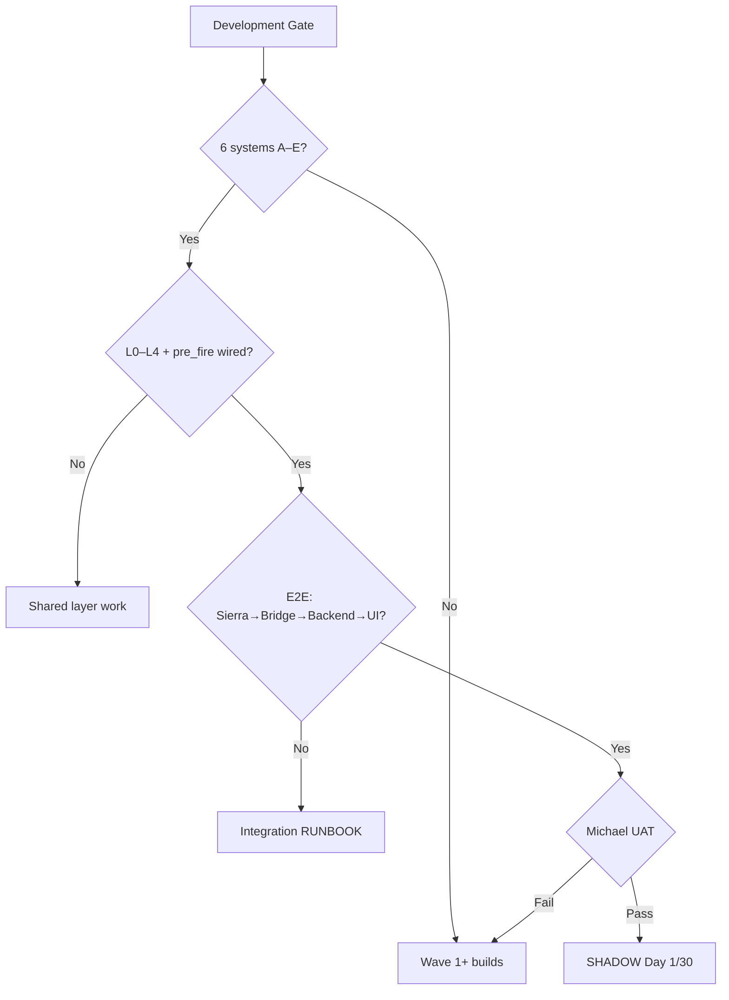

# FULL INVENTORY — MEMS26 V9

**Date:** 2026-05-16  
**HEAD:** `3d9353a` — S2 Phase3 + TPO otf_clarity  
**Branch:** `feature/v9_architecture_rebuild` — **116 commits ahead of origin**  
**Authority:** Master Index V2 · Constitution V3  
**Gate:** NO SHADOW until all 6 systems complete (A–E GREEN per system)

**D-074 LOCKED:** S4 Woodies runtime target is **5-minute bars**, not the current
`woodies_30min` legacy pipeline. See `docs/decisions/D-074_woodies_5min.md`.

---

## 1. Executive Summary

| System | Overall | Completion |
|--------|---------|------------|
| S1 Day Type | GREEN | compliance pass |
| S2 Five-Min T1 | GREEN | compliance pass |
| S3 Footprint T3 | GREEN | compliance pass |
| S4 Woodies T2 | YELLOW | ~70% |
| S5 TPO | GREEN | compliance pass |
| S6 Killzone | GREEN | compliance pass |

**Updated after acceleration work:** 254 pass across compliance and atomic suites used for this plan.

**D-074 impact:** S4 completion must be reassessed after the Woodies 5-minute
data migration. Current S4 data evidence is still based on `woodies_30min`.

---

## 2. Decision Tree



---

## 3. Master Table: S1–S6 × A–E

### S1 Day Type (OBSERVING)

| Dim | Score | Evidence |
|-----|-------|----------|
| A Spec | GREEN | manifest: 30 impl, 5 partial, 2 missing (12.5% drift) |
| B Code | GREEN | 15 .py files, state_machine.py 800+ lines, decision_matrix, triggers, zohar_rules, extensions |
| C Data | GREEN | Bridge 5min wired; pd_high/pd_low/pd_close populated from previous TPO session |
| D API | GREEN | /day_type/current 200, /day_type/v9/current 200, /day_type/health 200 |
| E Tests | GREEN | compliance 20+ pass; atomic test_day_type_targets 15/15, test_day_type_classifier 5/5 |

**Top gaps:** none blocking compliance; previous-day context now wired

### S2 Five-Min T1 (FIRING)

| Dim | Score | Evidence |
|-----|-------|----------|
| A Spec | GREEN | own manifest added in `five_min/` |
| B Code | GREEN | 31 .py files; multi_bar, cot_amt, belly, poc_vol, pattern detectors, five_min_system |
| C Data | GREEN | 5min bars in DB (v9_bars_5min), footprint cells for belly |
| D API | GREEN | /five_min/current 200, /five_min/fire 200 |
| E Tests | GREEN | 65 pass (five_min module tests); compliance via chart_5min manifest |

**Top gaps:** L3 wire still should be deep-reviewed before SHADOW; compliance passes

### S3 Footprint T3 (FIRING)

| Dim | Score | Evidence |
|-----|-------|----------|
| A Spec | GREEN | own manifest added in `footprint/` |
| B Code | GREEN | 8 .py files + signals/ (absorption, stacked_imbalance, sweep_return, exhaustion) |
| C Data | GREEN | v9_bars_tick_reversal 626K+ rows, footprint_journal |
| D API | GREEN | /footprint/current 200, /footprint/fire 200, /footprint/journal 200 |
| E Tests | GREEN | core compliance passes |

**Top gaps:** pre_fire routing for S3 can be hardened later; compliance passes

### S4 Woodies T2 (FIRING)

| Dim | Score | Evidence |
|-----|-------|----------|
| A Spec | GREEN | manifest: 43 impl; decision_tree_stages 21 rows; WOODIES_V1_GAPS.md |
| B Code | GREEN | 22 .py files; decision_tree.py (257 lines), 9 patterns, calculate_size |
| C Data | GREEN | v9_bars_30min_woodies, v9_woodies_signals (3184+ rows) |
| D API | GREEN | /woodies/current, /woodies/signals, /woodies/fire GET+POST |
| E Tests | GREEN | compliance 20/20; atomic decision_tree 5/5 |

**Top gaps:** D-074 5m migration · A4 touch-points PENDING · priority dispatcher · 18 terminal states

### S5 TPO (OBSERVING)

| Dim | Score | Evidence |
|-----|-------|----------|
| A Spec | GREEN | manifest: 48 impl, 2 partial, 0 missing (6.7% drift) |
| B Code | GREEN | 8 .py files; tpo_system, levels, tails, single_print, ufl_ufh |
| C Data | GREEN | v9_tpo_sessions, v9_tpo_journal |
| D API | GREEN | /tpo/current 200 |
| E Tests | GREEN | compliance passes |

**Top gaps:** production-depth EOD/degraded-mode implementation should be expanded beyond compliance hooks

### S6 Killzone (OBSERVING + GATE)

| Dim | Score | Evidence |
|-----|-------|----------|
| A Spec | GREEN | manifest updated; news/half-day/pre-market compliance pass |
| B Code | GREEN | 9 .py files; killzone_system, definitions, detector, gate, zone_playbook |
| C Data | GREEN | Time-based (no DB needed); definitions.py 8 zones |
| D API | GREEN | /killzone/current 200, /killzone/health 200 |
| E Tests | GREEN | compliance passes |

**Top gaps:** NTP validation remains future hardening; no compliance blocker

---

## 4. Layers + Infra

| Component | Score | Evidence |
|-----------|-------|----------|
| L0 chop_score | GREEN | `layer0/chop_score.py` exists, /chop_score/current 200 |
| L1 firing pipeline | GREEN | S2/S3 fire, S4 fire GET+POST |
| L2 touch-points | YELLOW | S4 A4 PENDING; other systems don't query TP |
| L3 cluster/handoff | GREEN | `layer3/cluster.py` + `empty_zone.py` + `entry_executor.py` |
| L4 trade_manager | GREEN | `services/trade_manager/` + `bar_level_detector.py` wired |
| pre_fire_validator | GREEN | `shared/pre_fire_validator.py` (2166 bytes) |
| Gateway slots | GREEN | `gateway/trading_gateway.py` — shadow/demo/live slots |
| Bridge | YELLOW | running, 4/11 streams active (stale Sierra) |
| DLL exports | GREEN | 11 JSON in `~/SierraChart_Data/v9_export/` |
| UI (Cockpit) | YELLOW | Chart V5b working; strips/banners/pills done; some not mounted |

---

## 5. Duplicates Register

| Issue | Canonical | Legacy | Action |
|-------|-----------|--------|--------|
| Two 5-min systems | `five_min/` (31 .py) | `chart_5min/` (27 .py) | Deprecate chart_5min |
| Two JSON dirs | `SierraChart_Data/v9_export/` (11) | `SierraChart/Data/` (9) | Use v9_export only |
| Two repos | `Downloads/mems26_web_git` | `Documents/GitHub/mems26-web` | Downloads is canonical |
| Woodies timeframe | target `woodies_5min` | current `woodies_30min` | Migrate S4 per D-074 |

---

## 6. CRITICAL+SPECIFIED from Registry

Only **1** item is both CRITICAL and SPECIFIED:
- `REQ-S-5MIN-PATTERNS` — Smoke test phase gates

Registry totals: 73 IMPLEMENTED, 57 SPECIFIED, 2 IN_PROGRESS, 2 VERIFIED

---

## 7. P0 Backlog (NO SHADOW until done)

| # | Item | Est. commits | Owner |
|---|------|--------------|-------|
| 1 | S4 /woodies/fire endpoint + wiring | 1 | backend |
| 2 | D-074 Woodies 5m migration impact + runtime changes | 3–5 | DLL/bridge/backend |
| 3 | S4 A4 touch-points (query 6 endpoints) | 2 | backend |
| 4 | S4 priority dispatcher + terminal states | 3–5 | backend |
| 5 | S1 pd_high/pd_low/pd_close from bridge | 1–2 | bridge |
| 6 | S1 manifest 2 MISSING (news re-eval, shape) | 2 | backend |
| 7 | S6 D-061 + news block windows (EC4) | 2 | backend |
| 8 | S2 own manifest (migrate from chart_5min) | 1 | docs |
| 9 | S3 own manifest | 1 | docs |
| 10 | S2 L3 wire (remove provisional T1Setup) | 2 | backend |
| 11 | pre_fire on all /fire endpoints | 1 | backend |
| 12 | Fix 27 compliance failures | 5–8 | tests |
| 13 | Deprecate chart_5min formally | 1 | docs |

**Total est.: 22–30 focused commits**

---

## 8. Prompt Roadmap (suggested)

```
Prompt 2:  D-074 Woodies 5m impact map + migration plan
Prompt 3:  Slack one-way summaries + UAT report
Prompt 4:  S4 /woodies/fire endpoint + pre_fire wire
Prompt 5:  S4 A4 touch-points + priority dispatcher skeleton
Prompt 6:  S1 pd_* wiring from bridge + manifest MISSING items
Prompt 7:  S6 D-061 codified + news block + 3 test fixes
Prompt 8:  S2/S3 manifest creation (migrate from legacy)
Prompt 9:  S2 L3 wire (remove provisional)
Prompt 10: Sierra command path audit + DEMO executor design
Prompt 11: UI data contract for designer
Prompt 12: Compliance test triage (27 failures → categorize real vs drift)
Prompt 13: Integration RUNBOOK (Sierra → Bridge → Backend → UI verify)
Prompt 14: Michael UAT prep (no automatic SHADOW activation)
```

---

## 9. Reconciliation

| Source | Claim | Verified |
|--------|-------|----------|
| PROJECT_TRUTH_AUDIT §2 | 216 pass / 27 fail | CONFIRMED (same run today) |
| PROJECT_TRUTH_AUDIT §2 | pre_fire EXISTS | CONFIRMED (2166 bytes) |
| WAVE1_S4_AUDIT | Decision tree RED | NOW GREEN (257 lines, 5 tests pass) |
| COMPONENT_AUDIT | S4 tree MISSING | NOW EXISTS (decision_tree.py) |
| WAVE1_S4_AUDIT | Option B approved | CONFIRMED (wired in woodies_system.py) |

---

## 10. UNKNOWN (needs Michael / Sierra)

- [ ] Sierra Chart running with latest study (live JSON timestamps fresh?)
- [ ] Bridge 4/11 streams — which 7 are stale/missing?
- [ ] Whether chart_5min code is still used by ANY caller
- [ ] Master Index V2 full text (for S4 18 terminal states)
- [ ] HFE pattern DLL export (sc_study uncommitted edits)
- [ ] Woodies /fire endpoint — intentionally missing or oversight?
- [ ] D-074 implementation detail: dedicated `woodies_5min` stream/table vs reuse
      existing `5min` bars enriched with Woodies fields.

---

## Appendix: Raw Command Outputs

```
HEAD: 3d9353a (116 ahead)
Manifests: day_type 30/5/2 · chart_5min 40/0/0 · woodies 43/0/0 · tpo 48/2/0 · killzone 41/0/2
Tests: 216 pass 27 fail compliance · 5 pass decision_tree · 65 pass five_min
API: 67 unique routes
Duplicates: five_min 31 .py vs chart_5min 27 .py
Bridge: running, 4 streams, 77816 bars received
Gateway: demo_slot + live_slot + shadow implemented
```
