# MEMS26 — תוכנית מההתחלה עד LIVE (עדכון 2026-05-21)

**מסמך מרכזי** — איפה אנחנו, מה הושלם, איפה נכנסים הייצואים וההחלטות האחרונות.  
**Companion:** [`P30_PRIORITY_TASK_TABLE.md`](./P30_PRIORITY_TASK_TABLE.md) · [`handoff/PROMPT_LIST_TO_LIVE.md`](./handoff/PROMPT_LIST_TO_LIVE.md) · [`spec_authority/MEMS26_MASTER_INDEX_V2.markdown`](../spec_authority/MEMS26_MASTER_INDEX_V2.markdown)

**כללים:** D-067 (no push main) · M13 (Sierra > Spec > Code) · אין DLL/עיצוב בלי Michael · אין המצאות.

---

## 1. איפה אנחנו — נקודת ציון אחת (היום)

```
┌─────────────────────────────────────────────────────────────────┐
│  אתם כאן ▼  P31 P0 — לפני P-S0 (יומן P&L + S2 + PAT)            │
│                                                                 │
│  ✅ Phase 0–2 · P30 baseline · P0.5 · Wave 0–2 · L0/L2/L3       │
│  ✅ L4 risk audit — SHADOW OK, LIVE NO-GO (`P30_L4_RISK_AUDIT`) │
│  🟡 P31-01..04 + PAT — **לוח:** `handoff/P31_TASK_BOARD.md`     │
│  ⬜ P-S0 + SHADOW soak — **אחרי P0 ירוק**                       │
│  ⬜ DEMO → Pre-flight (L4 fixes) → LIVE                          │
└─────────────────────────────────────────────────────────────────┘
```

| שכבה | סטטוס | הערה |
|------|--------|------|
| **נתונים / Sierra** | 🟢 | 29/29 (Wave 0) |
| **P0.5 + Wave 1–2 קוד** | 🟢 | GW, S1, prev_day, tpo dedupe |
| **D-087 Registry** | 🟢 waived | SHADOW only — `D-087_REGISTRY_WAIVER.md` |
| **D-088 cluster_guard** | 🟢 | `P30_D088_DEPLOY_VERIFY.md` PASS · PID 46604 |
| **Registry §18 (LIVE)** | 🔴 | enforced לפני P-L1 |
| **P31 P0** (journal/S2/PAT) | 🟡 | `P31_TASK_BOARD.md` |
| **L4 risk (LIVE)** | 🔴 NO-GO | R1–R3 ב-`P30_L4_RISK_AUDIT.md` |
| **SHADOW soak** | ⬜ | אחרי P31 P0 ירוק + P-S0 |
| **LIVE** | ⬜ | |

**טבלת משימות:** [`P30_PRIORITY_TASK_TABLE.md`](./P30_PRIORITY_TASK_TABLE.md)

---

## 2. מפת שלבים — מההתחלה עד LIVE

| Phase | שם | מקור | סטטוס | יציאה |
|-------|-----|------|--------|--------|
| **0** | Backend data integrity | P27.5a–f, z | ✅ DONE | Michael approved → Phase 1 |
| **1** | Replay smoke | P28 | ✅ DONE | 11/11 replay plan |
| **2** | Scenario pack | P29 | ✅ DONE | Gateway contract S2/S3/S4 |
| **3** | Systems build + wire | PROMPT 3a–3f (Drive) | 🟡 חלקי | 6 systems רצים; gaps ב-P30 audit |
| **P30** | Pre-SHADOW hardening | inbox + diagnostic | 🟡 **כאן** | Waves 0–2 DONE → D-088 deploy → SHADOW |
| **5** | SHADOW activation | P-S0, `MEMS26_MODE=shadow` | ⬜ | gateway SHADOW only |
| **6** | SHADOW soak | P-S1…S10 / D-067 min 5d | ⬜ | ≥20 trades, review |
| **—** | POST-SHADOW fixes | D-086, Registry, S1 P1.5 | ⬜ | לפני DEMO |
| **7** | DEMO activation | P-D0 | ⬜ | Sierra Sim round-trip |
| **8** | DEMO soak | P-D1…D7 | ⬜ | SHADOW vs DEMO slippage |
| **9** | LIVE pre-flight | P-L0a–e (Cockpit V6 §8) | ⬜ | kill-switch, risk, Slack |
| **10** | LIVE micro | P-L1 | ⬜ | 1 contract, 1 day |
| **11** | LIVE full | P-L2 + push main | ⬜ | D-067 lift |

---

## 3. תרשים זמן (Mermaid)

```mermaid
flowchart LR
  subgraph done [הושלם]
    P0[Phase 0 P27.5]
    P1[Phase 1 P28]
    P2[Phase 2 P29]
    P30a[P30 Sierra Plan]
    P05[P0.5 GW FP]
  end
  subgraph now [עכשיו]
    D088[D-088 deploy verify]
  end
  subgraph done2 [הושלם היום]
    W0[Wave 0 CC]
    W1[S1 PREV WIRE]
    W2[P1.5 CLOCK]
  end
  subgraph shadow [SHADOW]
    S0[P-S0 activate]
    S1[P-S1..S10 soak]
    SR[SHADOW review]
  end
  subgraph post [POST-SHADOW]
    D086[S3 fix A/B]
    REG[Registry triage]
  end
  subgraph livepath [ל-LIVE]
    DEMO[DEMO 7d]
    L0[P-L0 pre-flight]
    L1[LIVE micro]
  end
  P0 --> P1 --> P2 --> P30a --> P05 --> W0 --> W1 --> W2 --> D088
  D088 --> S0 --> S1 --> SR
  SR --> D086 --> REG --> DEMO --> L0 --> L1
```



---

## 4. מה ייצאת / נעלת עכשיו — איפה זה נכנס

### 4.1 ייצוא Drive + Spec briefings (הבריף ל-Cursor P0.5)

| חומר | איפה בתוכנית | פעולה |
|------|--------------|--------|
| טבלת Drive IDs (S1–S6, Cockpit V6, Registry) | **מקור אמת לכל Phase** — `docs/spec_authority/` + manifests | קרא לפני כל שינוי קוד |
| D-082 S3 observer | Phase P30 verify → **D-086** | לא חוסם SHADOW |
| D-083 S6 observational | כל השלבים — D-061 wins | אין קוד P0.5 |
| D-084 HFE Woodies | **POST-SHADOW / pre-LIVE** | לא P0.5 |
| D-085 TPO touchpoint rename | **P2 cosmetic** | DEFER |
| cluster_guard = GW-02 only | **P0.5** ✅ בוצע | |
| S2-PF verify first | **P0.5** ✅ VERIFIED | אין P1 קוד |

**קבצים ב-repo מהסבב הזה:**

- `docs/reports/P30_CURSOR_P05_REPORT.md`
- `docs/reports/P30_S2_PF_VERIFY.md`
- `docs/reports/P30_S3_OBS_CHECK.md`
- `docs/reports/P30_REGISTRY_STATE.md`
- `docs/reports/P30_DECISION_D086_S3_FIRING.md`

### 4.2 החלטה D-086 (S3 firing)

| נושא | מיקום בתוכנית |
|------|----------------|
| הפרת V3 spec | מזוהה ב-P0.5 Task 4 |
| **ב-SHADOW** | **מותר** — רישום SHADOW בלבד (לא ניהול עסקה מלא) |
| **תיקון קוד** | **POST-SHADOW** — Option A/B או V4 spec |
| **לפני LIVE** | **חובה** לבקר |

### 4.3 PROMPT 5 / 6 / 7 — תיקון מיפוי (Drive vs repo ישן)

| מספר ב-Master Index / Cockpit V6 | משמעות אמיתית | שלב בתוכנית | קבצי repo ישנים (לא לבלבל) |
|----------------------------------|---------------|-------------|---------------------------|
| **PROMPT 5** | SHADOW Analyst + Stepped POC | **אחרי SHADOW soak** (V6 §11, Phase 4) | `PROMPT_5_*` UAT = S2 FiveMin |
| **PROMPT 6** | LIVE Pre-flight UI + checklist | **Phase 9** P-L0a–e | `PROMPT_6_REPORT` = S3 Footprint |
| **PROMPT 7** | LIVE Activation | **Phase 10–11** | `PROMPT_7_REPORT` = S4 Woodies |

### 4.4 Cockpit V6 לוח (מהבריף — לא ב-repo מלא)

| V6 § | נושא | שלב בתוכנית |
|------|------|-------------|
| §6 + §11 | SHADOW Analyst | **DEFER** — manual EOD ב-soak |
| §8 | LIVE Pre-flight (11 gates) | **Phase 9** — לא עכשיו |
| §12 | Phase 4–5 תאריכים (23–25 May Analyst, 29 May pre-flight) | תכנון — לא חוסם SHADOW אם Analyst ידני |

### 4.5 System 1 Data Reqs (Drive) — מעבר ל-prev_day בלבד

| רכיב | LOC משוער | שלב |
|------|-----------|-----|
| `prev_day.py` | ~50 | **P1** (לפני או במקביל SHADOW) |
| Market Clock service | ~150 | **P1.5** POST-SHADOW או מוקדם אם S1 BLOCKED |
| Open Type classifier | ~80 | P1.5 |
| IB width percentiles | ~50 | P1.5 |
| `/api/v9/tpo/previous_day` | ~30 | P1 |

### 4.6 MEMS26_REGISTRY.yaml + Spec Registry §18

| מצב | השפעה על תוכנית |
|-----|------------------|
| קיים, 93 רשומות | Phase gate **ניתן למדידה** |
| §18 **FAIL** עכשיו | לא חוסם **קוד** P0.5 / SHADOW soak; חוסם **הכרזה רשמית** "Registry GREEN" |
| משימה נפרדת | triage 20 CRITICAL + 23 HIGH — **במקביל או אחרי SHADOW** |

---

## 5. 6 מערכות — עץ החלטה + FIRING

| ID | מערכת | תפקיד | עץ החלטה | SHADOW יורה? | מסמך |
|----|--------|--------|-----------|--------------|------|
| S1 | Day Type | Observer | State machine A1–E2 (Drive Tree V2) | לא | manifest + `state_machine.py` |
| S2 | Five-Min | Firing T1 | mode→pattern→`emit_t1_setup`→pre_fire | כן | `P30_S2_PF_VERIFY.md` |
| S3 | Footprint | Observer (+ D-086 fire) | signals→journal; `_fire`→SHADOW | כן (רישום) | `P30_DECISION_D086` |
| S4 | Woodies | Firing T2 | A1–A7 + gateway | כן | `decision_tree.py` |
| S5 | TPO | Observer | TPO Tree V2 | לא | manifest |
| S6 | Killzone | Observer/gate | 11 zones (D-061 advisory) | לא | manifest |

**Gateway (אחרי P0.5 + D-088):** cooldown / SSV / chop → חוסמים הכל; **cluster_guard** חוסם DEMO/LIVE בלבד — **SHADOW תמיד נרשם** (D-088).

---

## 6. תוכנית מפורטת מהשלב הנוכחי

### שלב א — CC Verify ✅

→ `P30_WAVE_0_CC_VERIFY.md` — **GO-WITH-NOTES** · errata: `P30_WAVE_0_CC_VERIFY_ERRATA.md`

### שלב ב — החלטות Michael ✅ / 🔄

- [x] D-087 Registry §18 waived (SHADOW) — `docs/decisions/D-087_REGISTRY_WAIVER.md`
- [x] D-088 cluster_guard + SHADOW — קוד ב-repo
- [ ] D-088 deploy verify — `P30_D088_DEPLOY_VERIFY.md` (סוכן אחר)
- [ ] אורך soak: 5 / 10 ימים
- [ ] `P-S0` activation

### שלב ג — P1 + P1.5 ✅ (Cursor)

| משימה | סטטוס |
|--------|--------|
| S1 `prev_day.py` + wire | ✅ `P30_S1_PREV_DONE.md`, `P30_S1_WIRE_DONE.md` |
| P1.5 CLOCK 1–3,5 | ✅ `P30_P15_CLOCK_DONE.md` |
| CLOCK-4 percentile | DEFER |
| ~~S2 pre_fire~~ | VERIFIED (CC FAIL בוטל ב-errata) |

### שלב ד — SHADOW soak (5–10 ימי מסחר)

**רץ:**

- S2, S4, S3 (SHADOW records)
- Plan + snapshot
- יומן ידני (Analyst Agent = DEFER per V6)

**לא רץ:** DEMO, LIVE, Analyst UI, Pre-flight UI, DLL change, S3 spec fix (D-086).

**תוצר:** `docs/reports/shadow/SHADOW_SOAK_DAY_XX.md` → `SHADOW_SOAK_FINAL.md`

### שלב ה — POST-SHADOW (לפני DEMO)

| # | נושא |
|---|------|
| 1 | D-086 — S3 Option A / B / V4 |
| 2 | Registry §18 triage |
| 3 | S1 P1.5 (Market Clock…) אם נדרש |
| 4 | 6-agent audit merge (אם לא בוצע) |
| 5 | Michael → DEMO go |

### שלב ו — DEMO (Phase 7–8)

- P-D0: Woodies ראשון → `trade_command.json` → Sim
- 7 ימים + `DEMO_SOAK_FINAL.md`

### שלב ז — LIVE (Phase 9–11)

- P-L0a risk tests
- P-L0b kill-switch (TopBar + API + script)
- P-L0c Slack
- P-L0d redundancy
- P-L0e Michael sign-off
- P-L1 micro LIVE
- Gateway LIVE enable + איחוד `services/trading_gateway` vs `v9/gateway`

---

## 7. מה לא בתוכנית (מפורש)

| פריט | מתי |
|------|-----|
| push `main` | Phase 11 + D-067 lift |
| SHADOW Analyst code | Phase 4 V6 / post-soak |
| LIVE Pre-flight UI | Phase 9 |
| VAP=1 DLL | P3 + memory test + Michael |
| S3 disable fire | POST-SHADOW (D-086) |
| Woodies HFE | pre-LIVE (D-084) |
| redesign Plan / Woodies panel | אין אישור |

---

## 8. סוכנים / בעלים (למקסימום ביצוע)

| Wave | מי | מתי |
|------|-----|-----|
| CC-OPS | Claude Code | עכשיו — verify |
| Cursor Parent | P1 prev_day, docs | אחרי GO |
| Michael | החלטות, sign-off, EOD soak | כל שער |
| 6 agents read-only | S1–S6 fire/spec | אחרי HTTP GO, לפני DEMO |
| CC reports | דוחות PROMPT | אחרי כל wave |

---

## 9. קישורי מסמכים (מפת repo)

```
docs/spec_authority/          ← Master Index, Constitution, FIRST (ייצוא Drive)
docs/reports/P30_*.md         ← P30 + P0.5 + D-086 + Registry (הסבב האחרון)
docs/reports/PROMPT30_10b_*   ← Plan L3
docs/reports/handoff/         ← PROMPT_LIST, GANTT, CHECKLIST
docs/reports/P30_PRIORITY_TASK_TABLE.md  ← תור #1–26
MEMS26_REGISTRY.yaml          ← §18 gate (read-only)
```

---

## 10. סיכום בשורה אחת

**עברתם Phase 0–2 + P30 baseline + P0.5; אתם על סף SHADOW soak.**  
**מה שייצאת עכשיו (Drive brief, D-082–086, P0.5 דוחות, PROMPT 5/6/7 מיפוי, Registry, V6 לוח) נכנס ל-P30 ול-POST-SHADOW/LIVE — לא מחליף את SHADOW, ולא פותח LIVE מוקדם.**

**הצעד הבא:** CC verify → Michael GO → SHADOW Phase Start.

---

*עודכן: 2026-05-20 · Cursor · ללא commit*
