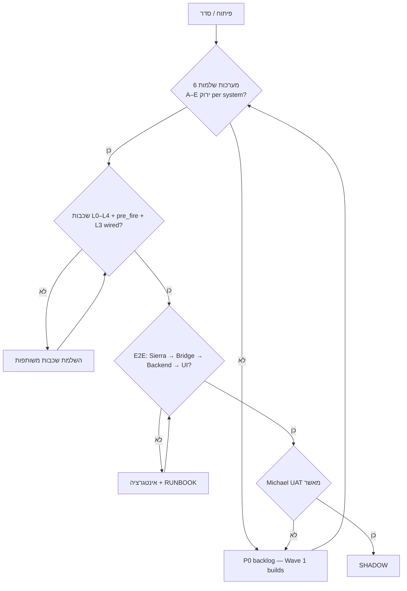
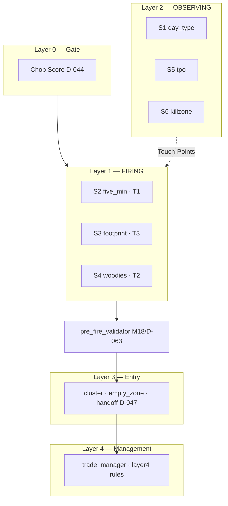

# PROJECT TRUTH AUDIT

**Date:** 2026-05-16  
**Repo:** `/Users/michael/Downloads/mems26_web_git` (local — NOT GitHub)  
**Branch:** `feature/v9_architecture_rebuild`  
**HEAD:** `dd36899` — `[S2 Phase3 §3.E+F] Confluence count + 10:30 transition`  
**Ahead of origin:** 104 commits (GitHub `michaelbarg/mems26-web` is stale)

**Authority:** Master Index V2 · Constitution V3  
**Michael's gate:** NO SHADOW until all 6 systems complete with all components.

---

## 1. Decision Tree (Mermaid)



### 4 Layers + 6 Systems



---

## 2. Executive Summary

| Metric | Value |
|--------|-------|
| Honest overall (all systems + layers) | **~65–70%** |
| MEMS26_REGISTRY | 135 REQ: **73 IMPLEMENTED**, **57 SPECIFIED**, 2 IN_PROGRESS |
| Compliance tests | **216 passed**, **27 failed** |
| S2 unit tests (five_min + shared) | **21 passed** (last run) |
| Biggest blocker | **S4 Woodies 21-stage decision tree** (manifest says patterns 100% — misleading) |
| Second blocker | **Dual code paths:** `five_min/` vs `chart_5min/`, two JSON export dirs |
| Good news since 16-May audit | **`pre_fire_validator.py` EXISTS** (was MISSING in COMPONENT_AUDIT) |

**CC session note:** Audit prompt was interrupted before this file was written. Uncommitted changes exist in `woodies/hfe.py`, `sc_study/*` — not part of Wave 0 audit; review separately.

---

## 3. Per-System Table (S1–S6)

Scoring: **GREEN** / **YELLOW** / **RED**

| System | A Spec | B Code | C Data | D API | E Tests | Overall | Top 3 gaps |
|--------|--------|--------|--------|-------|---------|---------|------------|
| **S1 Day Type** | YELLOW 12.5% drift | GREEN | RED pd_* not wired in main | GREEN | YELLOW | **YELLOW** | pd_high/low populate · re-eval news/shape · IB 33/67 rolling |
| **S2 5-Min T1** | YELLOW no manifest in `five_min/` | GREEN | GREEN | GREEN | GREEN 21/21 | **YELLOW** | L3 wire (provisional T1Setup) · deprecate `chart_5min` · Gateway fire path |
| **S3 Footprint** | YELLOW 7-stage vs signals | GREEN | GREEN | GREEN | YELLOW | **YELLOW** | Spec alignment 7-stage · pre_fire on /fire · Belly for S2 |
| **S4 Woodies** | **RED** tree not in manifest | GREEN patterns | GREEN | GREEN | YELLOW ZLR fails | **RED** | 21-stage A1–B14 · 18 terminal states · priority dispatcher · HFE in progress (uncommitted) |
| **S5 TPO** | GREEN 6.7% drift | GREEN | GREEN | GREEN | YELLOW v1_generated | **GREEN** | 2 PARTIAL manifest · MIGRATED enums |
| **S6 Killzone** | YELLOW 3.8% drift | GREEN | GREEN | GREEN | YELLOW | **YELLOW** | D-061 codified · EC4 news windows · EC5 NTP |

### Manifest summaries (from `compliance_manifest.yaml`)

| Folder | impl | partial | missing | drift |
|--------|------|---------|---------|-------|
| chart_5min | 30 | 0 | 2 | 6.3% |
| day_type | 21 | 5 | 2 | 12.5% |
| killzone | 24 | 0 | 2 | 3.8% |
| tick_reversal | 24 | 0 | 3 | 0% |
| tpo | 26 | 2 | 2 | 6.7% |
| woodies | 24 | 0 | 0 | 0%* |

\*Woodies 0% drift = **patterns/studies only** — does NOT include Master Index 21-stage decision tree.

---

## 4. Layer & Shared Services

| Component | Status | Evidence |
|-----------|--------|----------|
| L0 chop_score | GREEN | `backend/v9/systems/layer0/` |
| pre_fire_validator | **GREEN** | `backend/v9/shared/pre_fire_validator.py` |
| L3 cluster/empty_zone/executor | GREEN code | `backend/v9/layer3/` + `services/layer3/handoff.py` |
| L3 wired to S2 T1Setup | **RED** | `setup_wrapper.py` → `provisional=true` without cluster |
| L4 trade_manager + layer4 | YELLOW | partial modules; W11–W15 not complete |
| Trading Gateway | YELLOW | exists; not full E2E verified |
| Bar router + wrappers | GREEN | all 6 systems subscribed |
| Bridge all streams | YELLOW | woodies/tpo/5min gaps per MASTER_DEV_SKILL |
| DLL exports | GREEN | 11 JSON in `~/SierraChart_Data/v9_export/` |
| UI Cockpit V6 gaps | RED | SessionTimeStrip, RiskWidget, EmergencyKill, PreFlight |

---

## 5. Registry Cross-Check

```
IMPLEMENTED:          73
SPECIFIED:            57
IN_PROGRESS:           2
VERIFIED:              2
DIAGNOSTIC_COMPLETE:   1
```

**CRITICAL + SPECIFIED (still open — sample):** Many point to `chart_5min` and `tick_reversal` manifests while active T1 code is in `five_min/`. Reconcile registry paths before trusting counts.

**Action:** Re-map REQ-S-* rows to `five_min` + `footprint` folders after deprecating legacy names.

---

## 6. P0 Backlog (ordered — NO SHADOW until done)

1. **S4** — Implement Woodies Decision Tree A1–B14 + 18 terminal states + priority dispatcher  
2. **S4** — Finish HFE pattern (review uncommitted `hfe.py` + DLL changes)  
3. **S1** — Wire `pd_high/pd_low/pd_close` into day_type from main/bridge  
4. **S1** — IB width 33/67 rolling (D-069) · distribution shape · re-eval triggers  
5. **S6** — Codify D-061 + news block windows (EC4)  
6. **S2** — Wire Layer 3 to T1Setup (remove provisional) · single canonical `five_min` path  
7. **S3** — Align with spec (7-stage OR document accepted signal architecture)  
8. **Shared** — pre_fire on all `/fire` endpoints (S2/S3/S4)  
9. **Infra** — One JSON export dir · all Bridge streams live  
10. **UI** — Cockpit critical panels per V6  
11. **Tests** — Fix 27 compliance failures (split: spec-drift vs real bugs)  
12. **Registry** — Update paths: chart_5min → five_min where applicable  

**Est.:** 50–80 focused commits (no SHADOW work included).

---

## 7. Duplicates / Confusion (fix in "סדר" phase)

| Issue | Paths | Recommendation |
|-------|-------|----------------|
| Two 5-min systems | `five_min/` vs `chart_5min/` | **Canonical: `five_min`** — mark chart_5min deprecated in README |
| Two repos | `Downloads/mems26_web_git` vs `Documents/GitHub/mems26-web` | **Canonical: Downloads** |
| Two JSON dirs | `SierraChart/Data` vs `SierraChart_Data/v9_export` | **Canonical: v9_export only** |
| Woodies manifest vs Master Index | manifest 100% vs tree missing | Add `decision_tree_stages` section to manifest |

---

## 8. What Could Not Be Verified (needs Michael)

- [ ] Sierra Chart running with study loaded (live JSON timestamps)  
- [ ] Bridge process up (`/tmp/bridge.log`)  
- [ ] Master Index V2 full text (Drive export to `docs/`)  
- [ ] Whether uncommitted HFE/DLL edits are intentional WIP  

---

## 9. Reconciliation vs COMPONENT_AUDIT_2026_05_16.md

| Item | 16-May audit | Now |
|------|--------------|-----|
| pre_fire_validator | MISSING | **EXISTS** |
| S2 Wave 1 (T1Setup, COT/AMT, sr_proximity) | pending | **DONE** |
| S2 Phase 3 (confluence, 10:30) | — | **commit dd36899** |
| Woodies 21-stage tree | MISSING | **still MISSING** |
| S1 pd_* wiring | MISSING | **still MISSING** |

---

## 10. Terminal Summary (10 lines)

```
REPO:     mems26_web_git local · ahead 104 · NOT GitHub
GATE:     NO SHADOW until 6 systems complete
BEST:     S5 TPO ~90% · pre_fire EXISTS
WORST:    S4 Woodies decision tree · S1 pd wiring
MESS:     five_min vs chart_5min · dual JSON paths
TESTS:    216 pass · 27 fail compliance
NEXT P0:  S4 tree → S1 pd → S6 D-061 → S2 L3 wire
CC:       Audit interrupted · this file completes Wave 0
WIP:      uncommitted hfe.py + sc_study — review before commit
```

---

*Generated: Cursor strategic chat (CC Wave 0 completion). D-067: no push.*
