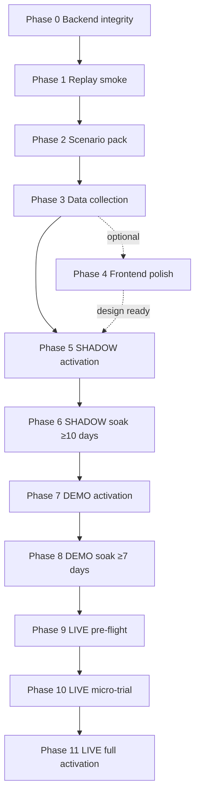

**Status:** living document — update as the project advances
**Last updated:** 2026-05-16
**Author:** Cursor multitask session

# GANTT_TO_LIVE — MEMS26 → real-money trading

Companion documents:

- [`NEXT_CHAT_PROMPT.md`](./NEXT_CHAT_PROMPT.md) — paste-and-continue prompt for the next session
- [`PROMPT_LIST_TO_LIVE.md`](./PROMPT_LIST_TO_LIVE.md) — ordered P## prompts that execute each phase
- [`SESSION_LOG_2026-05-16.md`](./SESSION_LOG_2026-05-16.md) — what happened today
- [`../SYSTEM_COMPLETION_CONTROL_BOARD.md`](../SYSTEM_COMPLETION_CONTROL_BOARD.md) — current per-system readiness (S1-S6)
- [`../PROMPT27_REPLAY_VALIDATION_PLAN.md`](../PROMPT27_REPLAY_VALIDATION_PLAN.md) — replay strategy reference

> The Gantt sections below are written in `mermaid gantt` so they render in any markdown viewer that supports mermaid (GitHub, VS Code with the mermaid plugin, Obsidian, etc.). Dates are intentionally relative ("after P28") not calendar-pinned, because the project paces by **prompt count**, not days (per Michael's standing instruction).

---

## Phase summary

| Phase | Description | Prompts | Depends on | Status | Exit criteria |
|---|---|---|---|---|---|
| **0. Backend data integrity** | Fix three pipeline bugs found 2026-05-16 (bad bars in `/chart/bars5min`, stale `live_price`, TPO `bars_processed_today=0`) | P27.5a, P27.5b, P27.5c | nothing | **IN PROGRESS** (identified, not fixed) | Three endpoints return clean, fresh, complete data during RTH and over weekend; SCB updated; no client-side `looksOk`/stale-price guards needed for correctness (kept as defense in depth) |
| **1. Replay smoke run** | Re-run Prompt 28 after P27.5 fixes; prove the replay clock + all 6 systems still pass against the cleaned data path | P28 (re-run) | Phase 0 | **PARTIAL** (11/11 PASS on 2026-05-16, but on dirty bars) | All 11 checks PASS on cleaned data; report `PROMPT28_REPLAY_SMOKE_RUN.md` refreshed |
| **2. Replay scenario pack** | Inject 10 historical scenarios (trend / balance / opening drive / S2 / S3 / S4 / killzone change / TPO context / degraded / pre_fire block) and verify expected reason trees and route/block outcomes | P29 | Phase 1 | NOT STARTED | All 10 scenarios pass; `docs/reports/PROMPT29_REPLAY_SCENARIO_PACK.md` exists |
| **3. Data collection package** | Define and wire the storage/log contract for everything we will collect during SHADOW (bars per stream, per-system state, pre_fire decisions, gateway dry-run decisions, reason trees, lifecycle events) | P29.5 | Phase 2 | NOT STARTED | Schema + sinks documented and exercised by a 1-hour replay run that produces parseable artifacts |
| **4. Frontend polish (optional, deferrable)** | Decide if SystemPanelsBar / Volume comes back in a new form; UI/UX evaluation now that the chart is a single pane; design package for handoff to a designer | P-UI-1..P-UI-3 | Phase 3 (data shape known) | DEFERRED | UI spec frozen for SHADOW dashboard; chart, banners, side panel, strips finalized |
| **5. SHADOW activation gate** | Set `MEMS26_MODE=shadow`; verify gateway records-only path; confirm no Sierra command is written; smoke 1 day | P-S0 | Phase 3 + Michael's manual go | NOT STARTED | `/api/v9/gateway/status` shows `shadow` slot active, `demo`/`live` slots `null`; status check passes; first SHADOW day completes without errors |
| **6. SHADOW soak (≥10 trading days)** | Accumulate log-only trades from S2/S3/S4 fires; nightly EOD review; daily checks of slippage, reason trees, pre_fire blocks | P-S1..P-S10 (one per trading day, parameterized) | Phase 5 | NOT STARTED | ≥10 RTH days complete; daily WR tracked; max drawdown monitored; pattern quality assessed; SCB shows clean accumulation |
| **7. DEMO activation** | Wire `DemoExecutor` to write `trade_command.json` for Sierra Sim; first-wins (only one of SHADOW/DEMO/LIVE owns the slot per trade); enable for one system at a time | P-D0 | Phase 6 + Michael's manual go | NOT STARTED | Sierra Sim receives commands; round-trip latency measured; first DEMO trade closes correctly |
| **8. DEMO soak + bug-fix loop** | DEMO running in parallel with SHADOW; nightly EOD compares SHADOW expected vs DEMO actual fills; slippage budget validated | P-D1..P-Dn | Phase 7 | NOT STARTED | ≥7 DEMO trading days, slippage within budget, no executor crashes |
| **9. LIVE pre-flight** | Risk caps audit ($250/day, 5 trades, 2 contracts, 14:30 ET cutoff); kill-switch implemented and tested; alerting hardened; redundancy review (`launchd` for bridge, status hook); offline UAT | P-L0a..P-L0e | Phase 8 | NOT STARTED | All risk gates green in audit; kill-switch tested live (Sim); alerts received in Slack; UAT signed by Michael |
| **10. LIVE micro-position trial** | Switch ONE system (likely S4 Woodies at smallest size) from SHADOW/DEMO to LIVE for one micro-contract; everything else stays SHADOW; abort on any anomaly | P-L1 | Phase 9 | NOT STARTED | ≥1 closed LIVE micro trade; PnL recorded; no risk-cap breach; no executor anomaly |
| **11. LIVE full activation** | Enable LIVE per-system progressively; monitor; preserve SHADOW shadow-account in parallel for ongoing comparison | P-L2..P-Ln | Phase 10 | NOT STARTED | All target systems LIVE; nightly EOD comparison healthy; risk caps enforced |

---

## Phase 0 — Backend data integrity

```mermaid
gantt
    title Phase 0 — Backend data integrity (must finish before SHADOW)
    dateFormat  X
    axisFormat  %s
    section /chart/bars5min
    P27.5a bad-bar root cause + fix             :crit, p275a, 0, 3
    P27.5a UAT (replay + RTH spot check)        :p275aU, after p275a, 1
    section /live_price
    P27.5b stale price root cause + fix         :crit, p275b, after p275a, 3
    P27.5b UAT (RTH freshness < 60s)            :p275bU, after p275b, 1
    section /tpo/current
    P27.5c TPO aggregator daily-roll fix        :crit, p275c, after p275b, 3
    P27.5c UAT (bars_processed_today > 0)       :p275cU, after p275c, 1
    section Board
    SCB refresh + handoff docs update           :p275z, after p275cU, 1
```

---

## Phases 1-3 — Replay validation track

```mermaid
gantt
    title Phases 1-3 — Replay validation
    dateFormat  X
    axisFormat  %s
    section Phase 1 Smoke
    P28 (re-run on clean data)                  :p28, 0, 2
    section Phase 2 Scenarios
    P29.1 Trend day                             :p291, after p28, 2
    P29.2 Balance / nontrend                    :p292, after p291, 2
    P29.3 Opening drive                         :p293, after p292, 2
    P29.4 S2 Five-Min setup                     :p294, after p293, 2
    P29.5 S3 Footprint/Reversal                 :p295, after p294, 2
    P29.6 S4 Woodies pattern                    :p296, after p295, 2
    P29.7 Killzone context change               :p297, after p296, 1
    P29.8 TPO context / location                :p298, after p297, 1
    P29.9 Missing data / degraded               :p299, after p298, 1
    P29.10 pre_fire / risk block                :p2910, after p299, 1
    P29 report consolidation                    :p29r, after p2910, 1
    section Phase 3 Data Collection
    P29.5 storage + log contract                :p295pkg, after p29r, 3
    P29.5 1-hour replay dry-run                 :p295dry, after p295pkg, 1
```

---

## Phase 4 — Frontend polish (deferrable)

```mermaid
gantt
    title Phase 4 — Frontend polish (parallelizable after data shape known)
    dateFormat  X
    axisFormat  %s
    section UI evaluation
    P-UI-1 reassess SystemPanelsBar form        :pUI1, 0, 2
    P-UI-2 reassess VolumePanel (overlay vs separate) :pUI2, after pUI1, 2
    P-UI-3 SHADOW dashboard spec + designer package :pUI3, after pUI2, 3
```

---

## Phases 5-6 — SHADOW activation + soak

```mermaid
gantt
    title Phases 5-6 — SHADOW activation + soak
    dateFormat  X
    axisFormat  %s
    section Activation
    P-S0 SHADOW activation gate                 :crit, pS0, 0, 1
    section Soak (10 RTH days)
    Day 1                                       :pS1, after pS0, 1
    Day 2                                       :pS2, after pS1, 1
    Day 3                                       :pS3, after pS2, 1
    Day 4                                       :pS4, after pS3, 1
    Day 5                                       :pS5, after pS4, 1
    Day 6                                       :pS6, after pS5, 1
    Day 7                                       :pS7, after pS6, 1
    Day 8                                       :pS8, after pS7, 1
    Day 9                                       :pS9, after pS8, 1
    Day 10                                      :pS10, after pS9, 1
    section Review
    SHADOW soak EOD review + DEMO go/no-go      :pSR, after pS10, 1
```

---

## Phases 7-8 — DEMO

```mermaid
gantt
    title Phases 7-8 — DEMO activation + soak
    dateFormat  X
    axisFormat  %s
    section Activation
    P-D0 DemoExecutor → Sierra Sim              :crit, pD0, 0, 2
    section Soak (≥7 RTH days)
    DEMO day 1                                  :pD1, after pD0, 1
    DEMO day 2                                  :pD2, after pD1, 1
    DEMO day 3                                  :pD3, after pD2, 1
    DEMO day 4                                  :pD4, after pD3, 1
    DEMO day 5                                  :pD5, after pD4, 1
    DEMO day 6                                  :pD6, after pD5, 1
    DEMO day 7                                  :pD7, after pD6, 1
    section Review
    SHADOW vs DEMO EOD compare + LIVE go/no-go  :pDR, after pD7, 1
```

---

## Phases 9-11 — LIVE

```mermaid
gantt
    title Phases 9-11 — LIVE pre-flight, micro-trial, full activation
    dateFormat  X
    axisFormat  %s
    section Pre-flight
    P-L0a Risk caps audit                       :crit, pL0a, 0, 1
    P-L0b Kill-switch (UI + API + script)       :crit, pL0b, after pL0a, 1
    P-L0c Alerting (Slack health + trade)       :pL0c, after pL0b, 1
    P-L0d Redundancy review                     :pL0d, after pL0c, 1
    P-L0e UAT sign-off (Michael)                :crit, pL0e, after pL0d, 1
    section Micro-trial
    P-L1 1 micro-contract LIVE (one system)     :crit, pL1, after pL0e, 2
    section Full activation
    P-L2 enable S2 LIVE                         :pL2, after pL1, 1
    P-L3 enable S3 LIVE                         :pL3, after pL2, 1
    P-L4 enable S4 LIVE                         :pL4, after pL3, 1
    P-L5 ongoing SHADOW shadow-account compare  :pL5, after pL4, 5
```

---

## Cross-phase dependencies (bird's eye)

---

## Notes for keeping this Gantt living

- Update the phase **Status** column after every successful prompt; mark NOT STARTED → IN PROGRESS → DONE.
- When you add a new P-ID, also add it to [`PROMPT_LIST_TO_LIVE.md`](./PROMPT_LIST_TO_LIVE.md) and (where appropriate) to the relevant phase's mermaid block.
- Do not delete completed phases — they are the audit trail. Strike-through (`~~text~~`) the rows as they finish if you want a visual cue, but keep them visible.
- If a phase ordering needs to change (e.g., DEMO before extra SHADOW soak), record a new `D-###` decision elsewhere and reference it here in the affected row.

*No SHADOW / DEMO / LIVE is enabled at the time this document was created.*
